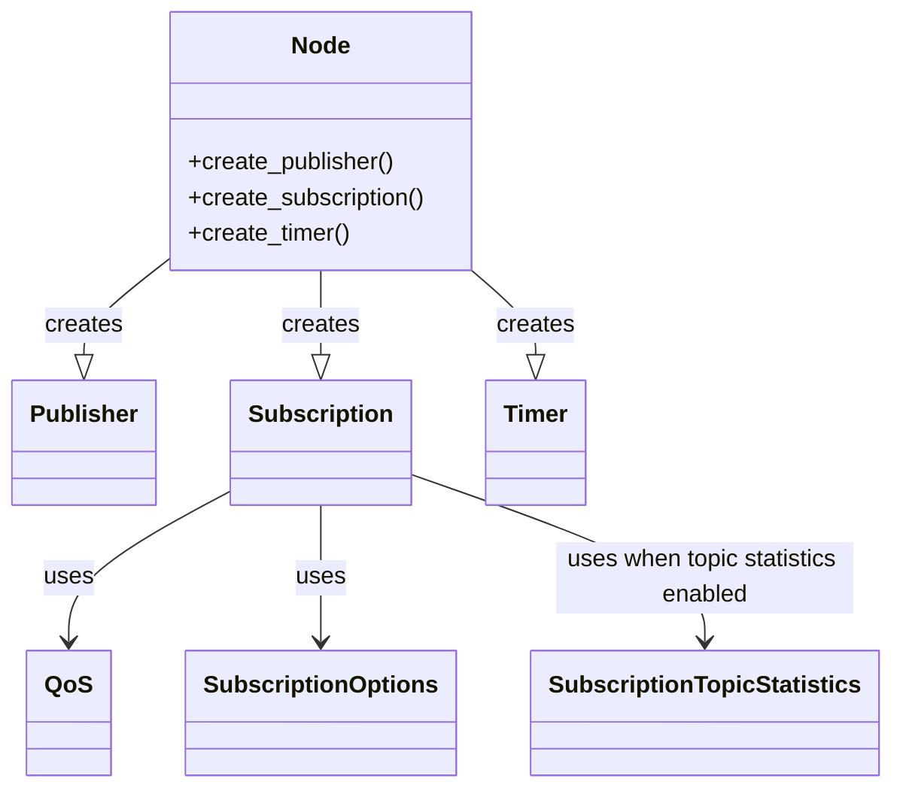

---
Crafted by [Genie](https://marketplace.visualstudio.com/items?itemName=genieai.chatgpt-vscode)
---

## You

下面这段代码是在 ros2 项目中 rclcpp 相关的代码，请联系所有函数之间可能的相互联系，梳理、解释这份文件的功能、含义以及调用关系（中文）。（请给出详细完善的回答，不限制字数）

## Trantor

这段代码是 ROS2（Robot Operating System 2）中的 rclcpp 库的一部分，主要用于创建订阅者。rclcpp 是 ROS2 的 C++ 客户端库，提供了与 ROS2 通信的接口和功能。

这个文件中定义了三个 `create_subscription` 函数模板，它们之间的关系如下：

1. 第一个 `create_subscription` 函数模板接收一个 NodeT 类型的引用，这个类型通常是一个节点对象。它将调用 detail 命名空间中的 `create_subscription` 函数来创建订阅。
2. 第二个 `create_subscription` 函数模板接收两个共享指针参数，分别是节点参数接口和节点主题接口。它将调用 detail 命名空间中的 `create_subscription` 函数来创建订阅。
3. detail 命名空间中的 `create_subscription` 函数模板是实际执行创建订阅操作的函数。它首先获取节点主题接口，然后根据选项判断是否启用主题统计功能。如果启用了主题统计功能，它会创建一个发布者并设置相关的定时器。接着，它会创建一个订阅工厂，并根据 QoS 覆盖选项声明 QoS 参数。最后，使用工厂创建订阅，将订阅添加到节点主题接口，并返回创建的订阅者指针。

这个文件的主要功能是提供创建订阅者的接口，用户可以通过调用这些接口来创建一个订阅者对象，用于接收特定主题的消息。同时，这个文件还支持主题统计功能，可以在启用时收集和发布订阅者的统计信息。

总结一下，这个文件的功能和含义如下：

- 提供创建订阅者的接口
- 支持主题统计功能
- 处理 QoS 参数声明和覆盖

调用关系如下：

1. 用户调用第一个或第二个 `create_subscription` 函数模板。
2. 这两个函数模板会调用 detail 命名空间中的 `create_subscription` 函数模板。
3. detail 命名空间中的 `create_subscription` 函数模板执行实际的订阅创建操作，并返回创建的订阅者指针。

---

以下是对代码的详细解释：

1. **头文件包含**：这段代码首先包含了一系列必要的头文件，以便使用 ROS2 rclcpp 库中的各种功能。这些头文件提供了创建发布者、创建计时器、节点接口、QoS 设置、订阅工厂等功能。

2. **命名空间定义**：代码在 `rclcpp` 命名空间下定义了一个名为 `detail` 的子命名空间。这个子命名空间包含了一个模板函数 `create_subscription`，用于实际创建订阅者实例。将其放在 `detail` 子命名空间下表示这个函数主要用于内部实现，而不是直接供用户调用。

3. **detail::create_subscription 函数**：

   - 获取节点主题接口：该函数首先通过 `get_node_topics_interface()` 函数获取节点主题接口，以便后续操作。
   - 初始化订阅主题统计指针：定义一个订阅主题统计指针，并将其初始化为空。这个指针用于存储订阅主题的统计信息。
   - 启用主题统计功能：如果启用了主题统计功能，则创建一个发布者并设置相关的计时器。这个计时器会定期触发回调函数，发布统计消息。
   - 创建订阅工厂：使用 `rclcpp::create_subscription_factory()` 函数创建一个订阅工厂。这个工厂用于生成订阅者实例。
   - 获取实际的 QoS 配置：根据提供的 QoS 设置和 QoS 覆盖选项，获取实际的 QoS 配置。如果有 QoS 覆盖选项，则声明 QoS 参数。
   - 使用工厂创建订阅：调用节点主题接口的 `create_subscription()` 函数，使用工厂创建一个订阅者实例。
   - 将订阅添加到节点主题接口：通过调用节点主题接口的 `add_subscription()` 函数，将新创建的订阅者实例添加到节点主题接口。
   - 返回创建的订阅者指针：最后，将创建的订阅者实例转换为 `SubscriptionT` 类型的共享指针，并返回。

4. **rclcpp::create_subscription 函数（接受节点引用）**：这个模板函数接受一个节点引用作为参数，并调用 `detail::create_subscription` 函数来创建订阅者实例。用户可以通过调用此函数并传入相应的参数（如消息类型、回调函数、QoS 设置等），在 ROS2 项目中创建订阅者。

5. **rclcpp::create_subscription 函数（接受节点参数接口和节点主题接口）**：这个模板函数接受节点参数接口和节点主题接口的共享指针作为参数，并调用 `detail::create_subscription` 函数来创建订阅者实例。这个函数提供了更灵活的方式来创建订阅者，允许用户直接传入节点参数接口和节点主题接口。

在 ROS2 项目中，用户可以通过调用 rclcpp::create_subscription 函数来创建订阅者。这个函数会根据提供的参数（如消息类型、回调函数、QoS 设置等）创建一个订阅者实例，并将其添加到节点主题接口。当有新消息发布到相应的主题时，订阅者会自动接收这些消息并调用指定的回调函数进行处理。

## You

这份代码中包含的头文件都是确实使用到的，并且也是在 rclcpp 中的文件，请联系这些文件对上述代码进行综合全面的分析

## Trantor

这份代码中包含了多个头文件，它们都在 rclcpp 中，并且与创建订阅者相关。下面是对这些头文件的综合全面分析：

1. **rclcpp/create_publisher.hpp**：这个头文件提供了创建发布者的接口。在这段代码中，当启用主题统计功能时，需要创建一个发布者来发布统计信息。

2. **rclcpp/create_timer.hpp**：这个头文件提供了创建定时器的接口。在这段代码中，当启用主题统计功能时，需要创建一个定时器来周期性地触发统计信息的发布。

3. **rclcpp/detail/resolve_enable_topic_statistics.hpp**：这个头文件定义了 `resolve_enable_topic_statistics` 函数，用于判断是否启用主题统计功能。在这段代码中，根据选项判断是否启用主题统计功能。

4. **rclcpp/node_interfaces/get_node_timers_interface.hpp** 和 **rclcpp/node_interfaces/get_node_topics_interface.hpp**：这两个头文件分别提供了获取节点定时器接口和节点主题接口的函数。在这段代码中，需要获取节点主题接口以创建订阅者和发布者，以及获取节点定时器接口以创建定时器。

5. **rclcpp/node_interfaces/node_timers_interface.hpp** 和 **rclcpp/node_interfaces/node_topics_interface.hpp**：这两个头文件分别定义了节点定时器接口和节点主题接口的类。在这段代码中，这些接口被用于创建订阅者、发布者和定时器。

6. **rclcpp/qos.hpp**：这个头文件定义了 QoS（Quality of Service，服务质量）相关的类。在这段代码中，QoS 用于配置订阅者和发布者的通信质量。

7. **rclcpp/subscription_factory.hpp**：这个头文件提供了创建订阅工厂的接口。在这段代码中，需要创建一个订阅工厂来生成订阅者对象。

8. **rclcpp/subscription_options.hpp**：这个头文件定义了订阅选项相关的类。在这段代码中，订阅选项用于配置订阅者的行为，例如是否启用主题统计功能。

9. **rclcpp/timer.hpp**：这个头文件定义了定时器相关的类。在这段代码中，当启用主题统计功能时，需要创建一个定时器来周期性地触发统计信息的发布。

10. **rclcpp/topic_statistics/subscription_topic_statistics.hpp**：这个头文件定义了 `SubscriptionTopicStatistics` 类，用于收集和发布订阅者的统计信息。在这段代码中，当启用主题统计功能时，需要创建一个 `SubscriptionTopicStatistics` 对象来处理统计信息。

11. **rmw/qos_profiles.h**：这个头文件定义了与 ROS2 中间件层（RMW）交互时使用的 QoS 配置。在这段代码中，它与 rclcpp 层的 QoS 配置相互关联。

通过分析这些头文件，我们可以更深入地了解这段代码的功能和实现细节。这些头文件提供了创建订阅者、发布者、定时器等所需的接口和类，以及处理 QoS 参数、主题统计功能等相关功能。

## You

我希望以 uml 视图进一步说明上述代码，并以 mermaid 格式输出

## Trantor

以下是使用 Mermaid 格式的 UML 类图，用于进一步说明上述代码：



在这个 UML 类图中，我们可以看到以下关系：

- `Node` 类负责创建 `Publisher`、`Subscription` 和 `Timer` 对象。
- `Subscription` 类使用 `QoS`、`SubscriptionOptions` 和（当主题统计功能启用时）`SubscriptionTopicStatistics` 类。

这个 UML 类图提供了一个更直观的视图，以帮助您理解上述代码中各个类之间的关系。

## 请详细对其中的这段代码解释，为么会使用 `? ... :` 表达式，实际的逻辑是什么？

```cpp
  // 获取实际的QoS配置，如果有QoS覆盖选项，则声明QoS参数
  const rclcpp::QoS& actual_qos = options.qos_overriding_options.get_policy_kinds().size()
                                      ? rclcpp::detail::declare_qos_parameters(
                                            options.qos_overriding_options, node_parameters,
                                            node_topics_interface->resolve_topic_name(topic_name),
                                            qos, rclcpp::detail::SubscriptionQosParametersTraits{})
                                      : qos;
```

## Trantor

这段代码使用了三目运算符 `? ... :` 表达式，它是一种简洁的条件语句。它的逻辑是：如果 `options.qos_overriding_options.get_policy_kinds().size()` 返回的值为真，则执行 `rclcpp::detail::declare_qos_parameters(...)` 函数，否则返回 `qos` 变量的值。

具体来说，这段代码用于获取实际的 QoS 配置。在 ROS2 中，QoS（Quality of Service）是一种配置选项，用于控制消息传输的可靠性、延迟和带宽等方面。在创建订阅者时，可以通过 `qos` 参数指定默认的 QoS 配置。但是，如果需要覆盖默认的 QoS 配置，可以使用 `options.qos_overriding_options` 参数。如果该参数不为空，则说明需要覆盖默认的 QoS 配置，此时就需要调用 `rclcpp::detail::declare_qos_parameters(...)` 函数来获取实际的 QoS 配置。否则，直接使用默认的 QoS 配置即可。

因此，这段代码的作用是根据是否有 QoS 覆盖选项来获取实际的 QoS 配置，并将其保存到 `actual_qos` 变量中。
