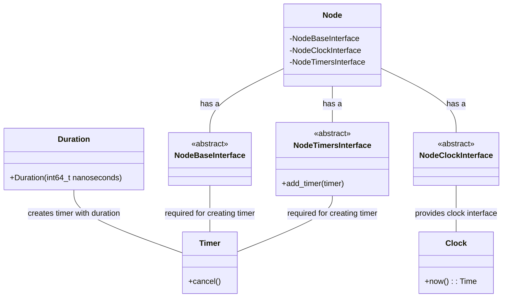

---
Crafted by [Genie](https://marketplace.visualstudio.com/items?itemName=genieai.chatgpt-vscode)
---

## You

下面这段代码是在 ros2 项目中 rclcpp 相关的代码，请联系所有函数之间可能的相互联系，梳理、解释这份文件的功能、含义以及调用关系（中文）。（请给出详细完善的回答，不限制字数）

```cpp
#include "rclcpp/duration.hpp"
#include "rclcpp/node_interfaces/get_node_base_interface.hpp"
#include "rclcpp/node_interfaces/get_node_clock_interface.hpp"
#include "rclcpp/node_interfaces/get_node_timers_interface.hpp"
#include "rclcpp/node_interfaces/node_base_interface.hpp"
#include "rclcpp/node_interfaces/node_clock_interface.hpp"
#include "rclcpp/node_interfaces/node_timers_interface.hpp"

namespace rclcpp {
namespace detail {
template <typename DurationRepT, typename DurationT>
std::chrono::nanoseconds safe_cast_to_period_in_ns(
    std::chrono::duration<DurationRepT, DurationT> period) {
  if (period < std::chrono::duration<DurationRepT, DurationT>::zero()) {
    throw std::invalid_argument{"timer period cannot be negative"};
  }

  constexpr auto maximum_safe_cast_ns =
      std::chrono::nanoseconds::max() - std::chrono::duration<DurationRepT, DurationT>(1);

  constexpr auto ns_max_as_double =
      std::chrono::duration_cast<std::chrono::duration<double, std::chrono::nanoseconds::period>>(
          maximum_safe_cast_ns);
  if (period > ns_max_as_double) {
    throw std::invalid_argument{"timer period must be less than std::chrono::nanoseconds::max()"};
  }

  const auto period_ns = std::chrono::duration_cast<std::chrono::nanoseconds>(period);
  if (period_ns < std::chrono::nanoseconds::zero()) {
    throw std::runtime_error{"Casting timer period to nanoseconds resulted in integer overflow."};
  }

  return period_ns;
}
}  // namespace detail

template <typename CallbackT>
typename rclcpp::TimerBase::SharedPtr create_timer(
    std::shared_ptr<node_interfaces::NodeBaseInterface> node_base,
    std::shared_ptr<node_interfaces::NodeTimersInterface> node_timers,
    rclcpp::Clock::SharedPtr clock,
    rclcpp::Duration period,
    CallbackT&& callback,
    rclcpp::CallbackGroup::SharedPtr group = nullptr) {
  return create_timer(
      clock, period.to_chrono<std::chrono::nanoseconds>(), std::forward<CallbackT>(callback), group,
      node_base.get(), node_timers.get());
}

template <typename NodeT, typename CallbackT>
typename rclcpp::TimerBase::SharedPtr create_timer(
    NodeT node,
    rclcpp::Clock::SharedPtr clock,
    rclcpp::Duration period,
    CallbackT&& callback,
    rclcpp::CallbackGroup::SharedPtr group = nullptr) {
  return create_timer(
      clock, period.to_chrono<std::chrono::nanoseconds>(), std::forward<CallbackT>(callback), group,
      rclcpp::node_interfaces::get_node_base_interface(node).get(),
      rclcpp::node_interfaces::get_node_timers_interface(node).get());
}

template <typename DurationRepT, typename DurationT, typename CallbackT>
typename rclcpp::GenericTimer<CallbackT>::SharedPtr create_timer(
    rclcpp::Clock::SharedPtr clock,
    std::chrono::duration<DurationRepT, DurationT> period,
    CallbackT callback,
    rclcpp::CallbackGroup::SharedPtr group,
    node_interfaces::NodeBaseInterface* node_base,
    node_interfaces::NodeTimersInterface* node_timers) {
  if (clock == nullptr) {
    throw std::invalid_argument{"clock cannot be null"};
  }
  if (node_base == nullptr) {
    throw std::invalid_argument{"input node_base cannot be null"};
  }
  if (node_timers == nullptr) {
    throw std::invalid_argument{"input node_timers cannot be null"};
  }

  const std::chrono::nanoseconds period_ns = detail::safe_cast_to_period_in_ns(period);

  auto timer = rclcpp::GenericTimer<CallbackT>::make_shared(
      std::move(clock), period_ns, std::move(callback), node_base->get_context());
  node_timers->add_timer(timer, group);
  return timer;
}

template <typename DurationRepT, typename DurationT, typename CallbackT>
typename rclcpp::WallTimer<CallbackT>::SharedPtr create_wall_timer(
    std::chrono::duration<DurationRepT, DurationT> period,
    CallbackT callback,
    rclcpp::CallbackGroup::SharedPtr group,
    node_interfaces::NodeBaseInterface* node_base,
    node_interfaces::NodeTimersInterface* node_timers) {
  if (node_base == nullptr) {
    throw std::invalid_argument{"input node_base cannot be null"};
  }

  if (node_timers == nullptr) {
    throw std::invalid_argument{"input node_timers cannot be null"};
  }

  const std::chrono::nanoseconds period_ns = detail::safe_cast_to_period_in_ns(period);

  auto timer = rclcpp::WallTimer<CallbackT>::make_shared(
      period_ns, std::move(callback), node_base->get_context());
  node_timers->add_timer(timer, group);
  return timer;
}
}  // namespace rclcpp

```

## You

下面这段代码是在 ros2 项目中 rclcpp 相关的代码，请联系所有函数之间可能的相互联系，梳理、解释这份文件的功能、含义以及调用关系（中文）。（请给出详细完善的回答，不限制字数）

```cpp
#include "rclcpp/duration.hpp"
#include "rclcpp/node_interfaces/get_node_base_interface.hpp"
#include "rclcpp/node_interfaces/get_node_clock_interface.hpp"
#include "rclcpp/node_interfaces/get_node_timers_interface.hpp"
#include "rclcpp/node_interfaces/node_base_interface.hpp"
#include "rclcpp/node_interfaces/node_clock_interface.hpp"
#include "rclcpp/node_interfaces/node_timers_interface.hpp"

namespace rclcpp {
namespace detail {
template <typename DurationRepT, typename DurationT>
std::chrono::nanoseconds safe_cast_to_period_in_ns(
    std::chrono::duration<DurationRepT, DurationT> period) {
  if (period < std::chrono::duration<DurationRepT, DurationT>::zero()) {
    throw std::invalid_argument{"timer period cannot be negative"};
  }

  constexpr auto maximum_safe_cast_ns =
      std::chrono::nanoseconds::max() - std::chrono::duration<DurationRepT, DurationT>(1);

  constexpr auto ns_max_as_double =
      std::chrono::duration_cast<std::chrono::duration<double, std::chrono::nanoseconds::period>>(
          maximum_safe_cast_ns);
  if (period > ns_max_as_double) {
    throw std::invalid_argument{"timer period must be less than std::chrono::nanoseconds::max()"};
  }

  const auto period_ns = std::chrono::duration_cast<std::chrono::nanoseconds>(period);
  if (period_ns < std::chrono::nanoseconds::zero()) {
    throw std::runtime_error{"Casting timer period to nanoseconds resulted in integer overflow."};
  }

  return period_ns;
}
}  // namespace detail

template <typename CallbackT>
typename rclcpp::TimerBase::SharedPtr create_timer(
    std::shared_ptr<node_interfaces::NodeBaseInterface> node_base,
    std::shared_ptr<node_interfaces::NodeTimersInterface> node_timers,
    rclcpp::Clock::SharedPtr clock,
    rclcpp::Duration period,
    CallbackT&& callback,
    rclcpp::CallbackGroup::SharedPtr group = nullptr) {
  return create_timer(
      clock, period.to_chrono<std::chrono::nanoseconds>(), std::forward<CallbackT>(callback), group,
      node_base.get(), node_timers.get());
}

template <typename NodeT, typename CallbackT>
typename rclcpp::TimerBase::SharedPtr create_timer(
    NodeT node,
    rclcpp::Clock::SharedPtr clock,
    rclcpp::Duration period,
    CallbackT&& callback,
    rclcpp::CallbackGroup::SharedPtr group = nullptr) {
  return create_timer(
      clock, period.to_chrono<std::chrono::nanoseconds>(), std::forward<CallbackT>(callback), group,
      rclcpp::node_interfaces::get_node_base_interface(node).get(),
      rclcpp::node_interfaces::get_node_timers_interface(node).get());
}

template <typename DurationRepT, typename DurationT, typename CallbackT>
typename rclcpp::GenericTimer<CallbackT>::SharedPtr create_timer(
    rclcpp::Clock::SharedPtr clock,
    std::chrono::duration<DurationRepT, DurationT> period,
    CallbackT callback,
    rclcpp::CallbackGroup::SharedPtr group,
    node_interfaces::NodeBaseInterface* node_base,
    node_interfaces::NodeTimersInterface* node_timers) {
  if (clock == nullptr) {
    throw std::invalid_argument{"clock cannot be null"};
  }
  if (node_base == nullptr) {
    throw std::invalid_argument{"input node_base cannot be null"};
  }
  if (node_timers == nullptr) {
    throw std::invalid_argument{"input node_timers cannot be null"};
  }

  const std::chrono::nanoseconds period_ns = detail::safe_cast_to_period_in_ns(period);

  auto timer = rclcpp::GenericTimer<CallbackT>::make_shared(
      std::move(clock), period_ns, std::move(callback), node_base->get_context());
  node_timers->add_timer(timer, group);
  return timer;
}

template <typename DurationRepT, typename DurationT, typename CallbackT>
typename rclcpp::WallTimer<CallbackT>::SharedPtr create_wall_timer(
    std::chrono::duration<DurationRepT, DurationT> period,
    CallbackT callback,
    rclcpp::CallbackGroup::SharedPtr group,
    node_interfaces::NodeBaseInterface* node_base,
    node_interfaces::NodeTimersInterface* node_timers) {
  if (node_base == nullptr) {
    throw std::invalid_argument{"input node_base cannot be null"};
  }

  if (node_timers == nullptr) {
    throw std::invalid_argument{"input node_timers cannot be null"};
  }

  const std::chrono::nanoseconds period_ns = detail::safe_cast_to_period_in_ns(period);

  auto timer = rclcpp::WallTimer<CallbackT>::make_shared(
      period_ns, std::move(callback), node_base->get_context());
  node_timers->add_timer(timer, group);
  return timer;
}
}  // namespace rclcpp

```

## Trantor

这段代码是 ROS2（Robot Operating System 2）项目中的 rclcpp 库相关代码。rclcpp 是 ROS2 的 C++ 客户端库，提供了用于构建 ROS2 节点和与 ROS2 系统交互的 API。这段代码主要涉及到定时器的创建和管理。

首先，我们来看一下头文件的引入：

```cpp
#include "rclcpp/duration.hpp"
#include "rclcpp/node_interfaces/get_node_base_interface.hpp"
#include "rclcpp/node_interfaces/get_node_clock_interface.hpp"
#include "rclcpp/node_interfaces/get_node_timers_interface.hpp"
#include "rclcpp/node_interfaces/node_base_interface.hpp"
#include "rclcpp/node_interfaces/node_clock_interface.hpp"
#include "rclcpp/node_interfaces/node_timers_interface.hpp"
```

这些头文件分别包含了 `rclcpp` 中的 `Duration` 类、节点接口类（如 `NodeBaseInterface`, `NodeClockInterface`, `NodeTimersInterface`）以及获取节点接口的辅助函数。

接下来，我们分析这段代码中的几个重要函数：

1. `safe_cast_to_period_in_ns` 函数：将给定的 `std::chrono::duration` 类型的周期转换为纳秒表示，并确保转换过程中不会出现溢出或负值。如果发生异常情况，将抛出相应的错误。

2. `create_timer` 函数模板：根据给定的参数创建一个定时器。有两个重载版本：

   - 第一个版本接受 `node_base` 和 `node_timers` 两个指针，以及一个 `rclcpp::Duration` 类型的周期参数。
   - 第二个版本接受一个 `NodeT` 类型的节点对象，以及一个 `rclcpp::Duration` 类型的周期参数。

   这两个版本都会调用第三个 `create_timer` 函数模板。

3. `create_timer` 函数模板（第三个版本）：根据给定的参数创建一个 `rclcpp::GenericTimer<CallbackT>` 类型的定时器。这个函数会首先检查输入参数的有效性，然后使用 `detail::safe_cast_to_period_in_ns` 函数将周期转换为纳秒表示。最后，创建一个 `rclcpp::GenericTimer<CallbackT>` 对象，并将其添加到 `node_timers` 中。

4. `create_wall_timer` 函数模板：根据给定的参数创建一个 `rclcpp::WallTimer<CallbackT>` 类型的定时器。这个函数与第三个 `create_timer` 函数类似，但创建的是 `rclcpp::WallTimer<CallbackT>` 对象。

总结一下，这段代码主要实现了以下功能：

- 提供了创建和管理定时器的函数模板，包括 `create_timer` 和 `create_wall_timer`。
- 定义了一个辅助函数 `safe_cast_to_period_in_ns`，用于安全地将周期转换为纳秒表示。

调用关系如下：

- 用户通过调用 `create_timer` 或 `create_wall_timer` 函数来创建定时器。
- `create_timer` 函数（前两个版本）会调用第三个 `create_timer` 函数模板。
- 第三个 `create_timer` 函数和 `create_wall_timer` 函数都会调用 `detail::safe_cast_to_period_in_ns` 函数来转换周期。

## You

这份代码中包含的头文件都是确实使用到的，并且也是在 rclcpp 中的文件，请联系这些文件对上述代码进行综合全面的分析

## Trantor

为了更全面地分析这段代码，我们需要结合所包含的头文件来理解它们之间的关系。以下是对这些头文件的简要概述：

1. `rclcpp/duration.hpp`：定义了 `rclcpp::Duration` 类，用于表示时间长度。这个类在 `create_timer` 函数中被用作参数，表示定时器的周期。

2. `rclcpp/node_interfaces/get_node_base_interface.hpp`、`rclcpp/node_interfaces/get_node_clock_interface.hpp` 和 `rclcpp/node_interfaces/get_node_timers_interface.hpp`：这些头文件提供了从节点对象获取相应接口的辅助函数。例如，在第二个 `create_timer` 函数重载版本中，通过调用 `rclcpp::node_interfaces::get_node_base_interface(node)` 和 `rclcpp::node_interfaces::get_node_timers_interface(node)` 来获取节点的基本接口和定时器接口。

3. `rclcpp/node_interfaces/node_base_interface.hpp`：定义了 `rclcpp::node_interfaces::NodeBaseInterface` 类，它是一个抽象基类，表示 ROS2 节点的基本接口。在创建定时器时，需要将节点的基本接口传递给 `create_timer` 函数。

4. `rclcpp/node_interfaces/node_clock_interface.hpp`：定义了 `rclcpp::node_interfaces::NodeClockInterface` 类，它是一个抽象基类，表示 ROS2 节点的时钟接口。虽然这个头文件被包含在这段代码中，但实际上并没有直接使用 `NodeClockInterface`。相反，这段代码使用了 `rclcpp::Clock` 类型的智能指针作为参数。

5. `rclcpp/node_interfaces/node_timers_interface.hpp`：定义了 `rclcpp::node_interfaces::NodeTimersInterface` 类，它是一个抽象基类，表示 ROS2 节点的定时器接口。在创建定时器时，需要将节点的定时器接口传递给 `create_timer` 函数。`NodeTimersInterface` 类中的 `add_timer` 方法用于将新创建的定时器添加到节点的定时器管理中。

结合这些头文件，我们可以更深入地理解这段代码的功能和实现：

- 通过包含不同的节点接口头文件，这段代码可以与 ROS2 节点进行交互，例如获取节点的基本接口和定时器接口。
- 在创建定时器时，这段代码会将节点的基本接口和定时器接口传递给 `create_timer` 函数，以便将新创建的定时器添加到节点的定时器管理中。
- 这段代码还利用了 `rclcpp::Duration` 类来表示定时器的周期，并在创建定时器时将其转换为纳秒表示。

综上所述，这段代码主要负责创建和管理 ROS2 节点的定时器，同时确保与节点的其他接口（如基本接口和定时器接口）正确交互。

## You

我希望以 uml 视图进一步说明上述代码，并以 mermaid 格式输出

## Trantor

以下是使用 Mermaid 格式的 UML 类图，以帮助您更好地理解上述代码中涉及的类和接口：



在这个 UML 类图中，我们可以看到 `Node` 类包含了 `NodeBaseInterface`、`NodeClockInterface` 和 `NodeTimersInterface`。`Duration` 类用于创建具有指定周期的 `Timer`。`NodeClockInterface` 提供了与 `Clock` 类的接口，而 `NodeTimersInterface` 则负责管理节点的定时器。

通过这个 UML 类图，您可以更清晰地看到代码中各个类和接口之间的关系。
