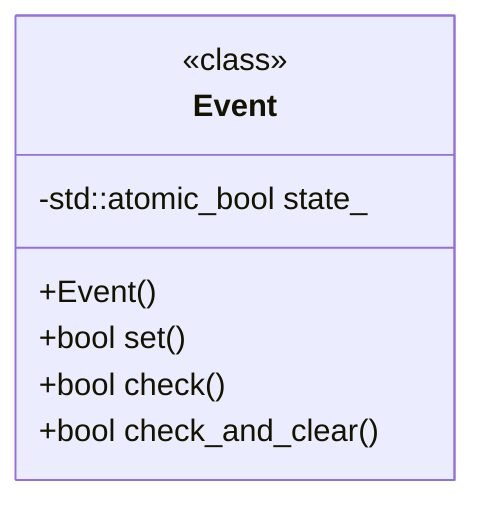

---
Crafted by [Genie](https://marketplace.visualstudio.com/items?itemName=genieai.chatgpt-vscode)
---

## You

下面这段代码是在 ros2 项目中 rclcpp 相关的代码，请联系所有函数之间可能的相互联系，梳理、解释这份文件的功能、含义以及调用关系（中文）。（请给出详细完善的回答，不限制字数）

## Trantor

这段代码定义了一个名为 `Event` 的类，它位于 `rclcpp` 命名空间中。`Event` 类表示一个简单的二值状态（true/false），主要用于 ROS2 项目中的事件处理。

以下是这个类的成员函数及其功能：

1. **构造函数**：默认构造函数 `Event()` 初始化原子布尔型状态变量 `state_` 为 false。

2. **set()**：将事件状态值设置为 true，并返回调用前的状态值。

3. **check()**：获取事件的状态值。

4. **check_and_clear()**：获取事件的状态值并将其设置为 false。

此外，该类还禁止了拷贝操作，以防止意外地复制对象。通过使用智能指针类型（如 `std::shared_ptr` 和 `std::weak_ptr`）来管理 `Event` 对象的生命周期。

下面是这些函数之间的调用关系：

- 构造函数 `Event()` 在创建 `Event` 对象时被调用。
- 当需要将事件状态设置为 true 时，调用 `set()` 函数。
- 要检查事件的当前状态值，可以调用 `check()` 函数。
- 如果需要在检查事件状态值的同时将其重置为 false，可以调用 `check_and_clear()` 函数。

总结一下，这个 `Event` 类提供了一个简单的二值状态（true/false）来表示事件是否发生。通过调用相应的成员函数，可以方便地设置、检查和清除事件状态。这对于在 ROS2 项目中处理事件触发和状态变化非常有用。

## You

这份代码中包含的头文件都是确实使用到的，并且也是在 rclcpp 中的文件，请联系这些文件对上述代码进行综合全面的分析

## Trantor

在这份代码中，包含了以下头文件：

1. `<atomic>`：提供了 `std::atomic_bool` 类型，用于表示原子布尔型状态变量。在 `Event` 类中，`state_` 变量使用了 `std::atomic_bool` 类型，以确保多线程环境下的安全访问和修改。

2. `<memory>`：提供了智能指针类型，如 `std::shared_ptr` 和 `std::weak_ptr`。在 `Event` 类中，通过宏 `RCLCPP_SMART_PTR_DEFINITIONS_NOT_COPYABLE(Event)` 定义了这些智能指针类型，以便在其他地方使用时可以方便地管理 `Event` 对象的生命周期。

3. `"rclcpp/macros.hpp"`：这个头文件定义了一些宏，例如 `RCLCPP_SMART_PTR_DEFINITIONS_NOT_COPYABLE` 和 `RCLCPP_DISABLE_COPY`。这些宏用于禁止拷贝操作并定义智能指针类型，以确保 `Event` 类对象的正确管理。

4. `"rclcpp/visibility_control.hpp"`：这个头文件定义了一些宏，例如 `RCLCPP_PUBLIC`，用于控制类和函数的可见性。在 `Event` 类中，这些宏用于标记构造函数和成员函数的可见性，以便在其他地方使用时可以正确地导出和链接这些符号。

综合分析这些头文件，我们可以得出以下结论：

- 代码利用了 C++ 标准库中的 `<atomic>` 和 `<memory>` 头文件，以确保 `Event` 类在多线程环境下的安全使用和正确的内存管理。
- 代码还包含了 `rclcpp` 中的一些头文件，这些头文件提供了宏定义，用于控制类和函数的可见性以及禁止拷贝操作。这些宏有助于确保 `Event` 类对象在 ROS2 项目中的正确使用和管理。

通过这些头文件，`Event` 类能够在 ROS2 项目中安全、高效地表示和处理事件状态。

##

这是一个用 C++编写的`Event`类，它表示一个简单的二值状态（true/false）。以下是使用 Mermaid 格式创建的 UML 类图：

这个 UML 类图展示了`Event`类及其公共方法和私有属性。`Event`类具有以下方法：

- `Event()`：默认构造函数，将状态值设置为 false。
- `bool set()`：将事件状态值设置为 true，并返回调用前的状态值。
- `bool check()`：获取事件的状态值。
- `bool check_and_clear()`：获取事件的状态值并设置为 false。

此外，`Event`类还包含一个私有属性：

- `std::atomic_bool state_`：原子布尔型状态变量。
