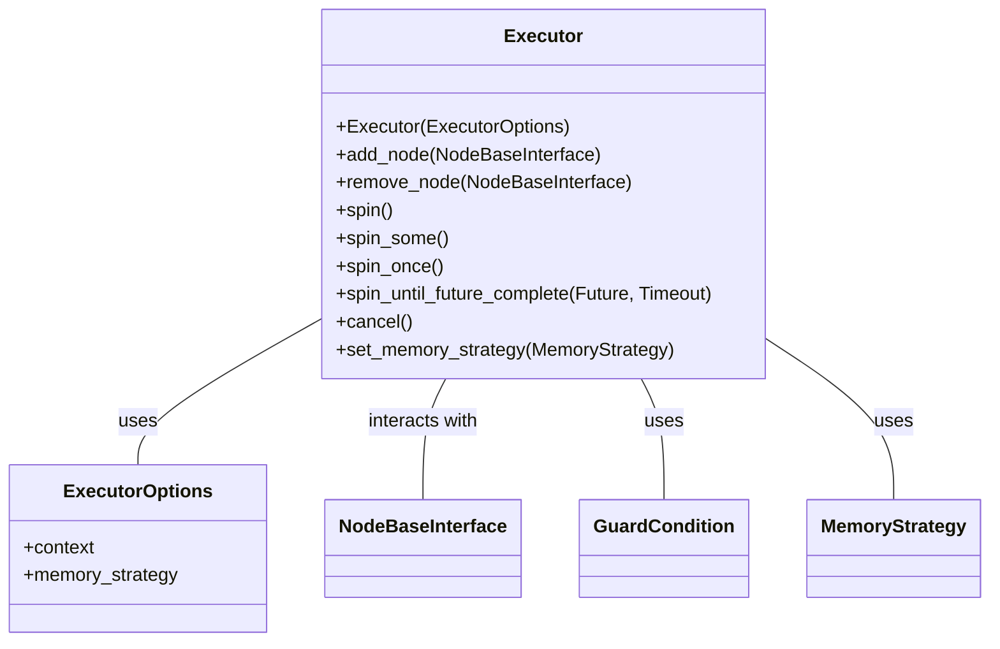

---
Crafted by [Genie](https://marketplace.visualstudio.com/items?itemName=genieai.chatgpt-vscode)
---

## You

下面这段代码是在 ros2 项目中 rclcpp 相关的代码，请联系所有函数之间可能的相互联系，梳理、解释这份文件的功能、含义以及调用关系（中文）。（请给出详细完善的回答，不限制字数）

```cpp
#include "rcl/guard_condition.h"
#include "rcl/wait.h"
#include "rclcpp/context.hpp"
#include "rclcpp/contexts/default_context.hpp"
#include "rclcpp/executor_options.hpp"
#include "rclcpp/future_return_code.hpp"
#include "rclcpp/guard_condition.hpp"
#include "rclcpp/memory_strategies.hpp"
#include "rclcpp/memory_strategy.hpp"
#include "rclcpp/node_interfaces/node_base_interface.hpp"
#include "rclcpp/utilities.hpp"
#include "rclcpp/visibility_control.hpp"
#include "rcpputils/scope_exit.hpp"
namespace rclcpp {
typedef std::map<
    rclcpp::CallbackGroup::WeakPtr,
    rclcpp::node_interfaces::NodeBaseInterface::WeakPtr,
    std::owner_less<rclcpp::CallbackGroup::WeakPtr>>
    WeakCallbackGroupsToNodesMap;
class Node;
class Executor {
public:
  RCLCPP_SMART_PTR_DEFINITIONS_NOT_COPYABLE(Executor)
  explicit Executor(const rclcpp::ExecutorOptions &options = rclcpp::ExecutorOptions());
  virtual ~Executor();
  virtual void spin() = 0;
  virtual void add_callback_group(
      rclcpp::CallbackGroup::SharedPtr group_ptr,
      rclcpp::node_interfaces::NodeBaseInterface::SharedPtr node_ptr,
      bool notify = true);
  virtual std::vector<rclcpp::CallbackGroup::WeakPtr> get_all_callback_groups();
  virtual std::vector<rclcpp::CallbackGroup::WeakPtr> get_manually_added_callback_groups();
  virtual std::vector<rclcpp::CallbackGroup::WeakPtr>
  get_automatically_added_callback_groups_from_nodes();
  virtual void remove_callback_group(
      rclcpp::CallbackGroup::SharedPtr group_ptr, bool notify = true);
  virtual void add_node(
      rclcpp::node_interfaces::NodeBaseInterface::SharedPtr node_ptr, bool notify = true);
  virtual void add_node(std::shared_ptr<rclcpp::Node> node_ptr, bool notify = true);
  virtual void remove_node(
      rclcpp::node_interfaces::NodeBaseInterface::SharedPtr node_ptr, bool notify = true);
  virtual void remove_node(std::shared_ptr<rclcpp::Node> node_ptr, bool notify = true);
  template <typename RepT = int64_t, typename T = std::milli>
  void spin_node_once(
      rclcpp::node_interfaces::NodeBaseInterface::SharedPtr node,
      std::chrono::duration<RepT, T> timeout = std::chrono::duration<RepT, T>(-1)) {
    // 将超时时间转换为纳秒并调用 spin_node_once_nanoseconds 函数。(Convert the timeout duration to
    // nanoseconds and call spin_node_once_nanoseconds function.)
    return spin_node_once_nanoseconds(
        node, std::chrono::duration_cast<std::chrono::nanoseconds>(timeout));
  }
  template <typename NodeT = rclcpp::Node, typename RepT = int64_t, typename T = std::milli>
  void spin_node_once(
      std::shared_ptr<NodeT> node,
      std::chrono::duration<RepT, T> timeout = std::chrono::duration<RepT, T>(-1)) {
    // 获取节点基本接口并将超时时间转换为纳秒，然后调用 spin_node_once_nanoseconds 函数。 (Get the
    // node base interface and convert the timeout duration to nanoseconds, then call
    // spin_node_once_nanoseconds function.)
    return spin_node_once_nanoseconds(
        node->get_node_base_interface(),
        std::chrono::duration_cast<std::chrono::nanoseconds>(timeout));
  }
  void spin_node_some(rclcpp::node_interfaces::NodeBaseInterface::SharedPtr node);
  void spin_node_some(std::shared_ptr<rclcpp::Node> node);
  virtual void spin_some(std::chrono::nanoseconds max_duration = std::chrono::nanoseconds(0));
  virtual void spin_all(std::chrono::nanoseconds max_duration);
  virtual void spin_once(std::chrono::nanoseconds timeout = std::chrono::nanoseconds(-1));
  template <typename FutureT, typename TimeRepT = int64_t, typename TimeT = std::milli>
  FutureReturnCode spin_until_future_complete(
      const FutureT &future,
      std::chrono::duration<TimeRepT, TimeT> timeout = std::chrono::duration<TimeRepT, TimeT>(-1)) {
    // TODO(wjwwood): does not work recursively; can't call spin_node_until_future_complete
    // inside a callback executed by an executor.
    // TODO（wjwwood）：不支持递归；不能在执行器执行的回调内部调用spin_node_until_future_complete。
    // Check the future before entering the while loop.
    // If the future is already complete, don't try to spin.
    // 在进入while循环之前检查future。
    // 如果future已经完成，不要尝试旋转。
    std::future_status status = future.wait_for(std::chrono::seconds(0));
    if (status == std::future_status::ready) {
      return FutureReturnCode::SUCCESS;
    }
    auto end_time = std::chrono::steady_clock::now();  // 记录当前时间（Record the current time）
    std::chrono::nanoseconds timeout_ns = std::chrono::duration_cast<std::chrono::nanoseconds>(
        timeout);  // 将超时时间转换为纳秒（Convert the timeout duration to nanoseconds）
    if (timeout_ns > std::chrono::nanoseconds::zero()) {
      end_time += timeout_ns;  // 如果超时时间大于0，计算结束时间（If the timeout duration is
                               // greater than 0, calculate the end time）
    }
    std::chrono::nanoseconds timeout_left =
        timeout_ns;  // 初始化剩余超时时间（Initialize the remaining timeout duration）
    if (spinning.exchange(true)) {
      throw std::runtime_error(
          "spin_until_future_complete() called while already spinning");  // 如果已经在旋转，则抛出异常（Throw
                                                                          // an exception if already
                                                                          // spinning）
    }
    RCPPUTILS_SCOPE_EXIT(this->spinning.store(false););
    while (rclcpp::ok(this->context_) && spinning.load()) {
      // 当上下文有效且正在旋转时执行循环（Execute the loop while the context is valid and
      // spinning） Do one item of work.
      spin_once_impl(timeout_left);  // 执行一次旋转实现（Perform a single spin implementation）
      // Check if the future is set, return SUCCESS if it is.
      status = future.wait_for(
          std::chrono::seconds(0));  // 检查未来是否已设置（Check if the future is set）
      if (status == std::future_status::ready) {
        return FutureReturnCode::SUCCESS;  // 如果未来已准备好，返回成功（Return success if the
                                           // future is ready）
      }
      // If the original timeout is < 0, then this is blocking, never TIMEOUT.
      if (timeout_ns < std::chrono::nanoseconds::zero()) {
        // 如果原始超时时间小于0，则为阻塞，永不超时（If the original timeout duration is less than
        // 0, this is blocking and will never timeout）
        continue;
      }
      // Otherwise check if we still have time to wait, return TIMEOUT if not.
      auto now = std::chrono::steady_clock::now();  // 获取当前时间（Get the current time）
      if (now >= end_time) {
        // 如果当前时间大于等于结束时间（If the current time is greater than or equal to the end
        // time）
        return FutureReturnCode::TIMEOUT;  // 返回超时（Return timeout）
      }
      // Subtract the elapsed time from the original timeout.
      timeout_left = std::chrono::duration_cast<std::chrono::nanoseconds>(
          end_time - now);  // 计算剩余超时时间（Calculate the remaining timeout duration）
    }
    // The future did not complete before ok() returned false, return INTERRUPTED.
    return FutureReturnCode::INTERRUPTED;  // 在ok()返回false之前，未来未完成，返回中断（The future
                                           // did not complete before ok() returned false, return
                                           // interrupted）
  }
  void cancel();
  void set_memory_strategy(memory_strategy::MemoryStrategy::SharedPtr memory_strategy);
  bool is_spinning();
protected:
  void spin_node_once_nanoseconds(
      rclcpp::node_interfaces::NodeBaseInterface::SharedPtr node, std::chrono::nanoseconds timeout);
  void spin_some_impl(std::chrono::nanoseconds max_duration, bool exhaustive);
  void execute_any_executable(AnyExecutable &any_exec);
  static void execute_subscription(rclcpp::SubscriptionBase::SharedPtr subscription);
  static void execute_timer(rclcpp::TimerBase::SharedPtr timer);
  static void execute_service(rclcpp::ServiceBase::SharedPtr service);
  static void execute_client(rclcpp::ClientBase::SharedPtr client);
  void wait_for_work(std::chrono::nanoseconds timeout = std::chrono::nanoseconds(-1));
  rclcpp::node_interfaces::NodeBaseInterface::SharedPtr get_node_by_group(
      const WeakCallbackGroupsToNodesMap &weak_groups_to_nodes,
      rclcpp::CallbackGroup::SharedPtr group);
  bool has_node(
      const rclcpp::node_interfaces::NodeBaseInterface::SharedPtr node_ptr,
      const WeakCallbackGroupsToNodesMap &weak_groups_to_nodes) const;
  rclcpp::CallbackGroup::SharedPtr get_group_by_timer(rclcpp::TimerBase::SharedPtr timer);
  virtual void add_callback_group_to_map(
      rclcpp::CallbackGroup::SharedPtr group_ptr,
      rclcpp::node_interfaces::NodeBaseInterface::SharedPtr node_ptr,
      WeakCallbackGroupsToNodesMap &weak_groups_to_nodes,
      bool notify = true) RCPPUTILS_TSA_REQUIRES(mutex_);
  virtual void remove_callback_group_from_map(
      rclcpp::CallbackGroup::SharedPtr group_ptr,
      WeakCallbackGroupsToNodesMap &weak_groups_to_nodes,
      bool notify = true) RCPPUTILS_TSA_REQUIRES(mutex_);
  bool get_next_ready_executable(AnyExecutable &any_executable);
  bool get_next_ready_executable_from_map(
      AnyExecutable &any_executable, const WeakCallbackGroupsToNodesMap &weak_groups_to_nodes);
  bool get_next_executable(
      AnyExecutable &any_executable,
      std::chrono::nanoseconds timeout = std::chrono::nanoseconds(-1));
  virtual void add_callback_groups_from_nodes_associated_to_executor()
      RCPPUTILS_TSA_REQUIRES(mutex_);
  std::atomic_bool spinning;
  rclcpp::GuardCondition interrupt_guard_condition_;
  std::shared_ptr<rclcpp::GuardCondition> shutdown_guard_condition_;
  rcl_wait_set_t wait_set_ = rcl_get_zero_initialized_wait_set();
  mutable std::mutex mutex_;
  memory_strategy::MemoryStrategy::SharedPtr memory_strategy_ RCPPUTILS_TSA_PT_GUARDED_BY(mutex_);
  std::shared_ptr<rclcpp::Context> context_;
  RCLCPP_DISABLE_COPY(Executor)
  virtual void spin_once_impl(std::chrono::nanoseconds timeout);
  typedef std::map<
      rclcpp::CallbackGroup::WeakPtr,
      const rclcpp::GuardCondition *,
      std::owner_less<rclcpp::CallbackGroup::WeakPtr>>
      WeakCallbackGroupsToGuardConditionsMap;
  WeakCallbackGroupsToGuardConditionsMap weak_groups_to_guard_conditions_
      RCPPUTILS_TSA_GUARDED_BY(mutex_);
  WeakCallbackGroupsToNodesMap weak_groups_associated_with_executor_to_nodes_
      RCPPUTILS_TSA_GUARDED_BY(mutex_);
  WeakCallbackGroupsToNodesMap weak_groups_to_nodes_associated_with_executor_
      RCPPUTILS_TSA_GUARDED_BY(mutex_);
  WeakCallbackGroupsToNodesMap weak_groups_to_nodes_ RCPPUTILS_TSA_GUARDED_BY(mutex_);
  std::list<rclcpp::node_interfaces::NodeBaseInterface::WeakPtr> weak_nodes_
      RCPPUTILS_TSA_GUARDED_BY(mutex_);
  rclcpp::OnShutdownCallbackHandle shutdown_callback_handle_;
};
}  // namespace rclcpp

```

## Trantor

这段代码是 ROS2 项目中的 `rclcpp` 库的一部分，主要实现了一个名为 `Executor` 的类。`Executor` 类负责管理和执行回调函数，它可以处理多个节点、回调组以及与之相关的回调函数。在 ROS2 中，`Executor` 是一个核心组件，用于协调节点之间的通信。

以下是这个文件中的主要功能和方法：

1. **构造函数与析构函数**：`Executor` 类的构造函数接受一个可选的 `rclcpp::ExecutorOptions` 参数，用于配置执行器。析构函数是虚拟的，允许派生类正确地清理资源。

2. **spin()**：这是一个纯虚函数，需要在派生类中实现。它会持续运行，直到用户停止或上下文失效。

3. **add_callback_group() 和 remove_callback_group()**：这两个函数用于向执行器添加和删除回调组。每个回调组都与一个节点相关联。

4. **get_all_callback_groups()、get_manually_added_callback_groups() 和 get_automatically_added_callback_groups_from_nodes()**：这些函数返回当前执行器管理的回调组列表。

5. **add_node() 和 remove_node()**：这两个函数用于向执行器添加和删除节点。当添加一个节点时，执行器将自动关联该节点的所有回调组。

6. **spin_node_once() 和 spin_node_some()**：这两个函数用于执行单个节点的一个或多个回调。

7. **spin_some()、spin_all() 和 spin_once()**：这些函数用于执行所有关联节点的一个或多个回调。

8. **spin_until_future_complete()**：这个函数会持续运行，直到给定的 `std::future` 对象完成或超时。

9. **cancel()**：这个函数用于取消执行器的当前操作。

10. **set_memory_strategy()**：这个函数用于设置执行器的内存策略。

11. **is_spinning()**：这个函数返回一个布尔值，表示执行器是否正在运行。

12. **其他保护方法**：这些方法主要用于内部实现，包括执行订阅、定时器、服务和客户端等。

总之，这个文件定义了一个名为 `Executor` 的类，它负责管理和执行 ROS2 节点中的回调函数。通过添加节点和回调组，`Executor` 可以协调多个节点之间的通信。

## You

这份代码中包含的头文件都是确实使用到的，并且也是在 rclcpp 中的文件，请联系这些文件对上述代码进行综合全面的分析

## Trantor

在这份代码中，包含了多个头文件，这些头文件都与 `Executor` 类的实现密切相关。下面是这些头文件及其在代码中的作用：

1. **rcl/guard_condition.h 和 rcl/wait.h**：这两个头文件来自于 ROS2 的底层 C 语言库（`rcl`）。它们提供了与执行器相关的底层功能，如等待集合（wait set）和保护条件（guard condition）。

2. **rclcpp/context.hpp 和 rclcpp/contexts/default_context.hpp**：这两个头文件定义了 ROS2 中的上下文（context）概念。上下文用于管理 ROS2 节点的生命周期和资源。`Executor` 类使用上下文来检查系统状态，例如是否需要停止运行。

3. **rclcpp/executor_options.hpp**：这个头文件定义了 `rclcpp::ExecutorOptions` 类，该类用于配置 `Executor` 的行为。`Executor` 的构造函数接受一个 `ExecutorOptions` 对象作为参数。

4. **rclcpp/future_return_code.hpp**：这个头文件定义了 `FutureReturnCode` 枚举，用于表示 `spin_until_future_complete()` 函数的返回值。可能的返回值有：`SUCCESS`、`TIMEOUT` 和 `INTERRUPTED`。

5. **rclcpp/guard_condition.hpp**：这个头文件定义了 `rclcpp::GuardCondition` 类，它是对底层 `rcl_guard_condition_t` 结构的封装。`Executor` 类使用保护条件来实现中断和关闭功能。

6. **rclcpp/memory_strategies.hpp 和 rclcpp/memory_strategy.hpp**：这两个头文件定义了与内存策略相关的类。内存策略用于管理 `Executor` 分配和释放内存的方式。用户可以通过 `set_memory_strategy()` 函数为执行器设置自定义内存策略。

7. **rclcpp/node_interfaces/node_base_interface.hpp**：这个头文件定义了 `rclcpp::node_interfaces::NodeBaseInterface` 类，它是所有 ROS2 节点的基本接口。`Executor` 类通过这个接口与节点进行交互。

8. **rclcpp/utilities.hpp**：这个头文件提供了一些实用函数，如 `rclcpp::ok()`，用于检查 ROS2 系统是否需要继续运行。

9. **rclcpp/visibility_control.hpp**：这个头文件定义了一些宏，用于控制符号在库之间的可见性。这对于跨平台兼容性和动态链接非常重要。

10. **rcpputils/scope_exit.hpp**：这个头文件来自 `rcpputils` 库，提供了一个名为 `RCPPUTILS_SCOPE_EXIT` 的宏，用于在离开作用域时自动执行指定的代码。在 `Executor` 类中，这个宏用于确保 `spinning` 标志在函数退出时被正确设置。

通过分析这些头文件及其在代码中的作用，我们可以更深入地了解 `Executor` 类的实现细节。这些头文件提供了底层功能、接口定义和实用工具，使得 `Executor` 能够高效地管理和执行 ROS2 节点中的回调函数。

## You

我希望以 uml 视图进一步说明上述代码，并以 mermaid 格式输出

## Trantor

以下是使用 Mermaid 格式表示的 UML 类图，展示了上述代码中涉及的主要类及其关系：



在这个 UML 类图中，我们可以看到 `Executor` 类与其他几个类之间的关系。`Executor` 使用 `ExecutorOptions` 来配置其行为，与 `NodeBaseInterface` 进行交互以管理和执行 ROS2 节点中的回调函数，使用 `GuardCondition` 实现中断和关闭功能，以及使用 `MemoryStrategy` 管理内存分配和释放。

请注意，由于 Mermaid 语法不支持显示枚举类型、头文件和宏等概念，因此这些内容未包含在 UML 类图中。
