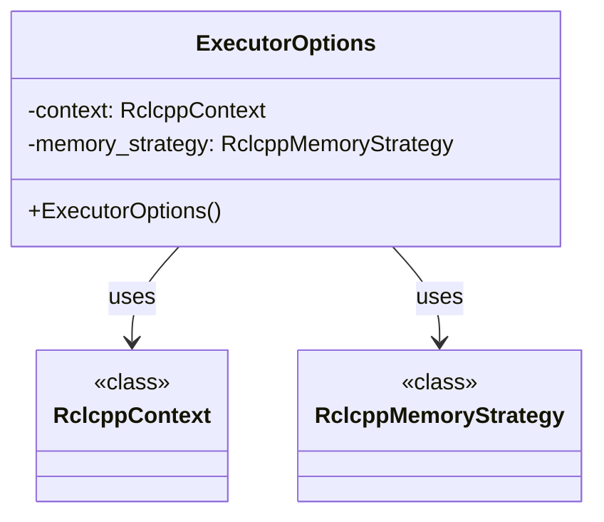

---
Crafted by [Genie](https://marketplace.visualstudio.com/items?itemName=genieai.chatgpt-vscode)
---

## You

下面这段代码是在 ros2 项目中 rclcpp 相关的代码，请联系所有函数之间可能的相互联系，梳理、解释这份文件的功能、含义以及调用关系（中文）。（请给出详细完善的回答，不限制字数）

## Trantor

这段代码是 ROS2 项目中的 rclcpp 库的一部分，主要定义了一个名为 `ExecutorOptions` 的结构体。这个结构体用于在创建执行器（executor）时传递选项参数。执行器负责管理和调度 ROS2 节点中的事件处理。

`ExecutorOptions` 结构体包含以下成员变量：

1. **memory_strategy**：类型为 `rclcpp::memory_strategy::MemoryStrategy::SharedPtr` 的共享指针，用于管理内存资源分配和回收。默认情况下，它使用 `rclcpp::memory_strategies::create_default_strategy()` 函数创建默认的内存策略。

2. **context**：类型为 `rclcpp::Context::SharedPtr` 的共享指针，用于存储 ROS2 节点的相关信息。默认情况下，它使用 `rclcpp::contexts::get_global_default_context()` 函数获取全局默认上下文。

3. **max_conditions**：类型为 `size_t`，表示最大条件变量数量。它用于限制执行器中可处理的事件数量。默认值为 0，表示没有限制。

`ExecutorOptions` 结构体提供了一个默认构造函数，用于初始化这些成员变量。

总结一下，这份文件定义了一个名为 `ExecutorOptions` 的结构体，用于在创建执行器时传递选项参数。它包含了内存策略、上下文和最大条件变量数量等成员变量，以便在执行器中管理和调度 ROS2 节点的事件处理。

## You

这份代码中包含的头文件都是确实使用到的，并且也是在 rclcpp 中的文件，请联系这些文件对上述代码进行综合全面的分析

## Trantor

在这份代码中，包含了以下头文件：

1. **rclcpp/context.hpp**：定义了 `rclcpp::Context` 类，它是 ROS2 节点的上下文，用于存储与节点相关的信息。在 `ExecutorOptions` 结构体中，`context` 成员变量使用了 `rclcpp::Context::SharedPtr` 类型。

2. **rclcpp/contexts/default_context.hpp**：提供了全局默认上下文的获取方法 `rclcpp::contexts::get_global_default_context()`。在 `ExecutorOptions` 的默认构造函数中，`context` 成员变量被初始化为全局默认上下文。

3. **rclcpp/memory_strategies.hpp**：包含了创建默认内存策略的方法 `rclcpp::memory_strategies::create_default_strategy()`。在 `ExecutorOptions` 的默认构造函数中，`memory_strategy` 成员变量被初始化为默认内存策略。

4. **rclcpp/memory_strategy.hpp**：定义了 `rclcpp::memory_strategy::MemoryStrategy` 类，它是内存策略的基类，用于管理内存资源分配和回收。在 `ExecutorOptions` 结构体中，`memory_strategy` 成员变量使用了 `rclcpp::memory_strategy::MemoryStrategy::SharedPtr` 类型。

5. **rclcpp/visibility_control.hpp**：定义了可见性控制宏，用于控制符号在库中的可见性。这对于跨平台编译和链接非常重要，但在这段代码中并未直接使用。

综合分析这些头文件，我们可以得出以下结论：

- `ExecutorOptions` 结构体依赖于 `rclcpp::Context` 和 `rclcpp::memory_strategy::MemoryStrategy` 类，它们分别表示 ROS2 节点的上下文和内存策略。
- 在 `ExecutorOptions` 的默认构造函数中，`context` 和 `memory_strategy` 成员变量分别被初始化为全局默认上下文和默认内存策略。这些默认值由 `rclcpp/contexts/default_context.hpp` 和 `rclcpp/memory_strategies.hpp` 头文件提供的方法获取。
- 代码中包含了 `rclcpp/visibility_control.hpp` 头文件，但并未直接使用其中的可见性控制宏。

通过这些头文件，我们可以更深入地理解 `ExecutorOptions` 结构体在 rclcpp 库中的作用和与其他组件之间的关系。

## You

我希望以 uml 视图进一步说明上述代码，并以 mermaid 格式输出

## Trantor

以下是使用 Mermaid 格式表示的 UML 类图，描述了上述代码中涉及的类和它们之间的关系：

在这个 UML 类图中，我们可以看到 `ExecutorOptions` 类依赖于 `rclcpp::Context` 和 `rclcpp::memory_strategy::MemoryStrategy` 类。箭头表示 "uses" 关系，意味着 `ExecutorOptions` 使用了这两个类的实例。
