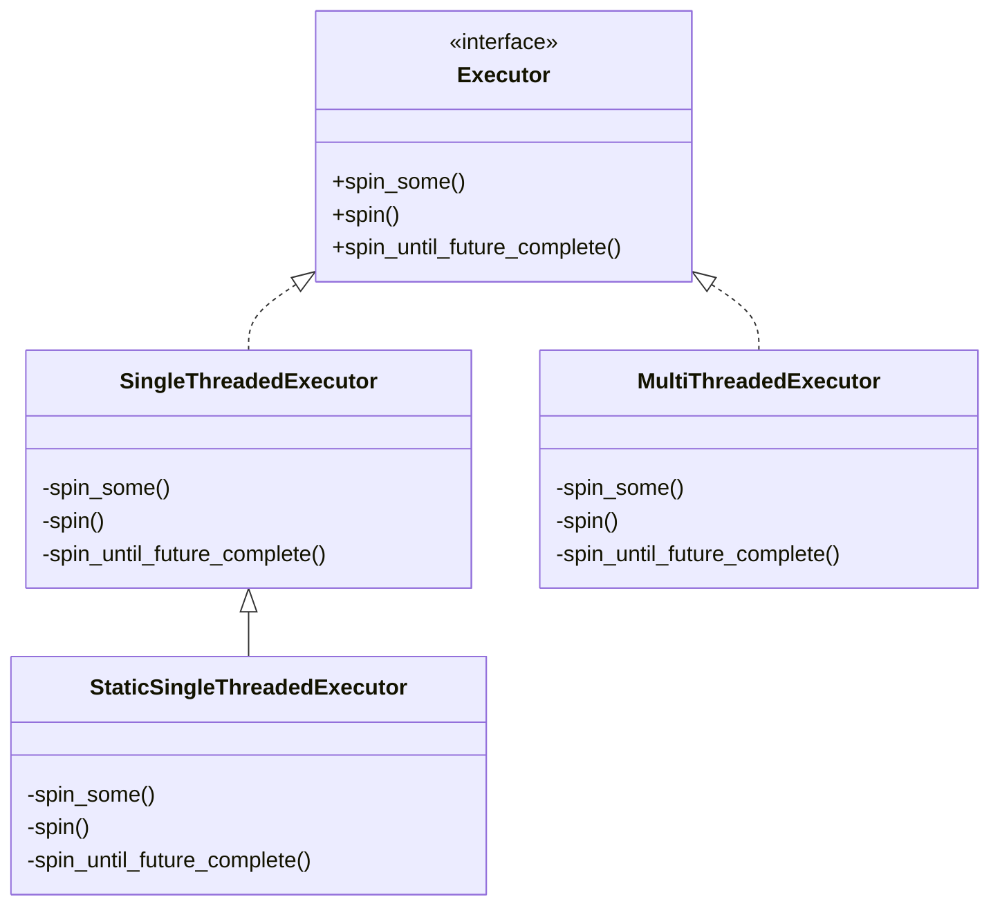

---
Crafted by [Genie](https://marketplace.visualstudio.com/items?itemName=genieai.chatgpt-vscode)
---

## You

下面这段代码是在 ros2 项目中 rclcpp 相关的代码，请联系所有函数之间可能的相互联系，梳理、解释这份文件的功能、含义以及调用关系（中文）。（请给出详细完善的回答，不限制字数）

## Trantor

这份代码是 ROS2 项目中的 `rclcpp` 库的一部分，主要涉及到执行器（executors）的实现。执行器负责管理节点（nodes）的回调和事件处理。这个文件包含了多种执行器类型，如单线程执行器、多线程执行器以及静态单线程执行器，并提供了一些辅助函数来简化执行器的使用。

以下是这份文件中的主要功能和函数：

1. **spin_some**：创建一个默认的单线程执行器并执行任何立即可用的工作。这个函数有两个重载版本，参数类型分别为 `rclcpp::node_interfaces::NodeBaseInterface::SharedPtr` 和 `rclcpp::Node::SharedPtr`。

2. **spin**：创建一个默认的单线程执行器并旋转指定的节点。这个函数也有两个重载版本，参数类型同样分别为 `rclcpp::node_interfaces::NodeBaseInterface::SharedPtr` 和 `rclcpp::Node::SharedPtr`。

3. **spin_node_until_future_complete**：阻塞地旋转节点，直到给定的 future 完成、超时或 rclcpp 被中断。这个模板函数有两个版本，一个接受 `rclcpp::node_interfaces::NodeBaseInterface::SharedPtr` 类型的节点，另一个接受 `std::shared_ptr<NodeT>` 类型的节点。

4. **spin_until_future_complete**：等待给定的 future 完成，直到超时。这个模板函数有两个版本，一个接受 `rclcpp::node_interfaces::NodeBaseInterface::SharedPtr` 类型的节点，另一个接受 `std::shared_ptr<NodeT>` 类型的节点。

函数之间的调用关系如下：

- `spin_some` 和 `spin` 函数分别有两个重载版本，它们之间没有直接的调用关系。
- `spin_node_until_future_complete` 的两个版本之间存在调用关系。接受 `std::shared_ptr<NodeT>` 类型节点的版本会调用接受 `rclcpp::node_interfaces::NodeBaseInterface::SharedPtr` 类型节点的版本。
- `spin_until_future_complete` 的两个版本之间存在调用关系。接受 `std::shared_ptr<NodeT>` 类型节点的版本会调用接受 `rclcpp::node_interfaces::NodeBaseInterface::SharedPtr` 类型节点的版本。
- `spin_until_future_complete` 会调用 `spin_node_until_future_complete`。

总结：这份文件主要提供了一些执行器相关的辅助函数，以简化 ROS2 节点的事件处理和回调管理。通过使用这些函数，用户可以轻松地创建和使用不同类型的执行器来管理他们的 ROS2 节点。

## You

这份代码中包含的头文件都是确实使用到的，并且也是在 rclcpp 中的文件，请联系这些文件对上述代码进行综合全面的分析

## Trantor

在这份代码中，包含了以下头文件：

1. **`<future>`**：C++ 标准库的头文件，提供了 `std::future` 类模板，用于表示异步操作的结果。在本文件中，`spin_node_until_future_complete` 和 `spin_until_future_complete` 函数使用了 `std::future`。

2. **`<memory>`**：C++ 标准库的头文件，提供了智能指针（如 `std::shared_ptr` 和 `std::unique_ptr`）等内存管理工具。本文件中的函数参数和返回值多次使用了 `std::shared_ptr`。

3. **`rclcpp/executors/multi_threaded_executor.hpp`**：定义了 `rclcpp::executors::MultiThreadedExecutor` 类，它是一个多线程执行器，可以并行处理多个节点的回调和事件。本文件中的 `using` 语句将其导入到 `rclcpp::executors` 命名空间。

4. **`rclcpp/executors/single_threaded_executor.hpp`**：定义了 `rclcpp::executors::SingleThreadedExecutor` 类，它是一个单线程执行器，在同一时间只处理一个节点的回调和事件。本文件中的 `spin_some`、`spin` 和 `spin_until_future_complete` 函数都创建了此类型的执行器实例。

5. **`rclcpp/executors/static_single_threaded_executor.hpp`**：定义了 `rclcpp::executors::StaticSingleThreadedExecutor` 类，它是一个静态单线程执行器，与 `SingleThreadedExecutor` 类似，但在编译时确定要处理的节点数量。本文件没有直接使用这个执行器，但通过 `using` 语句将其导入到 `rclcpp::executors` 命名空间，供用户使用。

6. **`rclcpp/node.hpp`**：定义了 `rclcpp::Node` 类，它是 ROS2 节点的主要实现。本文件中的部分函数重载版本使用了 `rclcpp::Node::SharedPtr` 类型参数。

7. **`rclcpp/utilities.hpp`**：提供了一些实用函数和类型，如 `rclcpp::shutdown` 和 `rclcpp::ok`。虽然本文件没有直接使用这些实用函数，但它们可能在其他地方与执行器一起使用。

8. **`rclcpp/visibility_control.hpp`**：定义了可见性控制宏，如 `RCLCPP_PUBLIC`。这些宏用于控制符号在库之间的可见性。本文件中的所有函数都使用了 `RCLCPP_PUBLIC` 宏。

综合分析：这些头文件为本文件提供了所需的数据结构、类和函数。它们共同支持了执行器的创建和管理，以及与 ROS2 节点的交互。通过这些依赖项，本文件可以实现对节点的回调和事件处理的简化操作。

## You

我希望以 uml 视图进一步说明上述代码，并以 mermaid 格式输出

## Trantor

以下是一个使用 Mermaid 格式表示的 UML 类图：

在上述 Mermaid UML 类图中，我们可以看到有一个名为 `Executor` 的接口，它包含了三个方法：

1. `spin_some()`
2. `spin()`
3. `spin_until_future_complete()`

然后，我们有两个类实现了 `Executor` 接口：`SingleThreadedExecutor` 和 `MultiThreadedExecutor`。这两个类都分别实现了接口中的三个方法。

最后，我们有一个名为 `StaticSingleThreadedExecutor` 的类，它继承自 `SingleThreadedExecutor` 类，并实现了相同的三个方法。

这个 UML 类图可以帮助您更好地理解代码的结构和类之间的关系。如果您需要进一步了解这些类及其方法的具体实现，请查阅相关文档或源代码。
