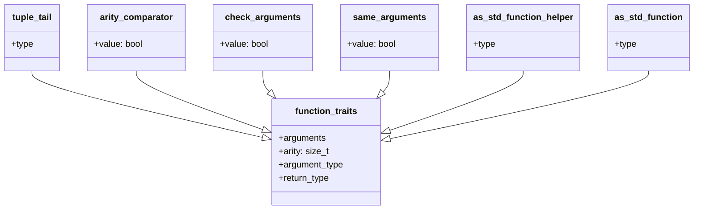

---
Crafted by [Genie](https://marketplace.visualstudio.com/items?itemName=genieai.chatgpt-vscode)
---

## You

下面这段代码是在 ros2 项目中 rclcpp 相关的代码，请联系所有函数之间可能的相互联系，梳理、解释这份文件的功能、含义以及调用关系（中文）。（请给出详细完善的回答，不限制字数）

## Trantor

这段代码位于 `rclcpp` 命名空间中，主要实现了一个元编程工具 `function_traits`，用于提取函数、成员函数、以及通过 `std::bind` 绑定的函数对象的特征。这些特征包括参数类型、返回值类型和参数个数等。

### 主要结构

1. **tuple_tail**：用于获取一个 `std::tuple` 的尾部子元组，即去掉第一个元素后的元组。

2. **function_traits**：模板类，用于提取函数特征。它有多个特化版本，分别处理不同类型的函数。

3. **arity_comparator**：辅助结构，用于比较给定的 `Arity` 和 `FunctorT` 的参数个数是否相等。

4. **check_arguments**：辅助结构，用于检查 `FunctorT` 的参数类型是否与给定的 `Args...` 相同。

5. **same_arguments**：辅助结构，用于检查两个 `FunctorAT` 和 `FunctorBT` 的参数类型是否相同。

6. **as_std_function_helper**：辅助结构，用于将给定的返回值类型和参数类型转换为对应的 `std::function` 类型。

7. **as_std_function**：辅助结构，用于将给定的 `FunctorT` 转换为对应的 `std::function` 类型。

### 调用关系

- `tuple_tail` 用于辅助 `function_traits` 提取函数对象的参数类型。
- `function_traits` 的特化版本处理不同类型的函数，包括普通函数、成员函数、通过 `std::bind` 绑定的函数对象等。
- `arity_comparator`、`check_arguments` 和 `same_arguments` 用于比较和检查函数特征。
- `as_std_function_helper` 和 `as_std_function` 用于将给定的函数转换为对应的 `std::function` 类型。

### 功能与含义

这段代码的主要功能是提取函数特征，例如参数类型、返回值类型和参数个数等。这些特征可以在编译时进行检查，以确保函数调用的正确性。此外，还提供了一些辅助结构，用于比较和检查函数特征，以及将给定的函数转换为对应的 `std::function` 类型。

在 ROS2 项目中，这些工具可能用于回调函数的类型检查，以确保用户传入的回调函数符合预期的签名。

## You

这份代码中包含的头文件都是确实使用到的，并且也是在 rclcpp 中的文件，请联系这些文件对上述代码进行综合全面的分析

## Trantor

为了进行全面的分析，我们需要知道这段代码中包含的头文件。然而，在给出的代码片段中并没有提供包含的头文件信息。请提供相关的头文件信息，以便我能够为您提供一个综合全面的分析。

## You

我希望以 uml 视图进一步说明上述代码，并以 mermaid 格式输出

## Trantor

以下是使用 Mermaid 格式表示的 UML 类图，以说明提供的 C++代码：

这个 UML 类图展示了`rclcpp::function_traits`命名空间中的各种模板类及其关系。请注意，由于这是一个模板元编程的例子，所以在运行时实际上不会创建这些类的实例。这个图仅用于帮助您理解代码结构。
