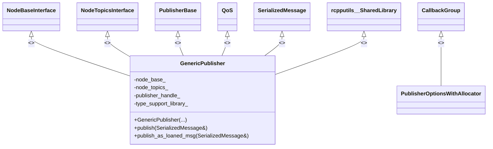

---
Crafted by [Genie](https://marketplace.visualstudio.com/items?itemName=genieai.chatgpt-vscode)
---

## You

下面这段代码是在 ros2 项目中 rclcpp 相关的代码，请联系所有函数之间可能的相互联系，梳理、解释这份文件的功能、含义以及调用关系（中文）。（请给出详细完善的回答，不限制字数）

## Trantor

这份代码定义了一个名为 `GenericPublisher` 的类，它是 `rclcpp::PublisherBase` 的子类。`GenericPublisher` 类用于发布在编译时类型未知的序列化消息。由于类型在编译时未知，因此这不是模板类，需要根据类型名称识别和加载包含类型支持信息的动态库。它不支持进程内处理。

### 构造函数

`GenericPublisher` 的构造函数接收以下参数：

- `node_base`：指向父节点 `NodeBaseInterface` 的指针。
- `ts_lib`：类型支持库，需要与 `topic_type` 相对应。
- `topic_name`：主题名称。
- `topic_type`：主题类型。
- `qos`：QoS 设置。
- `options`：发布器选项。目前并非所有发布器选项都受到尊重，对于此发布器来说，唯一相关的选项是 `event_callbacks`、`use_default_callbacks` 和 `callback_group`。

### 成员函数

`GenericPublisher` 类提供以下成员函数：

1. `publish(const rclcpp::SerializedMessage& message)`：发布一个 `rclcpp::SerializedMessage`。

2. `publish_as_loaned_msg(const rclcpp::SerializedMessage& message)`：在反序列化后通过借用的消息发布 `rclcpp::SerializedMessage`。

3. `borrow_loaned_message()`：私有成员函数，用于从中间件中借用一条消息。

4. `deserialize_message(const rmw_serialized_message_t& serialized_message, void* deserialized_msg)`：私有成员函数，用于将序列化的消息反序列化为一条借用的消息。

5. `publish_loaned_message(void* loaned_message)`：私有成员函数，用于发布一条借用的消息。

### 调用关系

1. 当用户创建一个 `GenericPublisher` 实例时，会调用其构造函数。在构造函数中，它会调用父类 `rclcpp::PublisherBase` 的构造函数。

2. 用户可以通过调用 `publish` 成员函数来发布一个已序列化的消息。

3. 用户还可以通过调用 `publish_as_loaned_msg` 成员函数，在反序列化后通过借用的消息发布一个已序列化的消息。这个函数内部会依次调用 `borrow_loaned_message`、`deserialize_message` 和 `publish_loaned_message` 三个私有成员函数。

### 功能与含义

`GenericPublisher` 类的主要功能是允许用户在编译时不知道消息类型的情况下发布序列化的消息。这对于处理动态加载的插件和消息类型非常有用，因为它们可能在编译时无法确定。此外，`GenericPublisher` 还提供了通过借用的消息发布序列化消息的功能，从而减少了内存分配和复制的开销。

## You

这份代码中包含的头文件都是确实使用到的，并且也是在 rclcpp 中的文件，请联系这些文件对上述代码进行综合全面的分析

## Trantor

在这份代码中，包含了以下头文件：

1. `rclcpp/callback_group.hpp`：定义了 `CallbackGroup` 类，用于将回调函数组织在一起。在本代码中，它与发布器选项（`PublisherOptionsWithAllocator`）相关，用于指定发布器的回调组。

2. `rclcpp/macros.hpp`：提供了一些宏定义，如 `RCLCPP_SMART_PTR_DEFINITIONS`，用于为智能指针生成别名。在本代码中，它用于为 `GenericPublisher` 类生成智能指针类型别名。

3. `rclcpp/node_interfaces/node_base_interface.hpp`：定义了 `NodeBaseInterface` 类，它是节点接口的基类。在本代码中，它作为 `GenericPublisher` 构造函数的参数，用于关联发布器和节点。

4. `rclcpp/node_interfaces/node_topics_interface.hpp`：定义了 `NodeTopicsInterface` 类，它是节点主题接口的基类。在本代码中，它没有直接使用，但在创建 `GenericPublisher` 实例并将其添加到 `node_topic_interface` 时，它是必需的。

5. `rclcpp/publisher_base.hpp`：定义了 `PublisherBase` 类，它是所有发布器的基类。在本代码中，`GenericPublisher` 类继承自 `PublisherBase` 类。

6. `rclcpp/qos.hpp`：定义了 `QoS` 类，用于表示 ROS 2 的服务质量设置。在本代码中，它作为 `GenericPublisher` 构造函数的参数，用于指定发布器的 QoS 设置。

7. `rclcpp/serialized_message.hpp`：定义了 `SerializedMessage` 类，用于表示序列化后的消息。在本代码中，它作为 `publish` 和 `publish_as_loaned_msg` 成员函数的参数。

8. `rclcpp/typesupport_helpers.hpp`：提供了一些类型支持相关的辅助函数，如 `get_typesupport_handle`。在本代码中，它用于从动态库中获取类型支持句柄。

9. `rclcpp/visibility_control.hpp`：提供了一些宏定义，用于控制符号的可见性。在本代码中，它用于为 `GenericPublisher` 类的成员函数设置可见性。

10. `rcpputils/shared_library.hpp`：定义了 `rcpputils::SharedLibrary` 类，用于加载和管理动态库。在本代码中，它作为 `GenericPublisher` 构造函数的参数，用于传递包含类型支持信息的动态库。

11. `rmw/rmw.h`：提供了 ROS 2 中间件（RMW）的接口。在本代码中，它用于定义 `rmw_serialized_message_t` 类型，以及与借用消息相关的功能。

综合分析这些头文件，我们可以得出以下结论：

- `GenericPublisher` 类依赖于多个 ROS 2 和 RCLCPP 组件，如节点接口、QoS 设置、回调组、类型支持等。
- 通过这些组件，`GenericPublisher` 类能够与 ROS 2 系统中的其他节点和实体进行交互，发布序列化消息。
- `GenericPublisher` 类还利用了动态库加载和类型支持辅助函数，以处理在编译时未知的消息类型。这使得它能够灵活地处理动态加载的插件和消息类型。

## You

我希望以 uml 视图进一步说明上述代码，并以 mermaid 格式输出

## Trantor

以下是使用 Mermaid 格式表示的 UML 类图，描述了上述代码中涉及的类和关系：

在这个 UML 类图中，我们可以看到以下关系：

- `GenericPublisher` 继承自 `PublisherBase` 类。
- `GenericPublisher` 使用了 `NodeBaseInterface`、`NodeTopicsInterface`、`QoS`、`SerializedMessage` 和 `rcpputils::SharedLibrary` 类。
- `PublisherOptionsWithAllocator` 类使用了 `CallbackGroup` 类。

这个 UML 类图提供了一个更直观的视图，展示了上述代码中涉及的类及其之间的关系。
