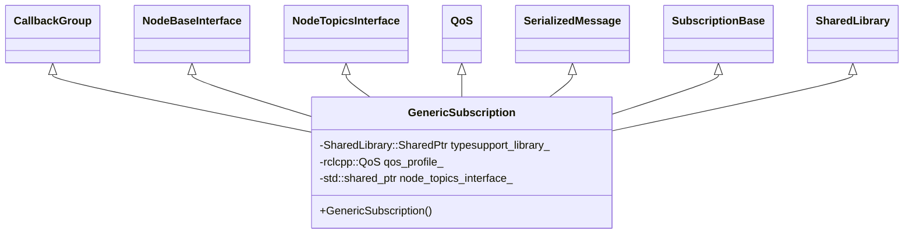

---
Crafted by [Genie](https://marketplace.visualstudio.com/items?itemName=genieai.chatgpt-vscode)
---

## You

下面这段代码是在 ros2 项目中 rclcpp 相关的代码，请联系所有函数之间可能的相互联系，梳理、解释这份文件的功能、含义以及调用关系（中文）。（请给出详细完善的回答，不限制字数）

## Trantor

这个文件定义了一个名为 `GenericSubscription` 的类，它是 `rclcpp::SubscriptionBase` 的子类。`GenericSubscription` 类用于处理在编译时无法知道类型的序列化消息的订阅。这个类不支持进程内处理。

### 构造函数

`GenericSubscription` 的构造函数接收以下参数：

- `node_base`：指向父节点的 `NodeBaseInterface` 的指针。
- `ts_lib`：类型支持库，需要对应于 `topic_type`。
- `topic_name`：主题名称。
- `topic_type`：主题类型。
- `qos`：QoS 设置。
- `callback`：用于序列化形式的新消息的回调。
- `options`：订阅选项。目前并非所有订阅选项都受到尊重，对于此订阅唯一相关的选项是 `event_callbacks`、`use_default_callbacks`、`ignore_local_publications` 和 `callback_group`。

### 成员函数

`GenericSubscription` 类包含以下成员函数：

1. `create_message()`：创建一个新的消息实例。由于订阅仅限于序列化消息，因此与 `create_serialized_message()` 相同。
2. `create_serialized_message()`：创建一个新的 `rclcpp::SerializedMessage` 实例。
3. `handle_message()`：将消息转换为 `rclcpp::SerializedMessage` 并调用回调。
4. `handle_serialized_message()`：处理将 `rclcpp::SerializedMessage` 分派给用户回调。
5. `handle_loaned_message()`：当前未实现此功能。
6. `return_message()`：返回消息。由于订阅仅限于序列化消息，因此与 `return_serialized_message()` 相同。
7. `return_serialized_message()`：返回一个 `rclcpp::SerializedMessage` 实例。

### 调用关系

1. 当用户创建一个 `GenericSubscription` 实例时，构造函数会被调用。在构造函数中，它将调用父类 `SubscriptionBase` 的构造函数，并初始化回调和类型支持库。

2. 当收到新消息时，`handle_message()` 函数会被调用。这个函数将消息转换为 `rclcpp::SerializedMessage` 并调用 `handle_serialized_message()` 函数。

3. `handle_serialized_message()` 函数负责处理将 `rclcpp::SerializedMessage` 分派给用户回调。

4. 当需要创建或返回消息时，`create_message()`、`create_serialized_message()`、`return_message()` 和 `return_serialized_message()` 函数会被调用。

### 总结

`GenericSubscription` 类是用于处理在编译时无法知道类型的序列化消息的订阅。它提供了一种方法来处理这些消息并将其分派给用户定义的回调。为了正确订阅主题，需要将此订阅添加到传递给构造函数的节点的 `node_topic_interface` 中。可以参考 `rclcpp::Node::create_generic_subscription()` 或 `rclcpp::create_generic_subscription()` 创建此类的实例并将其添加到 `node_topic_interface`。

## You

这份代码中包含的头文件都是确实使用到的，并且也是在 rclcpp 中的文件，请联系这些文件对上述代码进行综合全面的分析

## Trantor

在这份代码中，包含了以下头文件：

1. `rclcpp/callback_group.hpp`：提供了 `CallbackGroup` 类，用于管理回调组。在 `GenericSubscription` 的构造函数中，通过订阅选项（`options`）设置回调组。

2. `rclcpp/macros.hpp`：提供了一些宏定义，例如 `RCLCPP_SMART_PTR_DEFINITIONS` 和 `RCLCPP_DISABLE_COPY`。这些宏用于智能指针类型的定义和禁用类的拷贝构造函数及赋值运算符。

3. `rclcpp/node_interfaces/node_base_interface.hpp`：提供了 `NodeBaseInterface` 类，它是节点接口的基类。在 `GenericSubscription` 的构造函数中，需要传入一个指向父节点的 `NodeBaseInterface` 指针。

4. `rclcpp/node_interfaces/node_topics_interface.hpp`：提供了 `NodeTopicsInterface` 类，它是节点主题接口的基类。为了正确订阅主题，需要将 `GenericSubscription` 添加到传递给构造函数的节点的 `node_topic_interface` 中。

5. `rclcpp/qos.hpp`：提供了 `QoS` 类，用于表示 ROS 2 中的服务质量（Quality of Service）。在 `GenericSubscription` 的构造函数中，需要传入一个 `QoS` 对象。

6. `rclcpp/serialized_message.hpp`：提供了 `SerializedMessage` 类，用于表示序列化后的消息。`GenericSubscription` 类处理的消息都是序列化后的消息。

7. `rclcpp/subscription_base.hpp`：提供了 `SubscriptionBase` 类，它是订阅的基类。`GenericSubscription` 类继承自 `SubscriptionBase` 类。

8. `rclcpp/typesupport_helpers.hpp`：提供了一些类型支持相关的辅助函数，例如 `get_typesupport_handle()`。在 `GenericSubscription` 的构造函数中，使用这个函数获取类型支持句柄。

9. `rclcpp/visibility_control.hpp`：提供了一些宏定义，用于控制符号的可见性。在这份代码中，使用了 `RCLCPP_PUBLIC` 宏来声明公共成员函数。

10. `rcpputils/shared_library.hpp`：提供了 `SharedLibrary` 类，用于加载和卸载共享库。在 `GenericSubscription` 类中，需要传入一个指向类型支持库的 `SharedLibrary` 指针。

通过分析这些头文件，我们可以更深入地了解 `GenericSubscription` 类如何与其他 rclcpp 组件进行交互。`GenericSubscription` 类依赖于这些组件来实现序列化消息的订阅、回调管理、节点接口、QoS 设置以及类型支持等功能。

## You

我希望以 uml 视图进一步说明上述代码，并以 mermaid 格式输出

## Trantor

以下是使用 [Mermaid](https://mermaid-js.github.io/mermaid/#/) 格式的 UML 类图，描述了上述代码中涉及的类及其关系：

在这个 UML 类图中，`GenericSubscription` 类与其他相关类之间的关系如下：

- `CallbackGroup`：`GenericSubscription` 类依赖于 `CallbackGroup` 类来管理回调组。
- `NodeBaseInterface`：`GenericSubscription` 类依赖于 `NodeBaseInterface` 类来获取父节点信息。
- `NodeTopicsInterface`：`GenericSubscription` 类依赖于 `NodeTopicsInterface` 类来订阅主题。
- `QoS`：`GenericSubscription` 类依赖于 `QoS` 类来设置服务质量（Quality of Service）。
- `SerializedMessage`：`GenericSubscription` 类处理的消息都是序列化后的消息，因此依赖于 `SerializedMessage` 类。
- `SubscriptionBase`：`GenericSubscription` 类继承自 `SubscriptionBase` 类，实现订阅功能。
- `SharedLibrary`：`GenericSubscription` 类依赖于 `SharedLibrary` 类来加载和卸载类型支持库。
