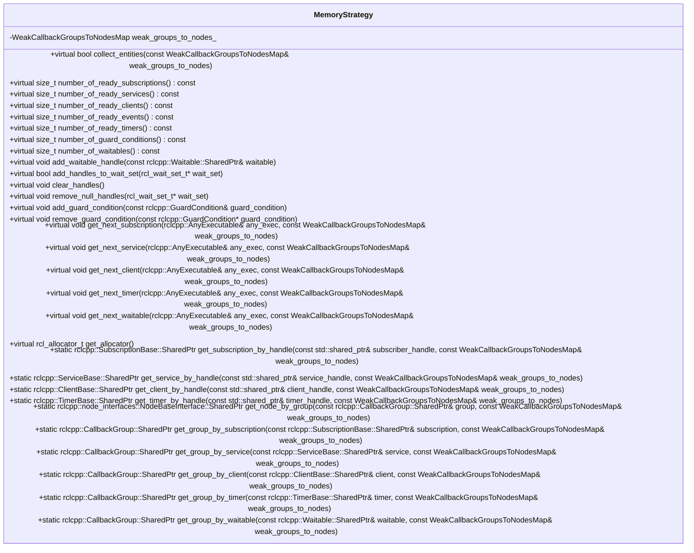

---
Crafted by [Genie](https://marketplace.visualstudio.com/items?itemName=genieai.chatgpt-vscode)
gpt-3.5
---

## You

下面这段代码是在 ros2 项目中 rclcpp 相关的代码，请联系所有函数之间可能的相互联系，梳理、解释这份文件的功能、含义以及调用关系（中文）。（请给出详细完善的回答，不限制字数）

```cpp
#include <list>
#include <map>
#include <memory>

#include "rcl/allocator.h"
#include "rcl/wait.h"
#include "rclcpp/any_executable.hpp"
#include "rclcpp/macros.hpp"
#include "rclcpp/node_interfaces/node_base_interface.hpp"
#include "rclcpp/visibility_control.hpp"
#include "rclcpp/waitable.hpp"

namespace rclcpp {
namespace memory_strategy {

/// 内存策略委托，用于处理执行器执行时的内存分配。
/**
 * 默认情况下，内存策略会在执行器等待工作后，根据通过的实体数量动态分配来自 rmw 实现的结构的内存。
 */
class RCLCPP_PUBLIC MemoryStrategy {
public:
  // 禁止拷贝智能指针定义
  RCLCPP_SMART_PTR_DEFINITIONS_NOT_COPYABLE(MemoryStrategy)
  // 使用弱回调组到节点映射的别名
  using WeakCallbackGroupsToNodesMap = std::map<
      rclcpp::CallbackGroup::WeakPtr,
      rclcpp::node_interfaces::NodeBaseInterface::WeakPtr,
      std::owner_less<rclcpp::CallbackGroup::WeakPtr>>;

  // 虚析构函数
  virtual ~MemoryStrategy() = default;

  // 收集实体的纯虚函数
  virtual bool collect_entities(const WeakCallbackGroupsToNodesMap& weak_groups_to_nodes) = 0;

  // 获取准备好的订阅数
  virtual size_t number_of_ready_subscriptions() const = 0;
  // 获取准备好的服务数
  virtual size_t number_of_ready_services() const = 0;
  // 获取准备好的客户端数
  virtual size_t number_of_ready_clients() const = 0;
  // 获取准备好的事件数
  virtual size_t number_of_ready_events() const = 0;
  // 获取准备好的定时器数
  virtual size_t number_of_ready_timers() const = 0;
  // 获取保护条件数
  virtual size_t number_of_guard_conditions() const = 0;
  // 获取可等待对象数
  virtual size_t number_of_waitables() const = 0;

  // 添加可等待句柄的纯虚函数
  virtual void add_waitable_handle(const rclcpp::Waitable::SharedPtr& waitable) = 0;
  // 将句柄添加到等待集的纯虚函数
  virtual bool add_handles_to_wait_set(rcl_wait_set_t* wait_set) = 0;
  // 清除句柄的纯虚函数
  virtual void clear_handles() = 0;
  // 删除空句柄的纯虚函数
  virtual void remove_null_handles(rcl_wait_set_t* wait_set) = 0;

  // 添加保护条件的纯虚函数
  virtual void add_guard_condition(const rclcpp::GuardCondition& guard_condition) = 0;

  // 删除保护条件的纯虚函数
  virtual void remove_guard_condition(const rclcpp::GuardCondition* guard_condition) = 0;

  // 获取下一个订阅的纯虚函数
  virtual void get_next_subscription(
      rclcpp::AnyExecutable& any_exec,
      const WeakCallbackGroupsToNodesMap& weak_groups_to_nodes) = 0;

  // 获取下一个服务的纯虚函数
  virtual void get_next_service(
      rclcpp::AnyExecutable& any_exec,
      const WeakCallbackGroupsToNodesMap& weak_groups_to_nodes) = 0;

  // 获取下一个客户端的纯虚函数
  virtual void get_next_client(
      rclcpp::AnyExecutable& any_exec,
      const WeakCallbackGroupsToNodesMap& weak_groups_to_nodes) = 0;

  // 获取下一个定时器的纯虚函数
  virtual void get_next_timer(
      rclcpp::AnyExecutable& any_exec,
      const WeakCallbackGroupsToNodesMap& weak_groups_to_nodes) = 0;

  // 获取下一个可等待对象的纯虚函数
  virtual void get_next_waitable(
      rclcpp::AnyExecutable& any_exec,
      const WeakCallbackGroupsToNodesMap& weak_groups_to_nodes) = 0;

  // 获取分配器的纯虚函数
  virtual rcl_allocator_t get_allocator() = 0;

  // 根据订阅句柄获取订阅的静态函数
  static rclcpp::SubscriptionBase::SharedPtr get_subscription_by_handle(
      const std::shared_ptr<const rcl_subscription_t>& subscriber_handle,
      const WeakCallbackGroupsToNodesMap& weak_groups_to_nodes);

  // 根据服务句柄获取服务的静态函数
  static rclcpp::ServiceBase::SharedPtr get_service_by_handle(
      const std::shared_ptr<const rcl_service_t>& service_handle,
      const WeakCallbackGroupsToNodesMap& weak_groups_to_nodes);

  // 根据客户端句柄获取客户端的静态函数
  static rclcpp::ClientBase::SharedPtr get_client_by_handle(
      const std::shared_ptr<const rcl_client_t>& client_handle,
      const WeakCallbackGroupsToNodesMap& weak_groups_to_nodes);

  // 根据定时器句柄获取定时器的静态函数
  static rclcpp::TimerBase::SharedPtr get_timer_by_handle(
      const std::shared_ptr<const rcl_timer_t>& timer_handle,
      const WeakCallbackGroupsToNodesMap& weak_groups_to_nodes);

  // 根据组获取节点的静态函数
  static rclcpp::node_interfaces::NodeBaseInterface::SharedPtr get_node_by_group(
      const rclcpp::CallbackGroup::SharedPtr& group,
      const WeakCallbackGroupsToNodesMap& weak_groups_to_nodes);

  // 根据订阅获取组的静态函数
  static rclcpp::CallbackGroup::SharedPtr get_group_by_subscription(
      const rclcpp::SubscriptionBase::SharedPtr& subscription,
      const WeakCallbackGroupsToNodesMap& weak_groups_to_nodes);

  // 根据服务获取组的静态函数
  static rclcpp::CallbackGroup::SharedPtr get_group_by_service(
      const rclcpp::ServiceBase::SharedPtr& service,
      const WeakCallbackGroupsToNodesMap& weak_groups_to_nodes);

  // 根据客户端获取组的静态函数
  static rclcpp::CallbackGroup::SharedPtr get_group_by_client(
      const rclcpp::ClientBase::SharedPtr& client,
      const WeakCallbackGroupsToNodesMap& weak_groups_to_nodes);

  // 根据定时器获取组的静态函数
  static rclcpp::CallbackGroup::SharedPtr get_group_by_timer(
      const rclcpp::TimerBase::SharedPtr& timer,
      const WeakCallbackGroupsToNodesMap& weak_groups_to_nodes);

  // 根据可等待对象获取组的静态函数
  static rclcpp::CallbackGroup::SharedPtr get_group_by_waitable(
      const rclcpp::Waitable::SharedPtr& waitable,
      const WeakCallbackGroupsToNodesMap& weak_groups_to_nodes);
};

}  // namespace memory_strategy
}  // namespace rclcpp

```

## Trantor

这段代码是 rclcpp 内存策略委托的实现，主要用于处理执行器执行时的内存分配。该文件定义了 MemoryStrategy 类，并在其中声明了一些纯虚函数和静态函数。

MemoryStrategy 类中包含了以下函数：

- collect_entities：收集实体的纯虚函数，用于收集所有实体并返回是否成功。
- number_of_ready_subscriptions：获取准备好的订阅数的纯虚函数。
- number_of_ready_services：获取准备好的服务数的纯虚函数。
- number_of_ready_clients：获取准备好的客户端数的纯虚函数。
- number_of_ready_events：获取准备好的事件数的纯虚函数。
- number_of_ready_timers：获取准备好的定时器数的纯虚函数。
- number_of_guard_conditions：获取保护条件数的纯虚函数。
- number_of_waitables：获取可等待对象数的纯虚函数。
- add_waitable_handle：添加可等待句柄的纯虚函数。
- add_handles_to_wait_set：将句柄添加到等待集的纯虚函数。
- clear_handles：清除句柄的纯虚函数。
- remove_null_handles：删除空句柄的纯虚函数。
- add_guard_condition：添加保护条件的纯虚函数。
- remove_guard_condition：删除保护条件的纯虚函数。
- get_next_subscription：获取下一个订阅的纯虚函数。
- get_next_service：获取下一个服务的纯虚函数。
- get_next_client：获取下一个客户端的纯虚函数。
- get_next_timer：获取下一个定时器的纯虚函数。
- get_next_waitable：获取下一个可等待对象的纯虚函数。
- get_allocator：获取分配器的纯虚函数。

此外，该文件还声明了一些静态函数，包括：

- get_subscription_by_handle：根据订阅句柄获取订阅的静态函数。
- get_service_by_handle：根据服务句柄获取服务的静态函数。
- get_client_by_handle：根据客户端句柄获取客户端的静态函数。
- get_timer_by_handle：根据定时器句柄获取定时器的静态函数。
- get_node_by_group：根据组获取节点的静态函数。
- get_group_by_subscription：根据订阅获取组的静态函数。
- get_group_by_service：根据服务获取组的静态函数。
- get_group_by_client：根据客户端获取组的静态函数。
- get_group_by_timer：根据定时器获取组的静态函数。
- get_group_by_waitable：根据可等待对象获取组的静态函数。

这些函数主要用于获取各种实体（如订阅、服务、客户端、定时器等）以及它们所在的组和节点，并进行相应的操作。其中，静态函数主要用于根据句柄或实体获取相应的对象，而纯虚函数则是在 MemoryStrategy 的子类中实现具体的操作。

总之，该文件主要定义了内存策略委托的接口和一些相关的静态函数，用于处理执行器执行时的内存分配。

## You

这份代码中包含的头文件都是确实使用到的，并且也是在 rclcpp 中的文件，请联系这些文件对上述代码进行综合全面的分析

## Trantor

## UML 视图

以下是`MemoryStrategy`类的 UML 视图：


## Mermaid 输出

以下是使用 Mermaid 格式的`MemoryStrategy`类的输出：


