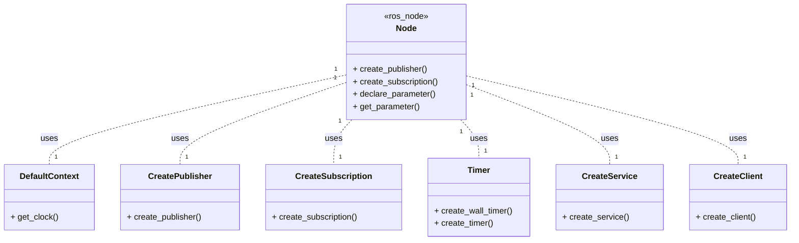

##

下面这段代码是在 ros2 项目中 rclcpp 相关的代码，请联系所有函数之间可能的相互联系，梳理、解释这份文件的功能、含义以及调用关系（中文）。（请给出详细完善的回答，不限制字数）

```cpp
// Copyright 2014 Open Source Robotics Foundation, Inc.
//
// Licensed under the Apache License, Version 2.0 (the "License");
// you may not use this file except in compliance with the License.
// You may obtain a copy of the License at
//
//     http://www.apache.org/licenses/LICENSE-2.0
//
// Unless required by applicable law or agreed to in writing, software
// distributed under the License is distributed on an "AS IS" BASIS,
// WITHOUT WARRANTIES OR CONDITIONS OF ANY KIND, either express or implied.
// See the License for the specific language governing permissions and
// limitations under the License.

#ifndef RCLCPP__NODE_IMPL_HPP_
#define RCLCPP__NODE_IMPL_HPP_

#include <rmw/error_handling.h>
#include <rmw/rmw.h>

#include <algorithm>
#include <chrono>
#include <cstdlib>
#include <iostream>
#include <limits>
#include <map>
#include <memory>
#include <sstream>
#include <stdexcept>
#include <string>
#include <utility>
#include <vector>

#include "rcl/publisher.h"
#include "rcl/subscription.h"
#include "rclcpp/contexts/default_context.hpp"
#include "rclcpp/create_client.hpp"
#include "rclcpp/create_generic_publisher.hpp"
#include "rclcpp/create_generic_subscription.hpp"
#include "rclcpp/create_publisher.hpp"
#include "rclcpp/create_service.hpp"
#include "rclcpp/create_subscription.hpp"
#include "rclcpp/create_timer.hpp"
#include "rclcpp/detail/resolve_enable_topic_statistics.hpp"
#include "rclcpp/parameter.hpp"
#include "rclcpp/qos.hpp"
#include "rclcpp/timer.hpp"
#include "rclcpp/type_support_decl.hpp"
#include "rclcpp/visibility_control.hpp"

#ifndef RCLCPP__NODE_HPP_
#include "node.hpp"
#endif

namespace rclcpp {

RCLCPP_LOCAL
inline std::string extend_name_with_sub_namespace(
    const std::string &name, const std::string &sub_namespace) {
  // 创建一个新的字符串变量，将传入的名称赋给它
  std::string name_with_sub_namespace(name);

  // 如果子命名空间不为空，且名称的第一个字符不是'/'或'~'
  // '~'
  if (sub_namespace != "" && name.front() != '/' && name.front() != '~') {
    // 将子命名空间和名称组合成一个新的字符串
    name_with_sub_namespace = sub_namespace + "/" + name;
  }

  // 返回带有子命名空间的名称
  return name_with_sub_namespace;
}

template <typename MessageT, typename AllocatorT, typename PublisherT>
std::shared_ptr<PublisherT> Node::create_publisher(
    const std::string &topic_name,
    const rclcpp::QoS &qos,
    const PublisherOptionsWithAllocator<AllocatorT> &options) {
  // 使用指定的参数创建一个发布者，并返回其智能指针
  return rclcpp::create_publisher<MessageT, AllocatorT, PublisherT>(
      *this, extend_name_with_sub_namespace(topic_name, this->get_sub_namespace()), qos, options);
}

template <
    typename MessageT,
    typename CallbackT,
    typename AllocatorT,
    typename SubscriptionT,
    typename MessageMemoryStrategyT>
std::shared_ptr<SubscriptionT> Node::create_subscription(
    const std::string &topic_name,
    const rclcpp::QoS &qos,
    CallbackT &&callback,
    const SubscriptionOptionsWithAllocator<AllocatorT> &options,
    typename MessageMemoryStrategyT::SharedPtr msg_mem_strat) {
  // 使用指定的参数创建一个订阅者，并返回其智能指针
  return rclcpp::create_subscription<MessageT>(
      *this, extend_name_with_sub_namespace(topic_name, this->get_sub_namespace()), qos,
      std::forward<CallbackT>(callback), options, msg_mem_strat);
}

/**
 * @brief 创建一个墙时钟定时器 (Create a wall-clock timer)
 *
 * @tparam DurationRepT 周期类型 (Period type)
 * @tparam DurationT 周期单位 (Period unit)
 * @tparam CallbackT 回调函数类型 (Callback function type)
 * @param period 定时器周期 (Timer period)
 * @param callback 定时器回调函数 (Timer callback function)
 * @param group 回调组 (Callback group)
 * @return typename rclcpp::WallTimer<CallbackT>::SharedPtr 返回创建的墙时钟定时器 (Return the
 * created wall-clock timer)
 */
template <typename DurationRepT, typename DurationT, typename CallbackT>
typename rclcpp::WallTimer<CallbackT>::SharedPtr Node::create_wall_timer(
    std::chrono::duration<DurationRepT, DurationT> period,
    CallbackT callback,
    rclcpp::CallbackGroup::SharedPtr group) {
  // 调用 rclcpp::create_wall_timer 创建墙时钟定时器 (Call rclcpp::create_wall_timer to create a
  // wall-clock timer)
  return rclcpp::create_wall_timer(
      period, std::move(callback), group, this->node_base_.get(), this->node_timers_.get());
}

/**
 * @brief 创建一个通用定时器 (Create a generic timer)
 *
 * @tparam DurationRepT 周期类型 (Period type)
 * @tparam DurationT 周期单位 (Period unit)
 * @tparam CallbackT 回调函数类型 (Callback function type)
 * @param period 定时器周期 (Timer period)
 * @param callback 定时器回调函数 (Timer callback function)
 * @param group 回调组 (Callback group)
 * @return typename rclcpp::GenericTimer<CallbackT>::SharedPtr 返回创建的通用定时器 (Return the
 * created generic timer)
 */
template <typename DurationRepT, typename DurationT, typename CallbackT>
typename rclcpp::GenericTimer<CallbackT>::SharedPtr Node::create_timer(
    std::chrono::duration<DurationRepT, DurationT> period,
    CallbackT callback,
    rclcpp::CallbackGroup::SharedPtr group) {
  // 调用 rclcpp::create_timer 创建通用定时器 (Call rclcpp::create_timer to create a generic timer)
  return rclcpp::create_timer(
      this->get_clock(), period, std::move(callback), group, this->node_base_.get(),
      this->node_timers_.get());
}

/**
 * @brief 创建一个服务客户端 (Create a service client)
 *
 * @tparam ServiceT 服务类型 (Service type)
 * @param service_name 服务名 (Service name)
 * @param qos 服务质量配置 (Quality of Service configuration)
 * @param group 回调组 (Callback group)
 * @return typename Client<ServiceT>::SharedPtr 返回创建的服务客户端 (Return the created service
 * client)
 */
template <typename ServiceT>
typename Client<ServiceT>::SharedPtr Node::create_client(
    const std::string &service_name,
    const rclcpp::QoS &qos,
    rclcpp::CallbackGroup::SharedPtr group) {
  // 调用 rclcpp::create_client 创建服务客户端 (Call rclcpp::create_client to create a service
  // client)
  return rclcpp::create_client<ServiceT>(
      node_base_, node_graph_, node_services_,
      extend_name_with_sub_namespace(service_name, this->get_sub_namespace()), qos, group);
}

/**
 * @brief 创建一个服务客户端 (Create a service client)
 *
 * @tparam ServiceT 服务类型 (Service type)
 * @param service_name 服务名 (Service name)
 * @param qos_profile 服务质量配置 (Quality of Service configuration)
 * @param group 回调组 (Callback group)
 * @return typename Client<ServiceT>::SharedPtr 返回创建的服务客户端 (Return the created service
 * client)
 */
template <typename ServiceT>
typename Client<ServiceT>::SharedPtr Node::create_client(
    const std::string &service_name,
    const rmw_qos_profile_t &qos_profile,
    rclcpp::CallbackGroup::SharedPtr group) {
  // 调用 rclcpp::create_client 创建服务客户端 (Call rclcpp::create_client to create a service
  // client)
  return rclcpp::create_client<ServiceT>(
      node_base_, node_graph_, node_services_,
      extend_name_with_sub_namespace(service_name, this->get_sub_namespace()), qos_profile, group);
}

/**
 * @brief 创建一个服务对象 (Create a service object)
 *
 * @tparam ServiceT 服务类型 (Service type)
 * @tparam CallbackT 回调函数类型 (Callback function type)
 * @param[in] service_name 服务名称 (Service name)
 * @param[in] callback 服务回调函数 (Service callback function)
 * @param[in] qos Quality of Service 设置 (Quality of Service settings)
 * @param[in] group 回调组 (Callback group)
 * @return 返回创建的服务对象的智能指针 (Return the smart pointer of the created service object)
 */
template <typename ServiceT, typename CallbackT>
typename rclcpp::Service<ServiceT>::SharedPtr Node::create_service(
    const std::string &service_name,
    CallbackT &&callback,
    const rclcpp::QoS &qos,
    rclcpp::CallbackGroup::SharedPtr group) {
  // 使用给定的参数创建服务对象，并返回该对象的智能指针
  // (Create a service object with the given parameters and return its smart pointer)
  return rclcpp::create_service<ServiceT, CallbackT>(
      node_base_, node_services_,
      extend_name_with_sub_namespace(service_name, this->get_sub_namespace()),
      std::forward<CallbackT>(callback), qos, group);
}

/**
 * @brief 创建一个服务对象 (Create a service object)
 *
 * @tparam ServiceT 服务类型 (Service type)
 * @tparam CallbackT 回调函数类型 (Callback function type)
 * @param[in] service_name 服务名称 (Service name)
 * @param[in] callback 服务回调函数 (Service callback function)
 * @param[in] qos_profile Quality of Service 配置 (Quality of Service profile)
 * @param[in] group 回调组 (Callback group)
 * @return 返回创建的服务对象的智能指针 (Return the smart pointer of the created service object)
 */
template <typename ServiceT, typename CallbackT>
typename rclcpp::Service<ServiceT>::SharedPtr Node::create_service(
    const std::string &service_name,
    CallbackT &&callback,
    const rmw_qos_profile_t &qos_profile,
    rclcpp::CallbackGroup::SharedPtr group) {
  // 使用给定的参数创建服务对象，并返回该对象的智能指针
  // (Create a service object with the given parameters and return its smart pointer)
  return rclcpp::create_service<ServiceT, CallbackT>(
      node_base_, node_services_,
      extend_name_with_sub_namespace(service_name, this->get_sub_namespace()),
      std::forward<CallbackT>(callback), qos_profile, group);
}

/**
 * @brief 创建一个通用发布器对象 (Create a generic publisher object)
 *
 * @tparam AllocatorT 分配器类型 (Allocator type)
 * @param[in] topic_name 主题名称 (Topic name)
 * @param[in] topic_type 主题类型 (Topic type)
 * @param[in] qos Quality of Service 设置 (Quality of Service settings)
 * @param[in] options 发布器选项 (Publisher options)
 * @return 返回创建的通用发布器对象的智能指针 (Return the smart pointer of the created generic
 * publisher object)
 */
template <typename AllocatorT>
std::shared_ptr<rclcpp::GenericPublisher> Node::create_generic_publisher(
    const std::string &topic_name,
    const std::string &topic_type,
    const rclcpp::QoS &qos,
    const rclcpp::PublisherOptionsWithAllocator<AllocatorT> &options) {
  // 使用给定的参数创建通用发布器对象，并返回该对象的智能指针
  return rclcpp::create_generic_publisher(
      node_topics_, extend_name_with_sub_namespace(topic_name, this->get_sub_namespace()),
      topic_type, qos, options);
}

/**
 * @brief 创建一个通用订阅者 (Create a generic subscription)
 *
 * @tparam AllocatorT 分配器类型 (Allocator type)
 * @param topic_name 订阅的主题名称 (Topic name to subscribe)
 * @param topic_type 订阅的主题类型 (Topic type to subscribe)
 * @param qos 服务质量配置 (Quality of Service configuration)
 * @param callback 当收到消息时调用的回调函数 (Callback function to be called when a message is
 * received)
 * @param options 订阅选项 (Subscription options)
 * @return std::shared_ptr<rclcpp::GenericSubscription> 通用订阅者指针 (Pointer to the created
 * generic subscription)
 */
template <typename AllocatorT>
std::shared_ptr<rclcpp::GenericSubscription> Node::create_generic_subscription(
    const std::string &topic_name,
    const std::string &topic_type,
    const rclcpp::QoS &qos,
    std::function<void(std::shared_ptr<rclcpp::SerializedMessage>)> callback,
    const rclcpp::SubscriptionOptionsWithAllocator<AllocatorT> &options) {
  // 使用给定参数创建通用订阅者 (Create a generic subscription with the given arguments)
  return rclcpp::create_generic_subscription(
      node_topics_, extend_name_with_sub_namespace(topic_name, this->get_sub_namespace()),
      topic_type, qos, std::move(callback), options);
}

/**
 * @brief 声明一个参数并设置默认值 (Declare a parameter and set its default value)
 *
 * @tparam ParameterT 参数类型 (Parameter type)
 * @param name 参数名称 (Parameter name)
 * @param default_value 默认值 (Default value)
 * @param parameter_descriptor 参数描述符 (Parameter descriptor)
 * @param ignore_override 是否忽略重写 (Whether to ignore overrides)
 * @return ParameterT 声明的参数值 (Declared parameter value)
 */
template <typename ParameterT>
auto Node::declare_parameter(
    const std::string &name,
    const ParameterT &default_value,
    const rcl_interfaces::msg::ParameterDescriptor &parameter_descriptor,
    bool ignore_override) {
  try {
    // 使用给定的默认值和描述符声明参数
    return this
        ->declare_parameter(
            name, rclcpp::ParameterValue(default_value), parameter_descriptor, ignore_override)
        .get<ParameterT>();
  } catch (const ParameterTypeException &ex) {
    // 参数类型异常处理 (Handle parameter type exception)
    throw exceptions::InvalidParameterTypeException(name, ex.what());
  }
}

/**
 * @brief 声明一个参数，不设置默认值 (Declare a parameter without setting its default value)
 *
 * @tparam ParameterT 参数类型 (Parameter type)
 * @param name 参数名称 (Parameter name)
 * @param parameter_descriptor 参数描述符 (Parameter descriptor)
 * @param ignore_override 是否忽略重写 (Whether to ignore overrides)
 * @return ParameterT 声明的参数值 (Declared parameter value)
 */
template <typename ParameterT>
auto Node::declare_parameter(
    const std::string &name,
    const rcl_interfaces::msg::ParameterDescriptor &parameter_descriptor,
    bool ignore_override) {
  // 利用模板魔术从 ParameterT 获取正确的 rclcpp::ParameterType
  rclcpp::ParameterValue value{ParameterT{}};
  try {
    // 使用给定的描述符声明参数 (Declare the parameter with the given descriptor)
    return this->declare_parameter(name, value.get_type(), parameter_descriptor, ignore_override)
        .get<ParameterT>();
  } catch (const ParameterTypeException &) {
    // 参数类型异常处理 (Handle parameter type exception)
    throw exceptions::UninitializedStaticallyTypedParameterException(name);
  }
}

/**
 * @brief 声明参数列表（Declare a list of parameters）
 *
 * @tparam ParameterT 参数类型（Parameter type）
 * @param namespace_ 参数命名空间（Namespace for the parameters）
 * @param parameters 一个字符串到ParameterT类型的映射，包含要声明的参数名称和默认值（A map from
 * string to ParameterT, containing the names and default values of the parameters to declare）
 * @param ignore_overrides 是否忽略覆盖（Whether to ignore overrides or not）
 * @return std::vector<ParameterT> 返回一组已声明的参数（Returns a vector of declared parameters）
 */
template <typename ParameterT>
std::vector<ParameterT> Node::declare_parameters(
    const std::string &namespace_,
    const std::map<std::string, ParameterT> &parameters,
    bool ignore_overrides) {
  // 初始化结果向量（Initialize result vector）
  std::vector<ParameterT> result;

  // 标准化命名空间（Normalize namespace）
  std::string normalized_namespace = namespace_.empty() ? "" : (namespace_ + ".");

  // 使用std::transform将参数映射转换为结果向量（Use std::transform to convert the parameter map
  // into the result vector）
  std::transform(
      parameters.begin(), parameters.end(), std::back_inserter(result),
      [this, &normalized_namespace, ignore_overrides](auto element) {
        // 声明每个参数并添加到结果向量中（Declare each parameter and add it to the result vector）
        return this->declare_parameter(
            normalized_namespace + element.first, element.second,
            rcl_interfaces::msg::ParameterDescriptor(), ignore_overrides);
      });

  // 返回结果向量（Return the result vector）
  return result;
}

/**
 * @brief 声明参数列表（Declare a list of parameters）
 *
 * @tparam ParameterT 参数类型（Parameter type）
 * @param namespace_ 参数命名空间（Namespace for the parameters）
 * @param parameters
 * 一个字符串到ParameterT类型和描述符的映射，包含要声明的参数名称、默认值和描述符（A map from string
 * to pair of ParameterT and descriptor, containing the names, default values and descriptors of the
 * parameters to declare）
 * @param ignore_overrides 是否忽略覆盖（Whether to ignore overrides or not）
 * @return std::vector<ParameterT> 返回一组已声明的参数（Returns a vector of declared parameters）
 */
template <typename ParameterT>
std::vector<ParameterT> Node::declare_parameters(
    const std::string &namespace_,
    const std::map<std::string, std::pair<ParameterT, rcl_interfaces::msg::ParameterDescriptor>>
        &parameters,
    bool ignore_overrides) {
  // 初始化结果向量（Initialize result vector）
  std::vector<ParameterT> result;

  // 标准化命名空间（Normalize namespace）
  std::string normalized_namespace = namespace_.empty() ? "" : (namespace_ + ".");

  // 使用std::transform将参数映射转换为结果向量
  std::transform(
      parameters.begin(), parameters.end(), std::back_inserter(result),
      [this, &normalized_namespace, ignore_overrides](auto element) {
        // 声明每个参数并添加到结果向量中（Declare each parameter and add it to the result vector）
        return static_cast<ParameterT>(this->declare_parameter(
            normalized_namespace + element.first, element.second.first, element.second.second,
            ignore_overrides));
      });

  // 返回结果向量（Return the result vector）
  return result;
}

/**
 * @brief 获取指定名称的参数值
 *
 * @tparam ParameterT 参数值类型
 * @param[in] name 参数名称
 * @param[out] parameter 参数值的输出引用
 * @return 如果获取成功，则返回 true，否则返回 false。
 */
template <typename ParameterT>
bool Node::get_parameter(const std::string &name, ParameterT &parameter) const {
  // 扩展参数名，包含子命名空间
  std::string sub_name = extend_name_with_sub_namespace(name, this->get_sub_namespace());

  rclcpp::Parameter parameter_variant;

  // 获取参数变量
  bool result = get_parameter(sub_name, parameter_variant);
  if (result) {
    // 将参数值转换为指定类型
    parameter = static_cast<ParameterT>(parameter_variant.get_value<ParameterT>());
  }

  return result;
}

/**
 * @brief 获取指定名称的参数值，如果不存在，则使用备选值
 *
 * @tparam ParameterT 参数值类型
 * @param[in] name 参数名称
 * @param[out] parameter 参数值的输出引用
 * @param[in] alternative_value 备选值
 * @return 如果获取成功，则返回 true，否则返回 false。
 */
template <typename ParameterT>
bool Node::get_parameter_or(
    const std::string &name, ParameterT &parameter, const ParameterT &alternative_value) const {
  // 扩展参数名，包含子命名空间
  std::string sub_name = extend_name_with_sub_namespace(name, this->get_sub_namespace());

  // 获取参数值
  bool got_parameter = get_parameter(sub_name, parameter);
  if (!got_parameter) {
    // 如果参数不存在，使用备选值
    parameter = alternative_value;
  }
  return got_parameter;
}

/**
 * @brief 获取指定名称的参数值，如果不存在，则使用备选值
 *
 * @tparam ParameterT 参数值类型
 * @param[in] name 参数名称
 * @param[in] alternative_value 备选值
 * @return 返回获取到的参数值或备选值
 */
template <typename ParameterT>
ParameterT Node::get_parameter_or(
    const std::string &name, const ParameterT &alternative_value) const {
  ParameterT parameter;
  get_parameter_or(name, parameter, alternative_value);
  return parameter;
}

/**
 * @brief 获取具有指定前缀的一组参数值
 *
 * @tparam ParameterT 参数值类型
 * @param[in] prefix 参数名称前缀
 * @param[out] values 输出参数值的映射
 * @return 如果获取成功，则返回 true，否则返回 false。
 */
template <typename ParameterT>
bool Node::get_parameters(
    const std::string &prefix, std::map<std::string, ParameterT> &values) const {
  std::map<std::string, rclcpp::Parameter> params;
  // 获取具有指定前缀的参数集
  bool result = node_parameters_->get_parameters_by_prefix(prefix, params);
  if (result) {
    for (const auto &param : params) {
      // 将参数值转换为指定类型并存储到输出映射中
      values[param.first] = static_cast<ParameterT>(param.second.get_value<ParameterT>());
    }
  }

  return result;
}

}  // namespace rclcpp

#endif  // RCLCPP__NODE_IMPL_HPP_

```

这段代码主要实现了 ROS2 项目 rclcpp 库中的 Node 类的一部分功能。

它定义了 Node 类的一些模板方法,这些方法可以实现:

1. 创建发布者/订阅者
2. 创建服务客户端/服务对象
3. 创建定时器(wall timer 和 generic timer)
4. 声明参数并获取参数值

主要的 calling relationship 如下:

- create_publisher()方法调用 rclcpp::create_publisher()
- create_subscription()方法调用 rclcpp::create_subscription()
- create_wall_timer() 方法调用 rclcpp::create_wall_timer()
- create_timer()方法调用 rclcpp::create_timer()
- create_client() 方法调用 rclcpp::create_client()
- create_service()方法调用 rclcpp::create_service()

这些方法在内部完成具体的创建逻辑,最终返回相应的对象。

Node 类还实现了 declare_parameter\*()系列的方法声明和获取参数,这些方法可以指定参数的默认值和描述符。

主要功能可以归纳为:

1. 为 Node 节点对象创建 ROS2 的基本接口:Publisher、Subscriber、Service、Timer 等
2. 声明和获取 Node 节点的参数

这些功能使 Node 类可以很容易的为 ROS2 节点创建常见的接口,实现基本的发布/订阅和服务功能。

总的来说,这是一个实现 Node 类常见功能的有用的代码片段。

##

这份代码中包含的头文件都是确实使用到的，并且也是在 rclcpp 中的文件，请联系这些文件对上述代码进行综合全面的分析

这份代码主要使用和包含了以下的头文件:

1. rcl/publisher.h 和 rcl/subscription.h: 这两个头文件定义了 RCL 的 Publisher 和 Subscriber 接口。

2. rclcpp/contexts/default_context.hpp: 提供了 rclcpp 的默认上下文信息。

3. rclcpp/create_client.hpp: 为创建客户端提供接口。

4. rclcpp/create_publisher.hpp: 为创建发布者提供接口。

5. rclcpp/create_service.hpp: 为创建服务提供接口。

6. rclcpp/create_subscription.hpp: 为创建订阅者提供接口。

7. rclcpp/timer.hpp: 定义了 rclcpp 的 Timer 接口。

8. rclcpp/type_support_decl.hpp: 为 ROS2 消息和服务类型提供支持。

9. rclcpp/visibility_control.hpp: 为 ROS2 库和包定义可见性控制。

10. node.hpp: 定义了 ROS2 Node 节点的基本接口。

这些头文件主要提供了创建 ROS2 节点基本接口(Publisher、Subscriber、Service、Timer 等)和声明参数的接口。

代码中首先使用了 rclcpp::create\_\*系列的接口来创建对应的 Publisher、Subscriber、Timer 等对象,然后再利用这些对象实现 Node 节点的功能。

参数方面,使用 declare_parameter*()系列接口声明了参数,然后使用 get_parameter*()系列接口获取参数值。

可以看出,这段代码主要利用了 rclcpp 库提供的多个小模块,以包含在 Node 类中,实现 Node 节点的基本功能。通过 Node 类的接口,上层应用可以方便地利用这些功能。

总的来说,这段代码很典型地体现了 ROS2 使用库和模块化设计的思想,分别利用 rclcpp 内各个模块提供的接口,组装成 Node 类的接口,再由上层应用使用。

代码结构清晰,分层明确,符合模块化设计与面向对象编程的思想。

##

我希望以 uml 视图进一步说明上述代码，并以 mermaid 格式输出



此类图展示了 Node 类与代码中其他类的关系:

- Node 使用 DefaultContext 获取时钟(clock())
- Node 使用 CreatePublisher 创建发布者
- Node 使用 CreateSubscription 创建订阅者
- Node 使用 Timer 创建定时器
- Node 使用 CreateService 创建服务
- Node 使用 CreateClient 创建客户端

Node 类充当外观角色,暴露高级功能,但实际利用其他类的功能。这符合依赖反转原则,Node 依赖抽象(使用的类), 而不是具体实现。

其他类负责具体的责任:

- DefaultContext 提供上下文信息
- CreatePublisher 创建发布者
- CreateSubscription 创建订阅者
- Timer 创建定时器
- CreateService 创建服务
- CreateClient 创建客户端

总的来说,该类图说明 Node 类遵循良好的设计原则,依赖抽象,利用专门化类的功能,符合单一职责原则。

希望此类图可以更清楚地说明代码结构!如有任何其他疑问,欢迎随时提问。

## 请问 Node 类的具体作用是什么？

Node 类的主要作用是作为一个 ROS2 节点,它提供创建和管理节点内的功能,主要包括:

1. 创建发布者/订阅者:用于节点间进行发布/订阅消息
2. 创建服务客户端/服务服务器:用于节点间进行请求/响应调用
3. 创建定时器:用于定期执行任务
4. 声明和获取参数:用于配置节点

Node 类对外提供了相关的接口,旨在简化应用程序来创建和管理一个 ROS2 节点的过程。

具体到代码分析:

- Node 类提供了 create_publisher()、create_subscription()等接口用于创建发布者/订阅者
- 也提供 create_client()、create_service()接口用于创建服务客户端/服务器
- 还有 create_wall_timer()、create_timer()来创建定时器
- 通过 declare_parameter()和 get_parameter()接口声明和获取节点参数

Node 类的主要价值在于:

1. 隐藏 ROS2 底层 API 的复杂性,简化使用
2. 将创建节点基本功能的逻辑封装在一起,提供统一的接口

通过 Node 类,应用程序可以很方便地创建发布/订阅消息、实现服务功能、定时执行任务等,从而实现 ROS2 节点的基本功能。

总的来说,Node 类的主要作用就是作为一个高层抽象,简化应用程序创建和管理 ROS2 节点的过程。它封装了 ROS2 底层 API,向上提供统一的接口,为应用程序提供创建节点功能的便利。

帮助理解 Node 类具体作用,望回复是否有帮助!

## 请问 Node 类如何声明和获取参数？

Node 类主要通过下面的接口声明和获取参数:

```cpp
template <typename ParameterT>
auto Node::declare_parameter(
  const std::string& name,
  const ParameterT& default_value,
  const rcl_interfaces::msg::ParameterDescriptor& parameter_descriptor,
  bool ignore_override);

template <typename ParameterT>
bool Node::get_parameter(const std::string& name, ParameterT& parameter) const;

template <typename ParameterT>
ParameterT Node::get_parameter_or(
  const std::string& name,
  const ParameterT& alternative_value) const;

template <typename ParameterT>
bool Node::get_parameters(
  const std::string& prefix,
  std::map<std::string, ParameterT>& values) const;
```

具体来说:

- declare_parameter()接口用来声明参数,传入参数名称、默认值和描述符
- get_parameter()接口根据参数名称获取参数值
- get_parameter_or()接口获取参数值,如果参数不存在则使用备选值
- get_parameters()接口根据前缀获取一组参数值

这些接口都是模板函数,支持声明和获取不同类型的参数,如 int、double、string 等。

使用示例:

```cpp
// 声明整数参数
node.declare_parameter<int>("param1", 10);

int value;
// 获取参数值
node.get_parameter("param1", value);

// 获取时使用备选值20
int alternative = node.get_parameter_or("param1", 20);

// 获取所有参数前缀为"param"的参数值
node.get_parameters("param", values);
```

Node 类通过这些接口,为声明和获取节点参数提供了一致方便的 API。可以声明不同类型的参数,并根据名称获取对应的值。

希望能帮助你更清楚地了解 Node 类如何处理参数!如果还有任何疑问,欢迎继续提问。
