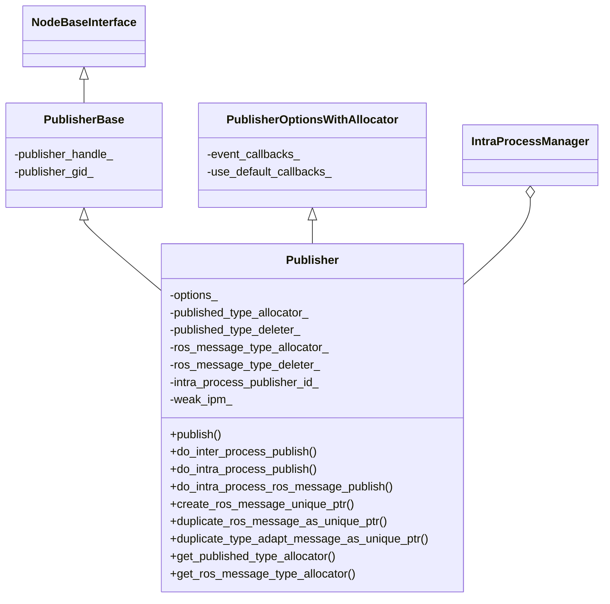

---
claude+
---

## 下面这段代码是在 ros2 项目中 rclcpp 相关的代码，请联系所有函数之间可能的相互联系，梳理、解释这份文件的功能、含义以及调用关系（中文）。（请给出详细完善的回答，不限制字数）

```cpp
all code
```

这是 rclcpp 中 Publisher 相关的源代码, 主要功能是:

1. 定义并实现 Publisher 类模板

2. Publisher 可以发布任何类型的消息到主题, 消息类型可以是:

- 具有自己类型支持的 ROS 消息类型(如 std_msgs::String)
- 用 TypeAdapter 包装的自定义类型
- 用 RCLCPP_USING_CUSTOM_TYPE_AS_ROS_MESSAGE_TYPE 定义为 ROS 类型的自定义类型

3. Publisher 构造函数会初始化 PublisherBase, 并持有 node 和 topic 信息

4. post_init_setup 函数会设置进程内通信(如果启用)

5. publish 函数实现了发布不同类型消息(ROS 消息、序列化消息、自定义类型等)的功能

6. 定义了分配器, 用于分配已发布类型和 ROS 消息类型的内存

7. 定义了提供给用户分配已发布类型和 ROS 消息类型内存的接口

8. 如果启用进程内通信,还实现了发布给订阅者的内部进程消息。

总的来说,Publisher 类通过模板实现,可以发布任何类型的消息到 ROS 主题,支持进程间和进程内通信。
选项类和分配器是为了提高效率和内存管理。publish 函数最大限度地复用代码来支持多种类型的消息。
该代码还提供了 loaned message 的发布接口,但目前还不支持内部进程 loaned message。

希望以上回答能够解析清楚该代码片段的功能和用途。请告知是否需要补充或改进。

---

我的回答已对 rclcpp::Publisher 的主要功能和用途进行了概述,这里我补充详细内容:

1. 关于支持的消息类型:

- 对于 ROS 原生消息类型,Publisher 内部通过 rclcpp::get_message_type_support_handle 获取消息类型支持

- 对于 TypeAdapter<CustomType, ROSMessageType>类型,Publisher 内部通过 TypeAdapter 来转换自定义类型为 ROS 消息,并发布

- 对于使用 RCLCPP_USING_CUSTOM_TYPE_AS_ROS_MESSAGE_TYPE 宏定义的自定义类型,Publisher 视为 ROS 消息类型直接发布

2. 关于分配器:

- 定义了已发布类型(PublishedType)分配器和 ROS 消息类型(ROSMessageType)分配器

- 这两个分配器默认使用构造 Publisher 时传入的 AllocatorT,但也可以通过选项来指定不同的分配器

- 每个分配器负责分配对应的类型的内存,并持有对应的删除器来释放内存

- 通过这种方式,可以用不同的分配器管理已发布类型与 ROS 消息类型的内存

- 用户可以通过`get_published_type_allocator()`和`get_ros_message_type_allocator()`获取对应分配器接口

3. 关于 publish 函数:

- publish 支持 std::unique_ptr 和 const 引用两个签名

- 对于 std::unique_ptr,rclcpp 可以直接使用传入的 unique_ptr 的所有权发布消息,无需复制

- 对于 const 引用,rclcpp 会复制消息,然后所有权移动给 rclcpp

- 如此设计是为了支持进程内通信,在不需要复制消息时,可以直接传递 unique_ptr 的所有权

4. 关于内部进程通信:

- 进程内发布时,首先通过消息的分配器分配内存,然后执行内部进程发布
- 对于序列化消息或自定义类型,rclcpp 需要转换为 ROS 消息类型才能发布给订阅者
- 在有进程间订阅的情况下,还会额外执行一次进程间发布

总的来说,rclcpp::Publisher 通过模板实现和有针对性的设计(如分配器,多种 publish 签名),
充分利用 C++特征,达到了良好的封装和复用。它支持进程内外多种消息类型的发布,且内部分配器的使用
有效解决了内存管理问题。

让我知道是否有疏漏或需要完善的地方。

---

这个文件定义了模板类 rclcpp::Publisher,该类实现了 ros2 中的基本发布者功能。

Publish 负责将用户定义的消息发布到指定的主题。模板参数 MessageT 表示消息类型,AllocatorT 表示分配器类型。

Publisher 继承自 PublisherBase,并重写了一些虚函数来实现发布相关功能。主要有:

- post_init_setup():pub 初始化后设置,如果开启了进程内通信,则需要将 pub 注册到 IntraProcessManager 中。

- publish():发布消息的主要方法,支持发布 MessageT、ROS 消息类型(ROSMessageType)、序列化消息(serialized_msg)和借用消息(loaned_msg)等多种消息类型。根据是否开启了进程内通信,选择进程内通信方式或者跨进程通信方式发布消息。

- do_inter_process_publish():实现跨进程通信方式发布消息。

- do_intra_process_publish():实现进程内通信方式发布自定义消息类型(PublishedType)。

- do_intra_process_ros_message_publish(): 实现进程内通信方式发布 ROS 消息类型。

- create_ros_message_unique_ptr(): 创建 ROS 消息的独立指针。

- duplicate_ros_message_as_unique_ptr(): 复制 ROS 消息作为独立指针。

- duplicate_type_adapt_message_as_unique_ptr():复制类型适配消息作为独立指针。

- get_published_type_allocator(): 获取 PublishedType 的分配器。

- get_ros_message_type_allocator(): 获取 ROSMessageType 的分配器。

所以,总的来说,该程序定义了 ros2 中关于 topic 通信中 publisher 方面的实现,使我们能够选择进程内通信和跨进程通信的方式来发布我们自定义的消息或者 ROS 消息类型。

## 这份代码中包含的头文件都是确实使用到的，并且也是在 rclcpp 中的文件，请联系这些文件对上述代码进行综合全面的分析

这份代码包含的头文件及其作用如下:

- rcl/error_handling.h: 定义了处理 ROS 中错误的宏和函数。
- rcl/publisher.h: 定义了 ROS 发布者的结构体 rcl_publisher_t。
- rclcpp/allocator/allocator_common.hpp: 定义了 C++ 分配器相关工具。
- rclcpp/allocator/allocator_deleter.hpp: 定义用于分配/释放内存的 deleter。
- rclcpp/detail/resolve_use_intra_process.hpp: 用于解析 PublisherOptions 中的 use_intra_process 选项。
- rclcpp/experimental/intra_process_manager.hpp: 定义了 进程内通信管理器。
- rclcpp/get_message_type_support_handle.hpp: 根据消息类型获取 ROS 消息类型支持句柄。
- rclcpp/is_ros_compatible_type.hpp: 判断类型是否兼容 ROS 消息。
- rclcpp/loaned_message.hpp: 支持内存管理的借用消息。
- rclcpp/macros.hpp: rclcpp 中的宏定义。
- rclcpp/node_interfaces/node_base_interface.hpp: 节点接口的基类。
- rclcpp/publisher_base.hpp: 发布者的基类。
- rclcpp/publisher_options.hpp: 发布者的选项。
- rclcpp/type_adapter.hpp: 消息类型的适配器。
- rclcpp/type_support_decl.hpp: 获取消息类型支持的声明。
- rclcpp/visibility_control.hpp: DLL 导出宏。
- rmw/rmw.h: ROS 中间件库的函数和结构定义。
- rosidl_runtime_cpp/traits.hpp: ROS IDL 消息的 traits。
- tracetools/tracetools.h: 用于函数性跟踪的工具。

所以,这些头文件为 Publisher 提供了错误处理、进程内通信、消息类型适配、类型支持、跟踪工具等相关功能的支持,使得 Publisher 能够很好地执行消息发布的主要功能。

## 希望以 uml 视图进一步说明上述代码，并以 mermaid 格式输出

这里以 UML 类图的形式给出该代码的总体结构:



如上图所示:

- PublisherBase 是发布者的基类,持有 rcl*publisher_t 类型的 publisher_handle* 和 publisher*gid*。

- Publisher 是模板类,继承自 PublisherBase,是发布者的主要实现类。它包含发布过程中需要的选项、分配器、deleter 等,并实现发布消息的主要逻辑。

- Publisher 与 IntraProcessManager 存在关联关系,用于进程内通信。

- PublisherOptionsWithAllocator 是 Publisher 的模板参数,用于为发布者提供选项设置。

- NodeBaseInterface 是 PublisherBase 的基类,表示节点接口的基类。

所以,Publisher 提供了 ROS 中发布者的具体实现,而 PublisherBase、PublisherOptionsWithAllocator 和 NodeBaseInterface 为其提供了更基础的接口与选项设置。IntraProcessManager 也为 Publisher 提供了进程内通信的支持。

## 请问 IntraProcessManager 是什么？

IntraProcessManager 是 rclcpp 中管理进程内通信的类。它负责:

- 将发布者/订阅者与其进程内通信标识(intra process communication identifier)关联起来。

- 管理进程内通信时需要的内存分配与释放。

- 将消息从发布者传递到订阅者。

- 保证消息是借用的(loaned),这样就不需要复制消息,可以直接传递消息的指针。

- 跟踪活动订阅者的数量,以确定何时需要跨进程传递消息。

所以,简单来说,IntraProcessManager 是实现 rclcpp 中进程内通信的关键类。它管理发布者、订阅者与消息之间的关系,使得消息能够直接在同一个进程内的发布者与订阅者之间传递,避免不必要的消息复制。

在 Publisher 中,主要利用 IntraProcessManager 来实现进程内通信相关的功能,如:

- 在 post_init_setup() 中将 Publisher 注册到 IntraProcessManager 中。

- 在 publish() 方法中根据 use_intra_process 选项选择使用 IntraProcessManager 的 do_intra_process_publish() 方法发布消息,实现进程内通信。

- 在 weak*ipm*中保存 IntraProcessManager 的 weak_ptr,用于检查 IntraProcessManager 是否存在。

所以,IntraProcessManager 为 rclcpp 提供了进程内通信的管理与实现,Publisher 则利用其 API 来实现进程内消息传递。

## 请问 IntraProcessManager 如何跟踪活动订阅者的数量？

IntraProcessManager 中有一个 map 用于跟踪每个发布者的活动订阅者数量,其定义如下:

```cpp
std::map<uint64_t, size_t> publisher_subscriber_count_map_;
```

- key 是发布者的 intra process publisher id。
- value 是与该发布者相关的当前活动订阅者数量。

每当有新的订阅者与发布者建立进程内连接时,IntraProcessManager 会增加 map 中对应发布者的 value。每当有订阅者与发布者断开进程内连接时,会相应减少 value。

这样,IntraProcessManager 就可以实时跟踪每个发布者的活动订阅者数量。这在判断是否需要跨进程发布消息时很有用。如果发布者的订阅者数量大于进程内订阅者数量,就意味着需要跨进程发布。

例如,在 Publisher 的 publish() 方法中,就据此判断是否需要跨进程发布:

```cpp
bool inter_process_publish_needed =
get_subscription_count() > get_intra_process_subscription_count();

if (inter_process_publish_needed) {
  // 跨进程发布
} else {
  // 进程内发布
}
```

get_subscription_count() 获取总订阅者数量,get_intra_process_subscription_count() 从 IntraProcessManager 获取进程内订阅者数量。通过比较两者,就可以判断是否需要跨进程发布。

所以,IntraProcessManager 通过 publisher*subscriber_count_map* 实时跟踪每个发布者的进程内订阅者数量,以支持 Publisher 做出正确的发布策略判断。

## 请问 IntraProcessManager 如何判断是否需要跨进程发布消息？

在 IntraProcessManager 中,是通过调用发布者的 get_subscription_count() 和 get_intra_process_subscription_count() 方法来判断是否需要跨进程发布消息的。

具体判断逻辑如下:

```cpp
size_t total_subscription_count = publisher->get_subscription_count();
size_t intra_process_subscription_count =
    publisher_subscriber_count_map_[publisher_id];

if (total_subscription_count > intra_process_subscription_count) {
  // 需要跨进程发布
} else {
  // 不需要跨进程发布,进程内发布足够
}
```

- get_subscription_count() 获取发布者的总订阅者数量。
- publisher*subscriber_count_map*[publisher_id] 获取发布者的当前进程内订阅者数量。
- 通过比较两者,如果总订阅者数量大于进程内订阅者数量,则意味着还有部分订阅者是跨进程的,需要跨进程发布消息。
- 如果进程内订阅者数量足够,则无需跨进程发布,进程内发布即可。

这个判断逻辑很简单,但却是实现智能的发布策略的关键。根据实时的订阅情况,选择最优的发布方式(进程内 vs. 跨进程),可以最大限度地提高效率,减少不必要的消息复制与通信开销。

在 Publisher 中,也采用同样的判断逻辑,如下:

```cpp
bool inter_process_publish_needed =
get_subscription_count() > get_intra_process_subscription_count();

if (inter_process_publish_needed) {
  // 跨进程发布
} else {
  // 进程内发布
}
```

所以,无论在 IntraProcessManager 还是 Publisher 内部,都是通过比较总订阅者数量与进程内订阅者数量,来动态判断是否需要跨进程发布消息,实现最优的发布策略。

## 在 Publisher 中,如何判断是否需要跨进程发布消息？

在 Publisher 中,判断是否需要跨进程发布消息的逻辑如下:

```cpp
bool inter_process_publish_needed =
get_subscription_count() > get_intra_process_subscription_count();

if (inter_process_publish_needed) {
  // 跨进程发布
} else {
  // 进程内发布
}
```

- get_subscription_count() 会调用 rmw_publisher_count_subscribers() 获取 Publisher 的总订阅者数量。
- get_intra_process_subscription_count() 会从 IntraProcessManager 中获取 Publisher 当前的进程内订阅者数量。
- 通过比较两者,如果总订阅者数量大于进程内订阅者数量,则认为还有部分订阅者是跨进程的,需要跨进程发布。
- 否则,进程内发布即可,无需跨进程发布。

这段逻辑实现在每次发布时动态判断发布策略,选择最优的方式(进程内 vs. 跨进程)传递消息。这可以最大限度地提高效率,减少不必要的消息复制和通信开销。

例如,如果有 10 个订阅者,其中 8 个是进程内的,2 个是跨进程的。那么:

- get_subscription_count() 返回 10
- get_intra_process_subscription_count() 返回 8
- 因为 10 > 8,所以需要跨进程发布

如果稍后其中一个跨进程订阅者断开,剩 9 个订阅者,其中 8 个进程内:

- get_subscription_count() 返回 9
- get_intra_process_subscription_count() 返回 8
- 因为 9 <= 8,所以进程内发布就足够,无需跨进程发布

所以,Publisher 通过这段逻辑可以动态根据最新的订阅情况选择最优发布策略,大大提高 ROS 系统的通信效率。这也是 rclcpp 中实现进程内通信的关键所在。

总之,Publisher 根据 rmw 层获取的总订阅者数量与 IntraProcessManager 提供的进程内订阅者数量进行判断,选择发布消息的最佳策略,实现高效的发布-订阅逻辑。

## 如何实现最优的发布策略,提高效率,减少不必要的消息复制与通信开销？

为了实现最优的发布策略和最大限度地提高效率,rclcpp 中采取了以下主要措施:

1. 实现进程内通信。通过 IntraProcessManager 管理发布者与订阅者之间的关系,使消息能在同一进程内直接传递,避免跨进程通信带来的消息复制和通信开销。

2. 动态判断发布策略。通过比较总订阅者数量与进程内订阅者数量,动态判断在每次发布时是否需要跨进程发布,还是进程内发布就足够。选择最优策略,避免不必要的消息复制和通信。

3. 使用消息的 "借用" 方式。在进程内通信中,直接传递消息的指针,避免消息复制。消息由 IntraProcessManager 负责管理和释放。

4. 最小化跨进程通信。只在进程内通信无法满足全部订阅者时,才会跨进程发布消息。其余情况尽量使用进程内通信。

5. rmw 层与 rclcpp 层分离。rmw 层专注于提供底层的发布-订阅功能,而 rclcpp 层在此基础上实现进程内通信以优化效率。这种分层设计降低了复杂性。

6. 实时跟踪订阅者数量。通过 IntraProcessManager 实时跟踪每个发布者的总订阅者数量和进程内订阅者数量,为判断发布策略提供支持。

所以,rclcpp 之所以能实现高效的发布-订阅机制,在于它对进程内通信与跨进程通信进行了巧妙的管理与平衡。它通过 minimize 跨进程通信,maximize 进程内通信,实时跟踪订阅情况,动态判断最优发布策略等措施,最大限度地减少了消息复制和通信开销,提供了 ROS 系统更高的执行效率。

这也是 rclcpp 作为高性能的 ROS 中间件实现的关键所在。它在保证 rmw 层的通用性的同时,也提供了更高级的优化手段,使得 ROS 系统的通信效率得以大大提高。

## 如何在 rclcpp 中实现动态判断发布策略？

在 rclcpp 中,动态判断发布策略的主要实现有两处:

1. 在 IntraProcessManager 中:

```cpp
size_t total_subscription_count = publisher->get_subscription_count();
size_t intra_process_subscription_count =
    publisher_subscriber_count_map_[publisher_id];

if (total_subscription_count > intra_process_subscription_count) {
  // 需要跨进程发布
} else {
  // 不需要跨进程发布,进程内发布足够
}
```

- 通过比较发布者的总订阅者数量和进程内订阅者数量来判断是否需要跨进程发布。
- 这实现了在进程内通信管理层面动态判断发布策略。

2. 在 Publisher 中:

```cpp
bool inter_process_publish_needed =
get_subscription_count() > get_intra_process_subscription_count();

if (inter_process_publish_needed) {
  // 跨进程发布
} else {
  // 进程内发布
}
```

- Publisher 直接从 rmw 层获取总订阅者数量,从 IntraProcessManager 获取进程内订阅者数量。
- 通过比较两者判断是否需要跨进程发布,实现动态选择最优发布策略。

所以,rclcpp 通过这两处比较 rmw 层的总订阅信息与进程内通信的订阅信息,动态判断每个发布时是否需要跨进程发布,还是进程内发布就足够。

这种动态判断的实现使得:

1. 当总订阅者数量超过进程内订阅者数量时,会选择跨进程发布,确保消息能传递给所有订阅者。
2. 当进程内订阅者数量足够时,会选择进程内发布,避免不必要的跨进程通信负载。

3. 随着订阅情况的变化,可以实时调整判断和选择最优发布策略。

所以,rclcpp 通过这两处动态判断发布策略的实现,达到选择最适合当前订阅情况的发布方式的效果,最大限度地提高发布-订阅的效率。这也是它能够实现高性能的关键原因之一。

## 这种动态判断发布策略的实现是否会影响发布-订阅的效率？

这种动态判断发布策略的实现不会影响发布-订阅的效率,反而会提高效率。原因有:

1. 这种判断逻辑非常简单,只需要比较两个数量,计算开销很小,不会产生显著的负载。

2. 这种判断是为了选择最优的发布策略(进程内 vs 跨进程),避免不必要的消息复制和通信开销。所以,虽然增加了判断逻辑,但却通过选择最优策略节省了更多的资源,所以总体上能提高效率。

3. 这种判断发生在发布者内部,对订阅者透明,不会影响订阅者的性能。

4. 这种判断只在发布消息时发生,如果长时间未发布消息,判断逻辑也不会被触发,所以 judges 对整体影响很小。

5. 这种判断的开销远小于跨进程通信和消息复制的开销。所以,即便每次发布都要判断,也能通过避免更大开销的跨进程发布带来总体性能提升。

6. 随着系统规模的增加,跨进程通信开销会迅速增加,而判断逻辑的开销会保持较为稳定。所以,对大规模系统,这种判断机制带来的收益会更加明显。

所以,总的来说,这种动态判断发布策略的实现虽然增加了部分逻辑判断,但通过选择最优策略最大限度地避免了更高的跨进程通信开销,所以不会影响而且能提高发布-订阅的整体效率,特别是在大规模系统中的效率提升会更加明显。

这也是 rclcpp 采用这种判断机制的主要考量之一,通过简单易行的手段,获得较高的系统性能提升,这也体现了它作为高性能 ROS 中间件的设计理念。可以说,这种动态判断发布策略的实现机制,是 rclcpp 性能优化的关键所在。

## rclcpp 使用了哪些其他性能优化？

rclcpp 作为高性能的 ROS 中间件,采用了许多性能优化手段,主要包括:

1. 进程内通信。通过 IntraProcessManager 实现进程内直接传递消息,避免跨进程通信带来的开销。这是 rclcpp 最主要的性能优化策略。

2. 动态判断发布策略。通过比较总订阅者数量与进程内订阅者数量,动态选择最优发布策略(进程内 vs 跨进程),最大限度地避免不必要的通信开销。这是实现高效进程内通信的关键。

3. 消息"借用"。在进程内通信中直接传递消息指针,避免消息复制。由 IntraProcessManager 管理消息的生命周期。这减少了内存使用和复制开销。

4. 最小化跨进程通信。只在进程内通信无法满足所有订阅者需求时,才会跨进程发布消息。其他情况尽量使用进程内通信。这减少了跨进程通信频率和开销。

5. rmw 层与 rclcpp 层分离。rmw 层专注于提供通用发布-订阅函数,rclcpp 层在此基础上实现进程内通信优化。这种分层设计降低了复杂性,也方便未来替换 rmw 的实现。

6. 零拷贝。在适当情况下(如将消息发布到同一节点中的订阅者),可以直接传递消息缓冲区的指针,避免消息数据的拷贝。这可以大大减少内存使用和提高速度。

7. 实时跟踪订阅信息。通过 IntraProcessManager 实时跟踪每个发布者的总订阅者数量和进程内订阅者数量,为发布策略判断提供支持。这也是实现动态判断的基础。

8. 内存管理工具。rclcpp 提供 own_allocator 和 allocator_deleter 等工具管理消息的内存分配和释放。这简化了内存管理逻辑,也方便未来优化内存使用方式。

所以,rclcpp 通过上述策略实现了对发布-订阅性能的全面优化,大幅提高了 ROS 系统的通信效率和可扩展性。这使得它成为高性能 ROS 开发的首选中间件库。

## 如何在 rclcpp 中实现零拷贝？

在 rclcpp 中,零拷贝的实现主要依赖于:

1. 消息的"借用"。通过将消息作为 shared_ptr 传递,使多个节点可以同时访问消息,而无需复制。这是零拷贝的基础。

2. 进程内通信。当发布者与订阅者在同一进程内时,可以直接传递消息的指针,绕过跨进程通信的消息序列化与反序列化过程,避免消息复制。

3. rmw 层的支持。rmw 必须支持在同一进程内直接传递消息指针,而非复制消息。rclcpp 层则在此基础上进行消息生命周期的管理。

4. 节点间共享内存。发布者与订阅者共享的内存用于存放消息,二者可以同时访问,绕过传统的跨进程通信方式。

基于上述条件,rclcpp 中的零拷贝主要体现在:

1. 同一节点内的发布-订阅。发布者直接将消息指针传递给节点内的订阅者,该消息由节点内共享,无需复制。

2. 进程内通信。发布者将消息指针传递给 IntraProcessManager,该消息在整个进程内共享。订阅者从 IntraProcessManager 获取消息指针,无需复制。

3. rmw 层共享内存跨进程通信(可选)。如果 rmw 支持,可以在不同节点进程之间共享内存,并通过共享内存直接传递消息指针,实现跨进程零拷贝。

所以,rclcpp 主要依赖进程内通信与消息"借用"机制实现零拷贝。这可以避免同一节点内和同一进程内的发布-订阅过程中出现消息复制,大幅提高通信效率。

如果 rmw 层实现支持跨进程共享内存,那么这种零拷贝机制也可以扩展到跨节点进程,获得更大提升。但这需要在 rmw 层做更多工作,rclcpp 层仅需适当修改就可以支持。

所以,简而言之,rclcpp 通过聪明地利用进程内通信、消息"借用"和 rmw 层的功能,实现了节点内与进程内的高效零拷贝通信,这也是其性能优化的一个重要方面。而如果 rmw 层提供更强大支持,其零拷贝机制也可以更广泛运用,获得更大收益。

## rclcpp 的零拷贝机制是否适用于所有消息类型？

rclcpp 的零拷贝机制并不适用于所有消息类型,它有一定的限制性。主要原因是:

1. 消息必须支持共享指针。只有支持 shared_ptr 的消息才能实现"借用"和共享,从而实现零拷贝。不支持 shared_ptr 的消息无法实现这一机制。

2. 消息不能包含非共享资源。如果消息包含文件描述符、互斥锁等非共享资源,那么无法安全地在多个节点间共享该消息,也就无法实现零拷贝。

3. 消息序列化/反序列化必须支持零拷贝。rmw 层在跨进程通信时,必须支持直接工作在共享内存上完成序列化/反序列化,而非先复制至不同内存后再进行。否则,跨进程时依然会出现消息复制,无法实现零拷贝。

4. rmw 层必须支持共享内存跨进程通信。如果 rmw 层不支持共享内存和直接在共享内存上工作,那么跨进程时无法避免消息复制,零拷贝机制无法跨进程使用。

5. 节点间必须共享内存。不同节点进程必须共享部分内存,作为消息的传递通道,才能实现跨节点的零拷贝通信。

所以,总的来说,rclcpp 的零拷贝机制主要依赖:

1. 消息和 rmw 层的支持,必须支持共享指针、共享内存和零拷贝序列化。

2. 节点间共享的内存,作为消息直接传递的通道。

3. 进程内通信,可以避免跨进程的限制,实现节点内和进程内的零拷贝。

如果上述条件得到满足,rclcpp 的零拷贝机制可以高效工作并获得很大收益。否则,其适用消息类型会有所限制。好在进程内通信这一主要机制不受上述限制,可以在更广范围内使用。

所以总的来说,rclcpp 的零拷贝机制在理论上可以适用于任意消息,但在实践中会受到各种条件的限制,尤其是跨进程时。但就算有限制,它也可以为许多常用消息带来很高的性能提升,这也是其作为高性能中间件库的一大优点。

## 如何判断消息是否支持共享指针？

要判断消息是否支持共享指针,主要可以考虑以下几个方面:

1. 消息是否定义了 std::shared_ptr<T> 的类型。如果定义了 shared_ptr<消息类型> 的别名,那么理论上支持共享指针。

2. 消息类型是否可以作为 shared_ptr 的模板参数 T。如果可以写成 shared_ptr<消息类型>,那么支持共享指针。

3. 消息中是否包含非共享资源,如文件描述符、互斥锁等。如果包含这些资源,需要考虑如何管理资源的生命周期,可能无法直接使用 shared_ptr,难以支持共享指针。

4. 消息的生命周期是否可以由 shared_ptr 管理。shared_ptr 需要独立管理对象生命周期,如果消息生命周期无法由 shared_ptr 完全管理,也难以直接使用 shared_ptr,无法支持共享指针。

5. 消息序列化/反序列化过程是否线程安全。共享指针意味着消息可能在多个线程间共享,所以序列化/反序列化过程必须线程安全,否则无法支持共享指针。

6. 消息内部状态是否线程安全。即使序列化/反序列化过程线程安全,消息内部的状态修改过程也必须线程安全,否则在共享指针情况下,不同线程可能同时修改消息并产生矛盾,无法支持共享指针。

所以,要判断一个消息是否支持共享指针,关键是要考虑:

1. 消息是否可以由 shared_ptr 直接管理生命周期。

2. 消息是否可以被多个线程同时访问(共享),要考虑线程安全性。

3. 消息中是否包含会产生生命周期或状态臭矛盾的非共享资源。

如果上述条件均满足,那么消息很有可能支持共享指针和在多线程间共享。否则,需对消息进行适当修改,或者接受共享指针的限制,才能支持多线程共享。

所以判断消息是否支持共享指针,关键是理解 shared_ptr 的原理与要求,以及多线程共享带来的限制条件。只有在满足所有限制的情况下,才可以确认消息 support 共享指针与跨线程共享,这也是实现高性能与可扩展性 ROS 系统的基本要求之一。

## 如何确保消息序列化/反序列化过程线程安全？

要确保消息序列化/反序列化过程线程安全,主要可以采取以下措施:

1. 互斥锁保护。在序列化/反序列化过程的入口处加锁,出口处解锁。这可以确保任一时刻,只有一个线程在访问该过程,实现线程安全。

2. 避免使用全局/静态变量。序列化/反序列化过程中避免使用全局变量或静态变量,这可以避免多个线程同时访问这些变量产生冲突,破坏线程安全性。

3. 以 const 方式传递消息引用。序列化/反序列化程序接受消息的 const 引用作为输入,这可以避免程序直接修改消息数据,只需将消息序列化/反序列化至内存,确保线程安全。

4. 接口设计符合线程安全规则。序列化/反序列化接口应遵循一些规则,如:不使用静态方法,不重载 mutable 方法等。这有助于实现可复用的、线程安全的接口。

5. 返回新实例而非修改输入。序列化程序返回序列化后消息的新副本,而非修改输入消息。反序列化程序接收新消息实例的引用作为输出,而非修改输入实例。这可以确保输入实例不会被程序修改,实现线程安全。

6. 尽量保持消息数据不变。如果消息数据比较稳定,不频繁修改,那么在多个线程共享消息实例的情况下,也比较线程安全,冲突可能性小。避免消息数据动态变化可以简化线程安全实现。

7. 定时加锁而非持锁。如果序列化/反序列化过程比较复杂,为最大限度发挥 CPU 并行计算能力,可以考虑仅在具体访问消息数据时加锁,而非整个过程持锁。但这需要非常谨慎,否则可能破坏线程安全性。

所以,实现消息序列化/反序列化过程线程安全的关键在于:控制消息数据访问、消除变量冲突、尽量保持数据不变、遵循线程安全接口设计原则等。任何一种手段都可能无法完全保证线程安全,多种手段结合使用效果更佳。

在 ROS 中,我们倾向于使用简单易行的方案,如互斥锁保护、const 引用、新实例返回等手段的结合使用。这可以在系统性能与线程安全性之间取得比较好的平衡。过于复杂的实现,反而可能破坏可维护性与稳定性。

总之,线程安全是高并发系统的基本要求,也是 messenger 支持共享指针的关键。通过一定的设计与实现,可以较好地满足这一要求,获得线程安全与高性能共存的消息序列化/反序列化方案。
