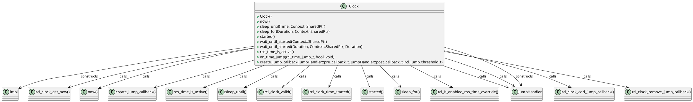

---
Crafted by [Genie](https://marketplace.visualstudio.com/items?itemName=genieai.chatgpt-vscode)
---

## You

下面这段代码是在 ros2 项目中 rclcpp 相关的代码，请联系所有函数之间可能的相互联系，梳理、解释这份文件的功能、含义（中文）。（请给出详细完善的回答，不限制字数）

## Trantor

这段代码是 ROS2（Robot Operating System 2）项目中的 rclcpp 库的一部分，主要实现了一个时钟（Clock）类。时钟类用于获取当前时间、休眠直到特定时间以及处理时间跳变等功能。以下是详细解释：

1. `Impl` 类：这是一个内部实现类，用于存储时钟信息（`rcl_clock_`）、分配器对象（`allocator_`）和互斥锁（`clock_mutex_`）。构造函数初始化时钟，析构函数清理时钟。

2. `JumpHandler` 类：用于处理时间跳变事件。它包含预跳转回调（`pre_callback`）、后跳转回调（`post_callback`）和跳转阈值（`notice_threshold`）。

3. `Clock` 类：
   - 构造函数和析构函数：创建和销毁时钟对象。
   - `now()`：获取当前时间。
   - `sleep_until()`：休眠直到指定的时间。
   - `sleep_for()`：休眠指定的持续时间。
   - `started()`：检查时钟是否已启动。
   - `wait_until_started()`：等待时钟启动。
   - `ros_time_is_active()`：检查 ROS 时间是否处于活动状态。
   - `get_clock_handle()`：获取时钟句柄。
   - `get_clock_type()`：获取时钟类型。
   - `get_clock_mutex()`：获取时钟互斥锁。
   - `on_time_jump()`：时间跳变回调函数。
   - `create_jump_callback()`：创建跳跃处理器回调。

这段代码的主要功能是提供一个时钟类，用于在 ROS2 项目中获取和操作时间。时钟类支持不同类型的时钟（如稳定时钟、系统时钟和 ROS 时钟），并提供了休眠、等待启动和处理时间跳变等功能。

## You

请进一步梳理这些函数之间的功能调用关系，并以清晰的格式输出

## Trantor

以下是这些函数之间的功能调用关系：

- `Clock` 类构造函数

  - 调用：`Impl` 类构造函数

- `Clock::now()`

  - 调用：`rcl_clock_get_now()`

- `Clock::sleep_until(Time until, Context::SharedPtr context)`

  - 调用：`now()`
  - 调用：`create_jump_callback()`
  - 调用：`ros_time_is_active()`

- `Clock::sleep_for(Duration rel_time, Context::SharedPtr context)`

  - 调用：`now()`
  - 调用：`sleep_until()`

- `Clock::started()`

  - 调用：`rcl_clock_valid()`
  - 调用：`rcl_clock_time_started()`

- `Clock::wait_until_started(Context::SharedPtr context)`

  - 调用：`started()`
  - 调用：`sleep_until()`

- `Clock::wait_until_started()`

  - 调用：`started()`
  - 调用：`sleep_for()`

- `Clock::ros_time_is_active()`

  - 调用：`rcl_clock_valid()`
  - 调用：`rcl_is_enabled_ros_time_override()`

- `Clock::on_time_jump()`

  - 调用：`JumpHandler::pre_callback`
  - 调用：`JumpHandler::post_callback`

- `Clock::create_jump_callback()`
  - 调用：`JumpHandler` 类构造函数
  - 调用：`rcl_clock_add_jump_callback()`
  - 调用：`rcl_clock_remove_jump_callback()`

## You

以 plantuml 的个数输出这些函数之间的功能调用关系

## Trantor

以下是以 PlantUML 格式表示的函数之间的功能调用关系：

将上述 PlantUML 代码粘贴到 [PlantUML 在线编辑器](http://www.plantuml.com/plantuml/uml/) 中，即可生成相应的 UML 图表。
