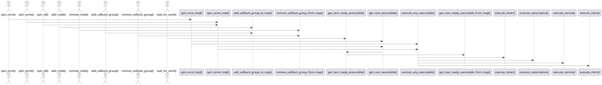

---
Crafted by [Genie](https://marketplace.visualstudio.com/items?itemName=genieai.chatgpt-vscode)
---

## You

下面这段代码是在 ros2 项目中 rclcpp 相关的代码，请联系所有函数之间可能的相互联系，梳理、解释这份文件的功能、含义（中文）。（请给出详细完善的回答，不限制字数）

## Trantor

这段代码是 ROS2 项目中 rclcpp 库的 Executor 类的实现。Executor 类负责管理和执行回调，包括定时器、订阅者、服务等。这个类提供了多种方法来控制回调的执行顺序和时间。

### 构造函数与析构函数

- `Executor::Executor(const rclcpp::ExecutorOptions &options)`：构造函数接收一个 ExecutorOptions 对象作为参数，用于初始化 Executor 的属性。构造函数会创建两个保护条件（guard condition），一个用于中断，另一个用于关闭。同时还会设置内存策略（memory strategy）。
- `Executor::~Executor()`：析构函数会释放所有关联的资源，如节点、回调组等，并清理它们所占用的内存。

### 回调组相关方法

- `get_all_callback_groups()`：返回所有回调组的弱指针列表。
- `get_manually_added_callback_groups()`：返回手动添加到 Executor 的回调组的弱指针列表。
- `get_automatically_added_callback_groups_from_nodes()`：返回从节点自动添加到 Executor 的回调组的弱指针列表。

### 添加/删除节点和回调组

- `add_node()`：将节点添加到 Executor 中，可以选择是否触发中断保护条件。
- `remove_node()`：从 Executor 中移除节点，可以选择是否触发中断保护条件。
- `add_callback_group()`：将回调组添加到 Executor 中，可以选择是否触发中断保护条件。
- `remove_callback_group()`：从 Executor 中移除回调组，可以选择是否触发中断保护条件。

### 执行回调

- `spin_node_once_nanoseconds()`：执行节点的一个回调，可以设置超时时间。
- `spin_node_some()`：执行节点的一些回调。
- `spin_some()`：执行一些回调，可以设置最大持续时间。
- `spin_all()`：执行所有回调，可以设置最大持续时间。
- `spin_once()`：执行一个回调，可以设置超时时间。

### 其他方法

- `cancel()`：取消当前正在执行的回调。
- `set_memory_strategy()`：设置内存策略。
- `execute_any_executable()`：执行任意可执行对象（如定时器、订阅者等）。
- `wait_for_work()`：等待工作，直到有新的可执行对象或达到超时时间。
- `get_next_executable()`：获取下一个可执行对象，如果没有可执行对象，则等待直到有新的可执行对象或达到超时时间。

这个类是 ROS2 的核心组件之一，它负责管理和调度各种类型的回调。通过使用 Executor 类，用户可以方便地管理和控制回调的执行顺序和时间。

## You

请进一步梳理这些函数之间的功能调用关系

## Trantor

以下是这些函数之间的功能调用关系：

1. `spin_once()`

   - 调用 `spin_once_impl()`，执行一个回调。
     - 调用 `get_next_executable()`，获取下一个可执行对象。
       - 调用 `get_next_ready_executable()`，获取下一个就绪的可执行对象。
         - 调用 `get_next_ready_executable_from_map()`，从映射中获取下一个就绪的可执行对象。
     - 如果有可执行对象，调用 `execute_any_executable()`，执行任意可执行对象（如定时器、订阅者等）。
       - 根据可执行对象类型，分别调用 `execute_timer()`、`execute_subscription()`、`execute_service()` 和 `execute_client()` 来执行对应的回调。

2. `spin_some()` 和 `spin_all()`

   - 调用 `spin_some_impl()`，根据参数决定是否执行所有回调。

3. `add_node()` 和 `remove_node()`

   - 添加或移除节点时，会遍历节点的回调组，并根据条件调用 `add_callback_group_to_map()` 或 `remove_callback_group_from_map()` 进行添加或移除操作。

4. `add_callback_group()` 和 `remove_callback_group()`

   - 直接调用 `add_callback_group_to_map()` 或 `remove_callback_group_from_map()` 进行添加或移除操作。

5. `wait_for_work()`
   - 等待工作，直到有新的可执行对象或达到超时时间。在等待过程中，可能会触发保护条件（如中断或关闭）。

这些函数之间的关系主要是通过调用链来实现的。例如，`spin_once()` 会调用 `spin_once_impl()` 来执行一个回调，而 `spin_once_impl()` 则会调用 `get_next_executable()` 获取下一个可执行对象。在获取到可执行对象后，`execute_any_executable()` 被调用以执行相应的回调。其他函数之间的关系也是类似的，它们通过调用其他函数来完成特定的任务。

## You

通过 plantuml 的格式输出各个函数之间的用例图

## Trantor

以下是使用 PlantUML 语法表示的函数之间的用例图：

将上述 PlantUML 代码粘贴到 [PlantUML 在线编辑器](http://www.plantuml.com/plantuml/uml/) 或使用支持 PlantUML 的编辑器，即可生成相应的用例图。这个用例图展示了各个函数之间的调用关系。
