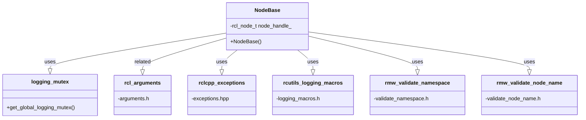

---
Crafted by [Genie](https://marketplace.visualstudio.com/items?itemName=genieai.chatgpt-vscode)
---

## You

下面这段代码是在 ros2 项目中 rclcpp 相关的代码，请联系所有函数之间可能的相互联系，梳理、解释这份文件的功能、含义，以及函数之间的功能调用关系（以中文语言输出，不限制字数）

````markdown
```cpp
#include "../logging_mutex.hpp"
#include "rcl/arguments.h"
#include "rclcpp/exceptions.hpp"
#include "rcutils/logging_macros.h"
#include "rmw/validate_namespace.h"
#include "rmw/validate_node_name.h"

using rclcpp::exceptions::throw_from_rcl_error;

using rclcpp::node_interfaces::NodeBase;

NodeBase::NodeBase(
    const std::string& node_name,
    const std::string& namespace_,
    rclcpp::Context::SharedPtr context,
    const rcl_node_options_t& rcl_node_options,
    bool use_intra_process_default,
    bool enable_topic_statistics_default,
    rclcpp::CallbackGroup::SharedPtr default_callback_group)
    : context_(context),
      use_intra_process_default_(use_intra_process_default),
      enable_topic_statistics_default_(enable_topic_statistics_default),
      node_handle_(nullptr),
      default_callback_group_(default_callback_group),
      associated_with_executor_(false),
      notify_guard_condition_(context),
      notify_guard_condition_is_valid_(false) {
  std::unique_ptr<rcl_node_t> rcl_node(new rcl_node_t(rcl_get_zero_initialized_node()));

  std::shared_ptr<std::recursive_mutex> logging_mutex = get_global_logging_mutex();

  rcl_ret_t ret;
  {
    std::lock_guard<std::recursive_mutex> guard(*logging_mutex);
    ret = rcl_node_init(
        rcl_node.get(), node_name.c_str(), namespace_.c_str(), context_->get_rcl_context().get(),
        &rcl_node_options);
  }
  if (ret != RCL_RET_OK) {
    if (ret == RCL_RET_NODE_INVALID_NAME) {
      rcl_reset_error();  // 丢弃 rcl_node_init 错误 (Discard the rcl_node_init error)
      int validation_result;
      size_t invalid_index;
      rmw_ret_t rmw_ret =
          rmw_validate_node_name(node_name.c_str(), &validation_result, &invalid_index);
      if (rmw_ret != RMW_RET_OK) {
        if (rmw_ret == RMW_RET_INVALID_ARGUMENT) {
          throw_from_rcl_error(RCL_RET_INVALID_ARGUMENT, "failed to validate node name");
        }
        throw_from_rcl_error(RCL_RET_ERROR, "failed to validate node name");
      }

      if (validation_result != RMW_NODE_NAME_VALID) {
        throw rclcpp::exceptions::InvalidNodeNameError(
            node_name.c_str(), rmw_node_name_validation_result_string(validation_result),
            invalid_index);
      } else {
        throw std::runtime_error("valid rmw node name but invalid rcl node name");
      }
    }

    if (ret == RCL_RET_NODE_INVALID_NAMESPACE) {
      rcl_reset_error();  // 丢弃 rcl_node_init 错误 (Discard the rcl_node_init error)
      int validation_result;
      size_t invalid_index;
      rmw_ret_t rmw_ret =
          rmw_validate_namespace(namespace_.c_str(), &validation_result, &invalid_index);
      if (rmw_ret != RMW_RET_OK) {
        if (rmw_ret == RMW_RET_INVALID_ARGUMENT) {
          throw_from_rcl_error(RCL_RET_INVALID_ARGUMENT, "failed to validate namespace");
        }
        throw_from_rcl_error(RCL_RET_ERROR, "failed to validate namespace");
      }

      if (validation_result != RMW_NAMESPACE_VALID) {
        throw rclcpp::exceptions::InvalidNamespaceError(
            namespace_.c_str(), rmw_namespace_validation_result_string(validation_result),
            invalid_index);
      } else {
        throw std::runtime_error("valid rmw node namespace but invalid rcl node namespace");
      }
    }
    throw_from_rcl_error(ret, "failed to initialize rcl node");
  }

  node_handle_.reset(rcl_node.release(), [logging_mutex](rcl_node_t* node) -> void {
    std::lock_guard<std::recursive_mutex> guard(*logging_mutex);
    if (rcl_node_fini(node) != RCL_RET_OK) {
      RCUTILS_LOG_ERROR_NAMED(
          "rclcpp", "Error in destruction of rcl node handle: %s", rcl_get_error_string().str);
    }
    delete node;
  });

  if (nullptr == default_callback_group_) {
    using rclcpp::CallbackGroupType;
    default_callback_group_ = NodeBase::create_callback_group(CallbackGroupType::MutuallyExclusive);
  }

  notify_guard_condition_is_valid_ = true;
}

NodeBase::~NodeBase() {
  {
    std::lock_guard<std::recursive_mutex> notify_condition_lock(notify_guard_condition_mutex_);
    notify_guard_condition_is_valid_ = false;
  }
}

const char* NodeBase::get_name() const { return rcl_node_get_name(node_handle_.get()); }

const char* NodeBase::get_namespace() const { return rcl_node_get_namespace(node_handle_.get()); }

const char* NodeBase::get_fully_qualified_name() const {
  return rcl_node_get_fully_qualified_name(node_handle_.get());
}

rclcpp::Context::SharedPtr NodeBase::get_context() { return context_; }

rcl_node_t* NodeBase::get_rcl_node_handle() { return node_handle_.get(); }

const rcl_node_t* NodeBase::get_rcl_node_handle() const { return node_handle_.get(); }

std::shared_ptr<rcl_node_t> NodeBase::get_shared_rcl_node_handle() {
  return std::shared_ptr<rcl_node_t>(shared_from_this(), node_handle_.get());
}

std::shared_ptr<const rcl_node_t> NodeBase::get_shared_rcl_node_handle() const {
  return std::shared_ptr<const rcl_node_t>(shared_from_this(), node_handle_.get());
}

rclcpp::CallbackGroup::SharedPtr NodeBase::create_callback_group(
    rclcpp::CallbackGroupType group_type, bool automatically_add_to_executor_with_node) {
  auto group =
      std::make_shared<rclcpp::CallbackGroup>(group_type, automatically_add_to_executor_with_node);
  std::lock_guard<std::mutex> lock(callback_groups_mutex_);
  callback_groups_.push_back(group);
  return group;
}

rclcpp::CallbackGroup::SharedPtr NodeBase::get_default_callback_group() {
  return default_callback_group_;
}

bool NodeBase::callback_group_in_node(rclcpp::CallbackGroup::SharedPtr group) {
  std::lock_guard<std::mutex> lock(callback_groups_mutex_);
  for (auto& weak_group : this->callback_groups_) {
    auto cur_group = weak_group.lock();
    if (cur_group && (cur_group == group)) {
      return true;
    }
  }
  return false;
}

void NodeBase::for_each_callback_group(const CallbackGroupFunction& func) {
  std::lock_guard<std::mutex> lock(callback_groups_mutex_);
  for (rclcpp::CallbackGroup::WeakPtr& weak_group : this->callback_groups_) {
    rclcpp::CallbackGroup::SharedPtr group = weak_group.lock();
    if (group) {
      func(group);
    }
  }
}

std::atomic_bool& NodeBase::get_associated_with_executor_atomic() {
  return associated_with_executor_;
}

rclcpp::GuardCondition& NodeBase::get_notify_guard_condition() {
  std::lock_guard<std::recursive_mutex> notify_condition_lock(notify_guard_condition_mutex_);
  if (!notify_guard_condition_is_valid_) {
    throw std::runtime_error("failed to get notify guard condition because it is invalid");
  }
  return notify_guard_condition_;
}

bool NodeBase::get_use_intra_process_default() const { return use_intra_process_default_; }

bool NodeBase::get_enable_topic_statistics_default() const {
  return enable_topic_statistics_default_;
}

std::string NodeBase::resolve_topic_or_service_name(
    const std::string& name, bool is_service, bool only_expand) const {
  char* output_cstr = NULL;
  auto allocator = rcl_get_default_allocator();
  rcl_ret_t ret = rcl_node_resolve_name(
      node_handle_.get(), name.c_str(), allocator, is_service, only_expand, &output_cstr);
  if (RCL_RET_OK != ret) {
    throw_from_rcl_error(ret, "failed to resolve name", rcl_get_error_state());
  }
  std::string output{output_cstr};
  allocator.deallocate(output_cstr, allocator.state);
  return output;
}
```
````

## Trantor

这段代码是 ROS2 项目中 rclcpp 库的一部分，主要实现了 `NodeBase` 类。`NodeBase` 类是节点基类，用于管理节点的生命周期、回调组、上下文以及与执行器相关的状态等。

以下是各个函数的功能和相互之间的关系：

1. **构造函数**：`NodeBase` 的构造函数接收节点名称、命名空间、上下文、节点选项、是否使用默认的进程内通信、是否启用主题统计以及默认的回调组。在构造函数中，首先初始化一个 `rcl_node_t` 类型的指针，并使用 `rcl_node_init` 函数初始化它。然后，检查节点名称和命名空间的有效性。最后，如果没有提供默认的回调组，则创建一个互斥类型的回调组。

2. **析构函数**：`NodeBase` 的析构函数将 `notify_guard_condition_is_valid_` 设置为 `false`。

3. **get_name**：返回节点的名称。

4. **get_namespace**：返回节点的命名空间。

5. **get_fully_qualified_name**：返回节点的完全限定名称。

6. **get_context**：返回节点的上下文。

7. **get_rcl_node_handle** 和 **get_rcl_node_handle const**：返回指向 `rcl_node_t` 的智能指针。

8. **get_shared_rcl_node_handle** 和 **get_shared_rcl_node_handle const**：返回指向 `rcl_node_t` 的共享智能指针。

9. **create_callback_group**：创建一个新的回调组，并将其添加到节点的回调组列表中。

10. **get_default_callback_group**：返回默认的回调组。

11. **callback_group_in_node**：检查给定的回调组是否在节点的回调组列表中。

12. **for_each_callback_group**：对节点的每个回调组执行给定的函数。

13. **get_associated_with_executor_atomic**：返回与执行器关联的原子布尔值。

14. **get_notify_guard_condition**：返回通知保护条件。如果无效，则抛出运行时错误。

15. **get_use_intra_process_default**：返回是否使用默认的进程内通信。

16. **get_enable_topic_statistics_default**：返回是否启用主题统计。

17. **resolve_topic_or_service_name**：解析给定的主题或服务名称，返回解析后的名称。

整体来看，这段代码主要实现了 `NodeBase` 类，该类负责管理 ROS2 节点的基本功能，如节点生命周期、回调组、上下文等。各个函数之间的关系主要是通过类成员变量进行交互。

## You

这份代码中包含的头文件都是确实使用到的，并且也是在 rclcpp 中的文件，请联系这些文件对上述代码进行综合全面的分析

## You

这份代码中包含的头文件都是确实使用到的，并且也是在 rclcpp 中的文件，请联系这些文件对上述代码进行综合全面的分析

## Trantor

这段代码中包含了以下头文件，它们在 rclcpp 中都有对应的实现。这些头文件与上述代码的关系如下：

1. **logging_mutex.hpp**：这个头文件定义了 `get_global_logging_mutex` 函数，用于获取全局日志互斥锁。在 `NodeBase` 的构造函数中，使用此互斥锁确保 `rcl_node_init` 函数的线程安全。

2. **rcl/arguments.h**：这个头文件包含了与 ROS 参数相关的函数和数据结构。虽然在这段代码中没有直接使用到这个头文件的内容，但它可能在其他与 `NodeBase` 相关的源文件中使用。

3. **rclcpp/exceptions.hpp**：这个头文件定义了一些异常类，例如 `InvalidNodeNameError` 和 `InvalidNamespaceError`。在 `NodeBase` 的构造函数中，当节点名称或命名空间无效时，会抛出这些异常。

4. **rcutils/logging_macros.h**：这个头文件提供了一些用于记录日志的宏。在 `NodeBase` 类的析构函数中，如果 `rcl_node_fini` 函数失败，将使用 `RCUTILS_LOG_ERROR_NAMED` 宏记录错误日志。

5. **rmw/validate_namespace.h** 和 **rmw/validate_node_name.h**：这两个头文件分别提供了 `rmw_validate_namespace` 和 `rmw_validate_node_name` 函数，用于验证命名空间和节点名称的有效性。在 `NodeBase` 的构造函数中，当 `rcl_node_init` 函数返回无效的命名空间或节点名称时，会调用这些函数进行验证。

通过分析这些头文件及其在代码中的使用，我们可以更深入地了解 `NodeBase` 类的实现细节。例如，在构造函数中，我们可以看到对节点名称和命名空间的有效性检查是如何进行的。同时，这些头文件还提供了一些与日志记录、异常处理和参数相关的功能，有助于提高代码的健壮性和可维护性。

## You

我希望以 uml 视图进一步说明上述代码，并以 mermaid 格式输出

## Trantor

以下是使用 Mermaid 格式表示的 UML 类图，展示了上述代码中涉及的类和头文件之间的关系：



在这个 UML 类图中，`NodeBase` 类与其他类和头文件之间的关系用箭头表示。例如，`NodeBase` 类使用了 `logging_mutex` 类中的 `get_global_logging_mutex` 函数，因此它们之间有一条箭头。同样，`NodeBase` 类还使用了其他头文件中的函数和宏，如 `rclcpp_exceptions`、`rcutils_logging_macros`、`rmw_validate_namespace` 和 `rmw_validate_node_name`。

请注意，这个 UML 类图仅展示了上述代码中涉及的类和头文件之间的关系，并未包含所有的方法和属性。要获得完整的类定义，请参考相应的头文件。
