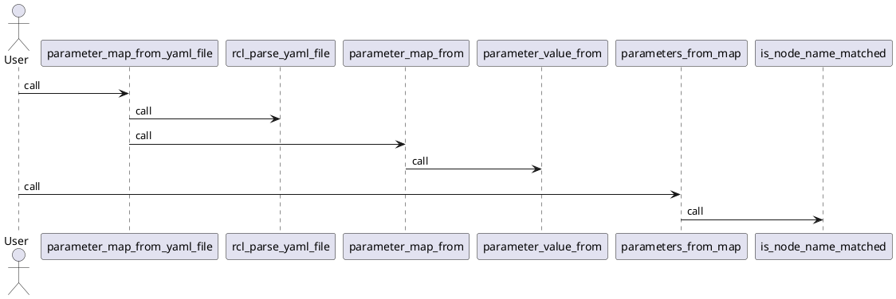

---
Crafted by [Genie](https://marketplace.visualstudio.com/items?itemName=genieai.chatgpt-vscode)
---

## You

下面这段代码是在 ros2 项目中 rclcpp 相关的代码，请联系所有函数之间可能的相互联系，梳理、解释这份文件的功能、含义（中文）。（请给出详细完善的回答，不限制字数）

## Trantor

这段代码是 ROS2 项目中 rclcpp 的一部分，主要用于处理参数映射（ParameterMap）。以下是这段代码的详细解释：

1. **函数 is_node_name_matched**：判断节点名称是否匹配。输入参数为两个字符串，返回布尔值。

2. **函数 parameter_map_from**：从 C 结构体 `rcl_params_t` 中提取参数映射。输入参数为指向 `rcl_params_t` 的指针和节点的完全限定名称（FQN），返回一个 ParameterMap 对象。

3. **函数 parameter_value_from**：从 C 结构体 `rcl_variant_t` 中提取参数值。输入参数为指向 `rcl_variant_t` 的指针，返回一个 ParameterValue 对象。

4. **函数 parameter_map_from_yaml_file**：从 YAML 文件中提取参数映射。输入参数为 YAML 文件名和节点的完全限定名称（FQN），返回一个 ParameterMap 对象。

5. **函数 parameters_from_map**：从参数映射中提取指定节点的参数。输入参数为 ParameterMap 对象和节点的完全限定名称（FQN），返回一个包含指定节点参数的向量。

这段代码的主要功能是将 ROS2 参数从不同的数据结构（如 C 结构体、YAML 文件）转换为 C++ 类型（如 ParameterMap、ParameterValue），以便在 rclcpp 中使用。同时，它还提供了从参数映射中提取特定节点参数的功能。

## You

请进一步梳理这些函数之间的功能关系

## Trantor

以下是这些函数之间的功能关系：

1. **parameter_map_from_yaml_file**：此函数负责从 YAML 文件中提取参数映射。在实现过程中，它会调用 `rcl_parse_yaml_file` 函数解析 YAML 文件并填充 `rcl_params_t` 结构体。然后，它会调用 **parameter_map_from** 函数将 `rcl_params_t` 结构体转换为 ParameterMap 对象。

2. **parameter_map_from**：此函数负责将 C 结构体 `rcl_params_t` 转换为 ParameterMap 对象。在实现过程中，它会遍历 `rcl_params_t` 结构体中的节点和参数，并调用 **parameter_value_from** 函数将每个参数值从 `rcl_variant_t` 结构体转换为 ParameterValue 对象。最后，它会将转换后的参数添加到 ParameterMap 对象中。

3. **parameter_value_from**：此函数负责将 C 结构体 `rcl_variant_t` 转换为 ParameterValue 对象。它会根据参数类型执行相应的转换操作。

4. **parameters_from_map**：此函数负责从参数映射中提取指定节点的参数。在实现过程中，它会遍历 ParameterMap 对象，并使用 **is_node_name_matched** 函数检查节点名称是否匹配。如果节点名称匹配，则将该节点的参数添加到结果向量中。

5. **is_node_name_matched**：此函数负责判断两个节点名称是否匹配。它在 **parameters_from_map** 函数中被调用，用于筛选出与指定节点名称匹配的参数。

总结：这些函数之间的关系是相互协作的。`parameter_map_from_yaml_file` 作为入口函数，调用 `parameter_map_from` 将 C 结构体转换为 ParameterMap 对象。`parameter_map_from` 函数则依赖于 `parameter_value_from` 函数来完成参数值的转换。最后，`parameters_from_map` 函数通过调用 `is_node_name_matched` 函数从参数映射中提取特定节点的参数。

## You

请以更清晰的格式梳理

## Trantor

### 函数功能关系梳理

以下是这些函数之间的功能关系，以清晰的格式进行梳理：

1. **parameter_map_from_yaml_file**

   - 功能：从 YAML 文件中提取参数映射
   - 调用：
     - `rcl_parse_yaml_file`
     - **parameter_map_from**

2. **parameter_map_from**

   - 功能：将 C 结构体 `rcl_params_t` 转换为 ParameterMap 对象
   - 调用：
     - **parameter_value_from**

3. **parameter_value_from**

   - 功能：将 C 结构体 `rcl_variant_t` 转换为 ParameterValue 对象
   - 调用：无

4. **parameters_from_map**

   - 功能：从参数映射中提取指定节点的参数
   - 调用：
     - **is_node_name_matched**

5. **is_node_name_matched**
   - 功能：判断两个节点名称是否匹配
   - 调用：无

### 总结

这些函数之间的关系是相互协作的。`parameter_map_from_yaml_file` 作为入口函数，调用 `parameter_map_from` 将 C 结构体转换为 ParameterMap 对象。`parameter_map_from` 函数则依赖于 `parameter_value_from` 函数来完成参数值的转换。最后，`parameters_from_map` 函数通过调用 `is_node_name_matched` 函数从参数映射中提取特定节点的参数。

## You

请以 plantuml 格式输出函数之间的调用关系

## Trantor

这个 PlantUML 图表展示了函数之间的调用关系。用户调用 `parameter_map_from_yaml_file` 函数，该函数依次调用 `rcl_parse_yaml_file` 和 `parameter_map_from` 函数。`parameter_map_from` 函数则调用 `parameter_value_from` 函数。最后，用户通过调用 `parameters_from_map` 函数来提取参数，该函数会调用 `is_node_name_matched` 函数。
