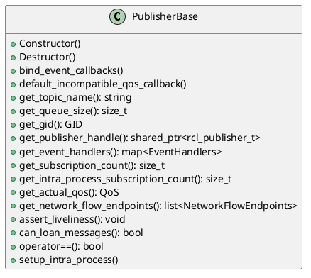

---
Crafted by [Genie](https://marketplace.visualstudio.com/items?itemName=genieai.chatgpt-vscode)
---

## You

下面这段代码是在 ros2 项目中 rclcpp 相关的代码，请联系所有函数之间可能的相互联系，梳理、解释这份文件的功能、含义（中文）。（请给出详细完善的回答，不限制字数）

## Trantor

这段代码是 ROS2 项目中 rclcpp 库的一部分，它定义了一个名为 `PublisherBase` 的类。`PublisherBase` 类是用于发布消息的基类，它包含了与 ROS2 发布者相关的功能和属性。

以下是该文件的主要功能和含义：

1. **构造函数**：`PublisherBase` 类的构造函数接收以下参数：

   - 节点基本接口指针（`node_base`）
   - 主题名称（`topic`）
   - 消息类型支持（`type_support`）
   - 发布者选项（`publisher_options`）
   - 事件回调（`event_callbacks`）
   - 是否使用默认回调（`use_default_callbacks`）

   构造函数首先初始化一些成员变量，然后创建一个 `rcl_publisher_t` 类型的发布者句柄，并使用提供的参数初始化它。如果发布者初始化失败，将抛出异常。最后，构造函数会绑定事件回调函数。

2. **析构函数**：`PublisherBase` 类的析构函数负责清理事件处理程序并从内部进程管理器中移除发布者。

3. **获取主题名称**：`get_topic_name()` 函数返回发布者的主题名称。

4. **绑定事件回调函数**：`bind_event_callbacks()` 函数根据提供的事件回调参数和是否使用默认回调来绑定相应的事件回调函数。

5. **获取队列大小**：`get_queue_size()` 函数返回发布者的队列大小。

6. **获取 GID**：`get_gid()` 函数返回发布者的 rmw_gid_t 类型的 GID（全局唯一标识符）。

7. **获取发布者句柄**：`get_publisher_handle()` 函数返回一个指向 `rcl_publisher_t` 类型的智能指针。

8. **获取事件处理程序**：`get_event_handlers()` 函数返回一个包含所有事件处理程序的映射。

9. **获取订阅计数**：`get_subscription_count()` 函数返回与此发布者相关的订阅数量。

10. **获取内部进程订阅计数**：`get_intra_process_subscription_count()` 函数返回与此发布者相关的内部进程订阅数量。

11. **获取实际 QoS**：`get_actual_qos()` 函数返回发布者的实际 QoS 设置。

12. **声明活跃状态**：`assert_liveliness()` 函数声明发布者的活跃状态。

13. **判断是否可以借用消息**：`can_loan_messages()` 函数检查发布者是否可以借用消息。

14. **比较 GID**：重载的 `operator==` 函数用于比较两个发布者的 GID 是否相等。

15. **设置内部进程**：`setup_intra_process()` 函数用于设置内部进程管理器和内部进程发布者 ID。

16. **默认不兼容 QoS 回调**：`default_incompatible_qos_callback()` 函数是默认的不兼容 QoS 事件回调，当发现请求不兼容 QoS 的新订阅时，会发出警告。

17. **获取网络流端点**：`get_network_flow_endpoints()` 函数返回发布者的网络流端点列表。

这个文件主要定义了 `PublisherBase` 类，它是 ROS2 发布者的基础实现。通过这个类，用户可以创建发布者对象，用于在特定主题上发布消息。同时，这个类还提供了一些辅助功能，如获取实际 QoS 设置、声明活跃状态等。

## You

请进一步梳理这些函数之间的功能关系

## Trantor

以下是这些函数之间的功能关系：

1. 构造函数和析构函数：构造函数用于初始化 `PublisherBase` 对象，包括创建和初始化发布者句柄、绑定事件回调等。析构函数则负责清理资源，如移除内部进程管理器中的发布者和清理事件处理程序。

2. 事件回调相关函数：

   - `bind_event_callbacks()` 函数根据提供的事件回调参数和是否使用默认回调来绑定相应的事件回调函数。
   - `default_incompatible_qos_callback()` 函数是默认的不兼容 QoS 事件回调，当发现请求不兼容 QoS 的新订阅时，会发出警告。

3. 查询相关函数：

   - `get_topic_name()` 函数返回发布者的主题名称。
   - `get_queue_size()` 函数返回发布者的队列大小。
   - `get_gid()` 函数返回发布者的 GID（全局唯一标识符）。
   - `get_publisher_handle()` 函数返回一个指向 `rcl_publisher_t` 类型的智能指针。
   - `get_event_handlers()` 函数返回一个包含所有事件处理程序的映射。
   - `get_subscription_count()` 函数返回与此发布者相关的订阅数量。
   - `get_intra_process_subscription_count()` 函数返回与此发布者相关的内部进程订阅数量。
   - `get_actual_qos()` 函数返回发布者的实际 QoS 设置。
   - `get_network_flow_endpoints()` 函数返回发布者的网络流端点列表。

4. 操作相关函数：

   - `assert_liveliness()` 函数声明发布者的活跃状态。
   - `can_loan_messages()` 函数检查发布者是否可以借用消息。
   - 重载的 `operator==` 函数用于比较两个发布者的 GID 是否相等。

5. 内部进程相关函数：
   - `setup_intra_process()` 函数用于设置内部进程管理器和内部进程发布者 ID。

这些函数共同实现了 `PublisherBase` 类的功能。它们之间的关系主要体现在构造函数和析构函数中对其他函数的调用，以及事件回调、查询和操作相关函数之间的协作。通过这些函数，用户可以创建和管理发布者对象，并在特定主题上发布消息。同时，这些函数还提供了一些辅助功能，如获取实际 QoS 设置、声明活跃状态等。

## You

通过 plantuml 格式输出

## Trantor

以下是使用 PlantUML 格式表示的函数关系图：

将此 PlantUML 代码粘贴到 [PlantUML 在线编辑器](http://www.plantuml.com/plantuml/uml/)，即可生成函数关系图。
