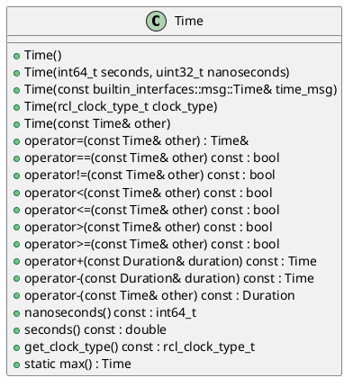

---
Crafted by [Genie](https://marketplace.visualstudio.com/items?itemName=genieai.chatgpt-vscode)
---

## You

下面这段代码是在 ros2 项目中 rclcpp 相关的代码，请联系所有函数之间可能的相互联系，梳理、解释这份文件的功能、含义（中文）。（请给出详细完善的回答，不限制字数）

## Trantor

这段代码是 ROS2 项目中的 `rclcpp` 库的一部分，主要实现了一个名为 `Time` 的类。`Time` 类用于表示时间点，并提供了一系列与时间相关的操作，例如比较、加法、减法等。以下是这个类的主要功能和含义：

1. **构造函数**：`Time` 类有多个构造函数，可以根据不同的输入参数创建时间对象。例如，可以通过秒数和纳秒数、纳秒数、`builtin_interfaces::msg::Time` 消息或 `rcl_time_point_t` 结构体来创建时间对象。

2. **拷贝构造函数和赋值操作符**：`Time` 类提供了默认的拷贝构造函数和赋值操作符，用于复制和赋值时间对象。

3. **类型转换操作符**：`Time` 类提供了将时间对象转换为 `builtin_interfaces::msg::Time` 消息的类型转换操作符。

4. **比较操作符**：`Time` 类提供了一系列比较操作符，如 `==`、`!=`、`<`、`<=`、`>=` 和 `>`，用于比较两个时间对象的大小关系。

5. **加法和减法操作符**：`Time` 类提供了与 `Duration` 类型的加法和减法操作符，用于计算时间点之间的差值或将持续时间添加到时间点上。

6. **nanoseconds() 和 seconds() 方法**：`Time` 类提供了 `nanoseconds()` 和 `seconds()` 方法，用于获取时间对象的纳秒值和秒值。

7. **get_clock_type() 方法**：`Time` 类提供了 `get_clock_type()` 方法，用于获取时间对象的时钟类型。

8. **静态 max() 方法**：`Time` 类提供了一个静态方法 `max()`，用于获取表示最大时间点的 `Time` 对象。

总之，这个文件定义了一个名为 `Time` 的类，用于表示时间点，并提供了一系列与时间相关的操作。这些操作包括创建时间对象、复制和赋值时间对象、将时间对象转换为时间消息、比较时间对象的大小关系、计算时间点之间的差值或将持续时间添加到时间点上等。

## You

请进一步梳理这些函数之间的功能关系

## Trantor

以下是 `Time` 类中各个函数之间的功能关系：

1. **构造函数**：多个构造函数用于根据不同输入参数创建时间对象。这些构造函数之间的关系是互补的，它们共同支持了多种方式来创建时间对象。

2. **拷贝构造函数和赋值操作符**：拷贝构造函数和赋值操作符用于复制和赋值时间对象。它们之间的关系是密切相关的，因为它们都涉及到将一个时间对象的值复制到另一个时间对象。

3. **类型转换操作符**：类型转换操作符与构造函数（接受 `builtin_interfaces::msg::Time` 消息作为参数）之间存在关系。类型转换操作符将 `Time` 对象转换为时间消息，而构造函数则从时间消息创建 `Time` 对象。

4. **比较操作符**：所有比较操作符（`==`、`!=`、`<`、`<=`、`>=` 和 `>`）之间具有相似的功能，它们用于比较两个时间对象的大小关系。这些操作符之间的关系是紧密相关的，因为它们共同实现了时间对象之间的比较功能。

5. **加法和减法操作符**：加法和减法操作符与 `Duration` 类型之间存在关系。加法操作符用于将持续时间添加到时间点上，而减法操作符用于计算时间点之间的差值。这两个操作符之间的关系是互补的，它们共同实现了时间点与持续时间之间的运算。

6. **nanoseconds() 和 seconds() 方法**：`nanoseconds()` 和 `seconds()` 方法之间存在关系，因为它们都用于获取时间对象的值，只是单位不同。`nanoseconds()` 返回纳秒值，而 `seconds()` 返回秒值。

7. **get_clock_type() 方法**：`get_clock_type()` 方法与构造函数（接受 `rcl_clock_type_t` 类型作为参数）之间存在关系。构造函数用于根据时钟类型创建时间对象，而 `get_clock_type()` 方法用于获取时间对象的时钟类型。

8. **静态 max() 方法**：`max()` 方法与其他构造函数之间存在关系，因为它提供了一种特殊的创建时间对象的方法，即创建表示最大时间点的 `Time` 对象。

总结一下，`Time` 类中的各个函数之间的功能关系主要体现在以下几个方面：

- 构造函数、拷贝构造函数和赋值操作符共同支持创建、复制和赋值时间对象。
- 类型转换操作符与构造函数相互配合，实现 `Time` 对象与时间消息之间的相互转换。
- 比较操作符共同实现了时间对象之间的比较功能。
- 加法和减法操作符实现了时间点与持续时间之间的运算。
- `nanoseconds()` 和 `seconds()` 方法用于获取时间对象的值，只是单位不同。
- `get_clock_type()` 方法与构造函数相互配合，支持时钟类型的设置和获取。
- 静态 `max()` 方法提供了一种特殊的创建时间对象的方法。

## You

请以 plantuml 的格式输出

## Trantor

以下是使用 PlantUML 语法描述的 `Time` 类：

将上述 PlantUML 代码粘贴到 [PlantUML 在线编辑器](http://www.plantuml.com/plantuml/uml/)，即可生成对应的 UML 类图。
