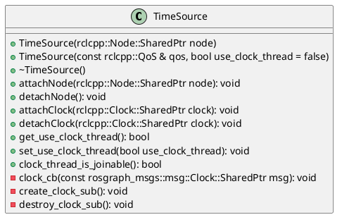

---
Crafted by [Genie](https://marketplace.visualstudio.com/items?itemName=genieai.chatgpt-vscode)
---

## You

下面这段代码是在 ros2 项目中 rclcpp 相关的代码，请联系所有函数之间可能的相互联系，梳理、解释这份文件的功能、含义（中文）。（请给出详细完善的回答，不限制字数）

## Trantor

这段代码是 ROS2 项目中 rclcpp 的 TimeSource 类的实现。TimeSource 类负责管理和同步模拟时间（仿真时间）和系统时间。它允许用户在使用 ROS 时间时，通过监听 `/clock` 主题来更新仿真时间。这对于在仿真环境中运行节点时保持时间同步非常有用。

以下是代码中各个部分的详细解释：

1. **头文件引入**：包含所需的头文件，例如 "rclcpp/time_source.hpp" 和其他相关头文件。

2. **命名空间**：所有代码都在 `rclcpp` 命名空间下。

3. **ClocksState 类**：此类负责管理与 ROS 时间相关的状态，如启用或禁用 ROS 时间，以及将时间信息传递给附加的时钟。

4. **TimeSource::NodeState 类**：此类负责管理与节点相关的状态，如节点接口、日志记录器、参数等。它还包含一个 ClocksState 对象，用于管理时钟状态。

5. **构造函数和析构函数**：TimeSource 类有两个构造函数，一个接受节点共享指针，另一个接受 QoS 和 use_clock_thread 参数。析构函数用于清理资源。

6. **attachNode() 和 detachNode() 方法**：这些方法用于将 TimeSource 附加到或从节点分离。当附加到节点时，它会设置回调函数并创建订阅以监听 `/clock` 主题。当从节点分离时，它会清除回调函数并销毁订阅。

7. **attachClock() 和 detachClock() 方法**：这些方法用于将时钟附加到或从 TimeSource 分离。附加的时钟将根据接收到的仿真时间进行更新。

8. **get_use_clock_thread() 和 set_use_clock_thread() 方法**：这些方法用于获取和设置是否使用单独的线程来处理时钟回调。

9. **clock_thread_is_joinable() 方法**：此方法检查时钟执行器线程是否可连接。

10. **私有方法和回调函数**：类中还包含一些私有方法和回调函数，如 `clock_cb()`（处理接收到的 `/clock` 消息），`create_clock_sub()`（创建订阅以监听 `/clock` 主题），`destroy_clock_sub()`（销毁订阅）等。

总之，这段代码实现了一个 TimeSource 类，用于在 ROS2 项目中管理和同步模拟时间（仿真时间）和系统时间。它提供了附加/分离节点和时钟的功能，并允许用户在使用 ROS 时间时，通过监听 `/clock` 主题来更新仿真时间。

## You

请进一步完善梳理这些函数功能之间的关系

## Trantor

以下是 TimeSource 类中各个函数之间关系的梳理：

1. 构造函数：TimeSource 类有两个构造函数，一个接受节点共享指针，另一个接受 QoS 和 use_clock_thread 参数。这两个构造函数都会创建一个 NodeState 对象，用于管理与节点相关的状态。

2. 析构函数：析构函数在 TimeSource 对象销毁时调用，负责清理资源，如分离节点和时钟。

3. attachNode() 方法：此方法将 TimeSource 附加到给定的节点。它首先设置 use_clock_thread 属性，然后调用 NodeState 的 attachNode() 方法。NodeState 的 attachNode() 方法将设置回调函数、参数以及创建订阅以监听 `/clock` 主题。

4. detachNode() 方法：此方法将 TimeSource 从当前附加的节点分离。它通过调用 NodeState 的 detachNode() 方法来实现。NodeState 的 detachNode() 方法将清除回调函数、参数并销毁订阅。

5. attachClock() 方法：此方法将时钟附加到 TimeSource。它通过调用 NodeState 的 attachClock() 方法来实现。NodeState 的 attachClock() 方法将时钟添加到 ClocksState 对象中，以便在接收到新的仿真时间时更新时钟。

6. detachClock() 方法：此方法将时钟从 TimeSource 分离。它通过调用 NodeState 的 detachClock() 方法来实现。NodeState 的 detachClock() 方法将时钟从 ClocksState 对象中移除。

7. get_use_clock_thread() 和 set_use_clock_thread() 方法：这两个方法分别用于获取和设置 TimeSource 是否使用单独的线程来处理时钟回调。它们通过调用 NodeState 的相应方法来实现。

8. clock_thread_is_joinable() 方法：此方法检查时钟执行器线程是否可连接。它通过调用 NodeState 的 clock_thread_is_joinable() 方法来实现。

9. 私有方法和回调函数：TimeSource 类和 NodeState 类中还包含一些私有方法和回调函数，如 `clock_cb()`（处理接收到的 `/clock` 消息），`create_clock_sub()`（创建订阅以监听 `/clock` 主题），`destroy_clock_sub()`（销毁订阅）等。这些方法在类的内部被其他方法调用，以完成特定功能。

总之，TimeSource 类中的各个函数相互关联，共同实现了管理和同步模拟时间（仿真时间）和系统时间的功能。附加/分离节点和时钟的方法与 NodeState 对象紧密相关，而 NodeState 对象则负责管理与节点相关的状态以及 ClocksState 对象。私有方法和回调函数在类的内部被调用，以完成特定功能。

## You

请进一步完善你的回答

## Trantor

为了更清晰地展示 TimeSource 类中各个函数之间的关系，我将使用伪代码和注释来说明它们的作用。

```cpp
class TimeSource {
public:
  // 构造函数1：接受节点共享指针
  TimeSource(rclcpp::Node::SharedPtr node) {
    // 创建 NodeState 对象
    // 调用 attachNode() 方法附加节点
  }

  // 构造函数2：接受 QoS 和 use_clock_thread 参数
  TimeSource(const rclcpp::QoS & qos, bool use_clock_thread = false) {
    // 创建 NodeState 对象
    // 设置 use_clock_thread 属性
  }

  // 析构函数：清理资源
  ~TimeSource() {
    // 调用 detachNode() 方法分离节点
    // 调用 detachClock() 方法分离时钟
  }

  // attachNode() 方法：附加节点
  void attachNode(rclcpp::Node::SharedPtr node) {
    // 调用 NodeState 的 attachNode() 方法
  }

  // detachNode() 方法：分离节点
  void detachNode() {
    // 调用 NodeState 的 detachNode() 方法
  }

  // attachClock() 方法：附加时钟
  void attachClock(rclcpp::Clock::SharedPtr clock) {
    // 调用 NodeState 的 attachClock() 方法
  }

  // detachClock() 方法：分离时钟
  void detachClock(rclcpp::Clock::SharedPtr clock) {
    // 调用 NodeState 的 detachClock() 方法
  }

  // get_use_clock_thread() 方法：获取 use_clock_thread 属性
  bool get_use_clock_thread() {
    // 调用 NodeState 的 get_use_clock_thread() 方法
  }

  // set_use_clock_thread() 方法：设置 use_clock_thread 属性
  void set_use_clock_thread(bool use_clock_thread) {
    // 调用 NodeState 的 set_use_clock_thread() 方法
  }

  // clock_thread_is_joinable() 方法：检查时钟执行器线程是否可连接
  bool clock_thread_is_joinable() {
    // 调用 NodeState 的 clock_thread_is_joinable() 方法
  }

private:
  // 私有方法和回调函数

  // clock_cb()：处理接收到的 `/clock` 消息
  void clock_cb(const rosgraph_msgs::msg::Clock::SharedPtr msg) {
    // 更新 ClocksState 对象中的时钟
  }

  // create_clock_sub()：创建订阅以监听 `/clock` 主题
  void create_clock_sub() {
    // 创建订阅并设置回调函数为 clock_cb()
  }

  // destroy_clock_sub()：销毁订阅
  void destroy_clock_sub() {
    // 销毁订阅
  }
};
```

通过以上伪代码，我们可以更清晰地看到 TimeSource 类中各个函数之间的关系。公共方法（如 attachNode()、detachNode()、attachClock()、detachClock() 等）负责管理节点和时钟的附加/分离操作，而私有方法（如 clock_cb()、create_clock_sub()、destroy_clock_sub() 等）在类的内部被调用，以完成特定功能。这些方法共同实现了 TimeSource 类的主要功能，即管理和同步模拟时间（仿真时间）和系统时间。

## You

可以采用 plantuml 的格式进行输出

## Trantor

当然可以。以下是使用 PlantUML 语法描述的 TimeSource 类的 UML 类图：



这个 UML 类图展示了 TimeSource 类的公共方法和私有方法。你可以将此 PlantUML 代码粘贴到 [PlantUML 在线编辑器](http://www.plantuml.com/plantuml/uml/) 中，以生成相应的类图。
