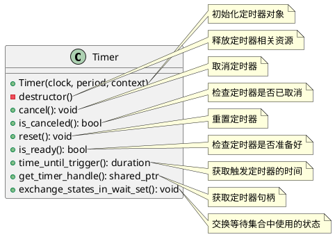

---
Crafted by [Genie](https://marketplace.visualstudio.com/items?itemName=genieai.chatgpt-vscode)
---

## You

下面这段代码是在 ros2 项目中 rclcpp 相关的代码，请联系所有函数之间可能的相互联系，梳理、解释这份文件的功能、含义（中文）。（请给出详细完善的回答，不限制字数）

## Trantor

这段代码是 ROS2（Robot Operating System 2）项目中的 rclcpp 库的一部分，主要实现了一个定时器类 `TimerBase`。这个定时器类可以用于在特定时间间隔内执行某些操作，例如发布消息或触发事件。

`TimerBase` 类具有以下功能：

1. 构造函数：接受一个时钟共享指针、定时器周期和上下文共享指针作为参数。它初始化定时器句柄并设置清理回调。

2. 析构函数：释放定时器资源。

3. 取消定时器：取消定时器，使其不再触发。

4. 检查定时器是否已取消：返回定时器是否已被取消。

5. 重置定时器：重置定时器，使其从当前时间开始重新计时。

6. 检查定时器是否准备好：返回定时器是否已经准备好触发。

7. 获取触发定时器的时间：返回定时器距离下次触发的时间。

8. 获取定时器句柄：返回定时器句柄的共享指针。

9. 交换等待集合中使用的状态：交换定时器在等待集合中的使用状态。

通过这些功能，我们可以在 ROS2 项目中创建和管理定时器，以便在特定时间间隔内执行任务。例如，我们可以创建一个定时器，每隔一秒发布一个消息，或者在特定时间后触发一个事件。这对于实现周期性任务和控制系统的执行非常有用。

## You

请进一步梳理这些函数之间的功能关系

## Trantor

以下是这些函数之间的功能关系梳理：

1. 构造函数：负责初始化定时器对象。它接受一个时钟共享指针、定时器周期和上下文共享指针作为参数。构造函数会创建定时器句柄并设置清理回调，以确保在销毁定时器对象时正确地释放资源。

2. 析构函数：在定时器对象生命周期结束时调用，负责释放定时器相关的资源。

3. 取消定时器：这个函数允许用户取消定时器，使其不再触发。当定时器被取消后，可以通过 `is_canceled()` 函数查询到定时器的状态。

4. 检查定时器是否已取消：这个函数返回定时器是否已被取消。如果定时器已取消，那么它将不再触发。

5. 重置定时器：这个函数允许用户重置定时器，使其从当前时间开始重新计时。这对于需要在特定事件发生后重新启动定时器的场景非常有用。

6. 检查定时器是否准备好：这个函数返回定时器是否已经准备好触发。当定时器准备好时，意味着它已经达到了预设的时间间隔，可以执行相应的操作。

7. 获取触发定时器的时间：这个函数返回定时器距离下次触发的时间。这可以帮助用户了解定时器何时将执行下一个操作。

8. 获取定时器句柄：这个函数返回定时器句柄的共享指针。定时器句柄是与底层 rcl 库交互所需的对象，通过获取定时器句柄，用户可以直接访问底层 rcl 定时器功能。

9. 交换等待集合中使用的状态：这个函数负责交换定时器在等待集合中的使用状态。等待集合是 ROS2 中用于管理多个实体（如订阅者、发布者和定时器）的机制。通过交换状态，我们可以确保在等待集合中正确地处理定时器。

总之，这些函数共同支持创建、管理和查询定时器对象。用户可以根据需要使用这些函数来控制定时器的行为，以便在特定时间间隔内执行任务。

## You

以 plantuml 的格式输出

## Trantor

以下是使用 PlantUML 格式表示的函数关系图：

将上述 PlantUML 代码粘贴到 [PlantUML 在线编辑器](http://www.plantuml.com/plantuml/uml) 中，即可生成相应的 UML 类图。这个类图展示了 `Timer` 类及其成员函数，以及每个函数的简要描述。
